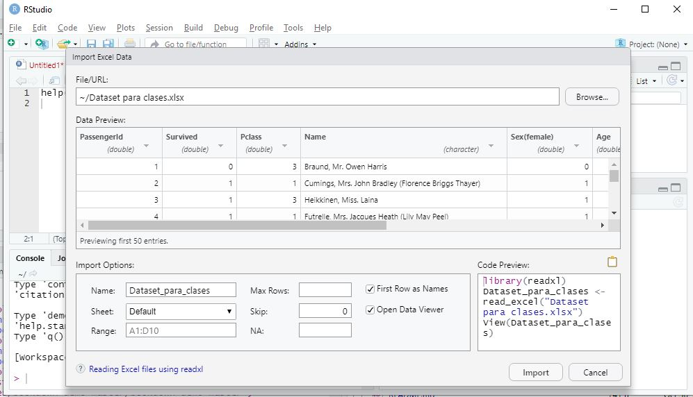

# Ambientes de trabajo y manipulación de variables (I)

## Antes de empezar

Una parte importante del trabajo en estadística depende de la prolijidad y el orden. Cualquier proyecto debe seguir estos pasos antes de empezar:

1. Cree una carpeta destinada **sólo** al proyecto estadístico
2. Coloque el archivo de la base de datos (CSV, XLS, o el formato que prefiera en la carpeta)
3. Cree un script vacío de R y guárdelo en la carpeta
4. Establezca esa carpeta como su directorio de trabajo o **working directory**

## Directorio de trabajo o Working directory

En ocasiones R tiene que buscar archivos en una carpeta (por ejemplo cuando queremos que "lea" una base de datos que tenes en Excel) y en otras ocasiones va a necesitar guardar datos en una carpeta.

El lugar en donde haga ello se llama directorio de trabajo o **working directory**.

Si establecemos ese directorio de trabajo en la carpeta que creamos antes de empezar, R va a poder leer los datos de allí y guardarnos los resultados en el mismo lugar. Al final del día vamos a tener, la base, el script y los resultados prolijos y ordenados en el mismo lugar. 

Vamos a aprender como establecer ese directorio.

A través de una función: `getwd()`, en donde tenemos que especificar la ruta (esto puede ser realmente engorroso si tenemos muchas sub-carpetas, como el ejemplo)


`getwd(~/Bookdown3/bookdown-demo-master/bookdown-demo-master)`


La segunda alternativa es simple pero requiere que hayamos guardado el script previamente y se usa siguiendo los siguientes comandos de la barra de herramientas

```{r echo=FALSE}
knitr::include_graphics("img/Rstudiofig7.png")
```

## Paquetes o librerías

Las funciones que podemos encontrar en R son limitadas. Sin embargo, R cuenta con una enorme comunidad que día a día desarrolla nuevas funciones. Estas funciones vienen empaquetadas en librerías, llamadas **packages**.
Para utilizarlas las librerías deben ser instaladas en nuestro ordenador y activadas cuando sean necesarias (no se las activa todo el tiempo para no enlentecer a la máquina)

### ¿Como instalar una librería?

Existen dos métodos para la instalación de librerías

><i class="fa fa-paperclip" aria-hidden="true"></i> **Recuerde**: la instalación de librerías es un proceso que sólo necesita realizar una vez, después bastará con activarla 

#### Instalación de librería a través de RStudio

Es posible instalar las librerías a ser utilizadas a través del comando de menús de RStudio para ello hay que ir al menú `Tool` y seleccionar `Install Packages`, se abre un cuador de diálogo en donde debemos tipear el nombre de la librería

#### Instalación de librería a través de sintaxis

Se puede utilizar la funcion `install.packages(nombre_de_la_libreria)` para instalarla a través de la sintaxis

### ¿Como activar una librería?

La activación de una librería se realiza mediante el comando `library()`

><i class="fa fa-eye" aria-hidden="true"></i>**Importante**: Este es un proceso que debe hacerse al inicio de cada script. Seleccionamos las funciones que queremos usar y activamos las librerías que las contienen para que esten disponibles, sino no podremos usar esas funciones

Bueno con todo esto en marcha vamos a empezar a trabajar...


## De la base de datos a R

### Metodo de ventanas para subir un dataframe a R

#### Datos desde Excel

En la ventana Environment podemos encontrar un menu de opciones `Import Dataset`, si hacemos clic en esa opción se abrirá un menú que nos permitira bajar datos desde excel


```{r echo=FALSE}
knitr::include_graphics("img/Rstudiofig8.JPG")
```


Este método presenta algunas ventajas la principal es que nos muestra una previsualización de la base de datos y como se asignará la clase a cada columnas y es posible cambiar las asignación haciendo varios clics

```{r echo=FALSE}

```


Una desventaja de este método es que no hay rastro de lo que hicimos en el script y puede que no lo recordes la próxima vez que encaremos la tarea.

Una solución inteligente es copiar el cçodigo que se va autoescribiendo en la ventana `Code Preview`y pergarlo en nuestro script. De esa forma siempre sabemos que ocurrió

#### Datos desde otros formatos

El mismo método permite importar datos desde archivos de texto (CSV) o archivos de datos de SPSS (.sav) u otros programas estadísticos (SAS y Stata)

### Código para subir un dataframe a R

Las alternativas mas populares es a traves de la librería readxl

Un código de ejemplo sería así 

>library(readxl)
>data<-read_excel("nombredelarchivo.xls")

Si el archivo a utilizar no esta en la carpeta de trabajo hay que escribir la ruta hasta allí.


## Manipulación de variables (I)

Una vez que hemos  subido nuestro dataframe al programa la habilidad más importante que necesitaremos es la capacidad de manipular las variables.

En la siguiente sección aprenderemos como indicar en el lenguaje de R que necesitamos que se trabajen con ciertos datos. 

El lenguaje basal de R posee un sinnumero de alternativas para manipular variables, nos limitaremos a ver las mas esenciales.

En la próxima sección seguiremos trabajando con la base de datos que creamos, si abordan esta sección sin haber leído las previas, o han limpiado su ambiente, por favor corran el siguiente código


```{r}

numeros<-1:10
nombres<-c("Ismael", "Claudia", "Alberto", "Juan Carlos", "Laura", "José", "Luis", "Lorena", "Charly", "Fito")
genero<-c("varon", "mujer","varon","varon", "mujer","varon", "varon", "mujer","varon","varon")
altura_alumnos <- factor(c("alto", "bajo", "bajo", "mediano","bajo", "alto", "bajo", "bajo", "mediano","bajo"),
                       levels=c("bajo", "mediano", "alto"))

set.seed(123) 
peso_alumnos <- runif(n=10, min=50, max=100)

mi_primera_base<-data.frame(numeros, nombres, genero, altura_alumnos, peso_alumnos)
```


### Métodos de selección de datos

#### El método $, "la dirección"

Dijimos que una forma de pedirle a R que nos devuelva un objeto se basa en escribir solamente su nombre.

Si tipeamos por ejemplo el nombre de la base: 

```{r}
mi_primera_base
```

Nos devuelve la base.
El carácter `$`: funciona como una subdirección. 
Cuando ponemos el nombre de un objeto seguido del signo, R espera el nombre de otro objeto contenido dentro de el (como si fuera una dirección, antes del `$` escribimos el numero de la calle, y después el departamento).

Miremos este ejemplo

```{r}
mi_primera_base$genero
```

como vemos, R entendió que le pedíamos sólo _genero_, que está contenido en _mi_primera_base_.
Este método (de dirección), es muy útil porque puede que este trabajando con dos bases en simultáneo con columnas del mismo nombre (por ejemplo genero). Entonces existen dos objetos _genero_ pero únicos en su dirección.

El resultante de este método es un objeto, y podemos manipularlo.

Veamos un ejemplo de la vida real.

Queremos calcular la media del peso de los alumnos, la sintaxis sería más o menos así.

```{r}
mean(mi_primera_base$peso_alumnos)
```

Como vemos la funcion `mean()` funcionó absolutamente igual que si le hubiéramos pedido que calculara la media del objeto _peso_alumnos_, sin que pertenezca a un dataframe


Este método de dirección es útil también para crear nuevas variables dentro del dataframe (siempre y cuando tenga el mismo _largo_ que las otras columnas).

Probemos creando al azar una columna de edad. Para ello vamos a seguir los siguientes pasos:
1. Vamos a usar la función `runif()`, para crear numeros aleatorios, entre 10 y 30
2. le vamos a aplicar la función `round()` para que redondee esos números a enteros
3. Y vamos a escribir ese resultado en una columna _edad_ directamente en el dataframe. 
4. Después vamos a previsualizar los primeros 3 elementos del dataframe para ver que pasó. 

Veamos como:

```{r}

mi_primera_base$edad <- round(runif(n=10, min=10, max=30))

head(mi_primera_base)
```

Hemos aprendido dos cosas, muchas funciones se pueden **anidar** simplemente con el uso de paréntesis como si se tratara de una operación matemática. 
La segunda, la màs importante: _ podemos utilizar el método de la direccion de $ para crear nuevas columnas_

Como funciona esto, si a R le damos una dirección dentro de nuestra base que no existe simplemente la crea.

> <i class="fa fa-eye" aria-hidden="true"></i> Cuidado, si asignamos a una dirección existente nuevos datos, va a escribir estos en la dirección indicada borrando los anteriores


##### <i class="fa fa-wrench" aria-hidden="true"></i> Ejercicios

Realicemos ahora algunas transformaciones de variables utilizando este método.

1. Supongamos que en lugar de la edad de los sujetos, necesitamos el año en que nacieron. Para ello vamos a crear una nueva variable _anio_nacimiento_ y le vamos a asignar la transformación de la edad al año.

```{r}

mi_primera_base$anio_nacimiento <- 2021-mi_primera_base$edad

head(mi_primera_base)
```

Como ven resolvimos el problema de una manera sencilla con las operaciones que vimos. 
Le pedimos a R que a 2021 le reste la edad de cada sujeto y los resultados los vaya guardando en la nueva variable.
Una vez que nos acostumbramos a la sintaxis es muy sencillo transformar variables con este método.

Practiquemos un poco más:

2. Tranformemos el peso de los alumnos en libras.

```{r}

mi_primera_base$peso_enlbs <- mi_primera_base$peso_alumnos*2.20462262185

head(mi_primera_base)
```

3. Imaginen que quieren dicotomizar la variable altura, y dividirla en los que son altos y los que no. Para ello podemos crear una variable a través de una función logica. Vemos que sencillo es:


```{r}

mi_primera_base$alto_y_n <- mi_primera_base$altura_alumnos=="alto"

head(mi_primera_base)
```

Creamos una variable lógica (que tambien funciona como una dictomica 0/1, recuerdan?)


#### El método "Phil Collins"

vamos a ver otro método de manipular datos y variables, este método es ligeramente màs flexible que el anterior.

¿Recuerdan la siguiente notación?:

`genero | chr[1:10]`

Esta era la forma de R de decirnos que se trataba de un objeto de 1 fila y 10 columnas, ¿no?.

Recordemos que siempre van primero las filas y después las columnas (**mnemotecnia Phil Collins**)

Con el mismo criterio podemos usar los corchetes como una dirección!!

Si una columna tiene 10 filas (o sea `[1:10]`), el contenido de esas 10 filas està etiquetado ( de arriba abajo) con valores del 1 al 10. A estas etiquetas las llamamos **índices**.

Cada valor de nuestro dataframe tiene entonces un ìndice propio de columna y de fila (una direcciòn para cada valor!!!)

De esta forma


Este mètodo nos permite seleccionar valores particulares.
Veamos por ejemplo si quisieramos saber el nombre del tercer alumno de la base:

```{r}
mi_primera_base[3,2]
```

Como leemos esto: le pedimos a R que dentro de la base _mi_primera_base_ nos devuelva el valor en la posición fila 3 y columna 2 (la de los nombres)


Por su simpleza este método es muy flexible.

><i class="fa fa-paperclip" aria-hidden="true"></i> **Aclaración**: Cuando dejemos uno de estos dos parámetros vacíos, R va a interpretar que le pedimos **todos!**


Veamos ahora si necesitaramos _toda_ la columna nombres escribiríamos lo siguiente:

```{r}
mi_primera_base[,2]
```

Tenemos los 10 registros de la columna nombres.

Si quisieramos los 5 primeros, por ejemplo


```{r}
mi_primera_base[1:5,2]
```

Recuerden que utilizabamos `:` para indicar, todos los valores de 1 a 5.

Este método funciona igual que el mètodo `$` a la hora de aplicar funciones.
Veamos este ejemplo para calcular la media del peso (columna 5)


```{r}
mean(mi_primera_base[,5])
```

Si subimos en el texto vemos que el resultado es el mismo con ambos métodos. Si leemos el código en voz alta sería algo así: "Calcular la media de todas las filas de la columna 5 de la base _mi_primera_base_"


