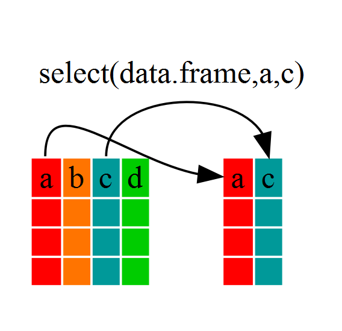

# Manipulación de variables (II)

En esta sección vamos a ver fundamentos sencillos de manipulación de datos mediante la gramática del tidiverse (paciencia que suena rarísimo, pero es una pavada).
Para eso vamos a utilizar dos paquetes: dplyr (que contiene las funciones para manipular los datos) y gapminder que es un paquete con bases de datos de PBI mundiales, vamos a activarlos ( e instalarlos si no los tienen)


```{r}
## estos son los comandos para instalar 
#(también pueden hacerlo desde tools-> install package)
#recuerden remover los "#" para que la línea se ejecute 


# install.packages("gapminder")
# install.packages("dplyr") 


##y estos los comandos para activarlos

library("gapminder")
library("dplyr")
```

Vamos a asignar nuestros datos a un objeto base local así los podemos visualizar en el ambiente

```{r}
data<-gapminder
```

Listo con los preliminares, ahora tenemos una base de datos en nuestro ambiente con 6  variables y 1704 observaciones (no es así? :-<, revisen la sintaxis)


## Piping y paquete dplyr

En la primera sección vimos cuan importante es el operador de asignación **->**. Bueno ahora veremos uno más potente aún, la pipa o **pipe**. Este operador se escribe de la siguiente forma %>%.  fue introducido por el paquete dplyr (el que vamos a usar aquí), pero su dinàmica es tan buena que ha sido replicado por muchos paquetes para ordenar datos (el conocido como tidiverse)

```{r echo=FALSE}

```

Es uno de los operadores más utilizados por su versatilidad. Este signo se escribe antecediendo una función de dplyr. Veamos como lo lee R.

Una sintaxis de dplyr seria por ejemplo asi

> data %>% filter(year==1992)

Esto se lee así, a la base data **apliquemosle** la función filter (y la función filter en este caso se lee, filtrar todos los registros en donde el año es 1992)

Una de las maravillas de este operador es que puede concatenarse, y eso nos permite aplicar varias funciones en orden como un flujo de trabajos o **piping**. Veamos como.

> data %>% filter(year==1992) %>% filter(continent=="Asia")

Esto se lee así, a la base data **apliquemosle** la función filter (y filtremos sólo los registros en donde el año es 1992); a lo que quedó, **apliquemosle** la función filter (y filtremos sólo los registros del continente asiático)

Si corren estas lineas veran que el resultado se muestra como una base de datos en la _consola_, es probable que con estos datos querramos trabajar a continuación, para que eso pase debemos convertirlo en un _objeto_ del ambiente, con nuestro viejo amigo el operador _->_, algo así:


> data_filtrada <- data %>% filter(year==1992) %>% filter(continent=="Asia")

Esto lo leeríamos así: en el objeto _datafiltrada_ **asignemos** el resultado de las operaciones de agarrar la base data **aplicarle** la función filter (y filtremos sólo los registros en donde el año es 1992); y a lo que quedó, **aplicarle** la función filter (y filtremos sólo los registros del continente asiático).

Una vez que aprendimos del piping vamos a aprender las funciones de dplyr màs útiles. 

## Funciones dplyr

Dplyr tiene muchísimas funciones, en esta seccion veremos sólo algunas: la función `filter()` o filtrado, que nos permite seleccionar todas las _filas_ que cumplan con una condición, la función `select()` que nos permite _seleccionar sólo algunas columnas del dataset. La función `arrange()` que sirve para ordenar los datos en función del agun criterio y la función `mutate()` para crear nuevas variables.


><i class="fa fa-paperclip" aria-hidden="true"></i> **Aclaración**: Probablemente llegado a este punto se plantearán que ya concen métodos para crear una nueva variable (con el método de $) o incluso podemos usar nuestro método Phil Colins para filtrar por condiciones, es cierto. 
>
>Una cosa interesante de R, es que hay varias formas de decir lo mismo (como en un lenguaje, recuerdan), e incluso podemos mezclar estilos (hacer un piping y usar cosas del método phil colins por ejemplo) 

Zarpemos a la aventura

### Función filter()

Esta función tiene la tarea de seleccionar las observaciones (filas) que cumplen las condiciones que nos interesan.
Tiene una sintaxis muy sencilla simplemente ponemos la variable y la condición (recuerden que el nombre del dataframe se lo dimos en el piping), ya vimos ejemplos de como usarla, pero nunca vienen mal otros:

1. Quiero obtener un dataset con solo los datos de Argentina, y lo quiero llamar PBIArg, deberíamos escribir algo así.

```{r}
 PBIArg <- data %>% filter (country == "Argentina")
```

Se animan a hacer algunas funciones clásicas ahora?

Calculemos el PBI percapita promedio en todos estos años de la base.

```{r}
mean(PBIArg$gdpPercap)
```

¿Se animan algo más complejo?, como contestarían la pregunta: ¿Cuál fue el PBI Argentino en 1982?, bueno podemos resolverlo de dos maneras ahora que tenemos el objeto PBIArg

Manera 1: 

```{r}
PBIArg %>% filter (year ==1982)
```

Manera 2:

```{r}
data %>% filter(country=="Argentina") %>% filter(year==1982)
```

El resultado fue el mismo! Hagan el ejercicio de leer el _piping_ en voz alta. ¿Cual opción les parece mejor?, si bien no hay una sóla respuesta a esto, la manera 2 es muy útil si sólo queremos un dato de Argentina porque no crea una objeto intermedio (en este caso, PBIArg) Ahora no parece un problema pero cuando trabajen más de 15 minutos van a darse cuenta que su ambiente se llena de _objetos basura_ si no somos cuidadosos y complica mucho el trabajo.


Resumiendo la función filter() haría algo así.

```{r echo=FALSE}

```


## Función select()

La función select sirve para seleccionar columnas completas, ¿para que puede servir algo así?.

Siganme un poco con el ejemplo:

Primero vamos a cargar una base que esta en R que se llama iris (que son medidas de ancho y largo del pétalo y el sépalo de florecitas de tres variedades distintas encontradas en el mismo campo medidas por un sr Ronald Fisher - que cuando no medía flores estaba revolucionando la estadística-), carguemos la base y veamos que tipos de variables son:

```{r}
flores<-iris

str(flores)
```
Bueno si todo les salió bien (como a mí) van a tener que hayt 4 variables numéricas (los anchos y largos) y un factor (una categórica que es la variedad de la flor)

Bueno hete aquí el problemita que que entre los defectos de Ronald Fisher (además de un poquito de racismo) estaba el ser inglés y tomó todas estas medias en pulgadas. nosotros investigadores del nuevo milenio queremos pasar esto al sistema internacional (con medidas más logicas que el tamaño del pulgar de un rey muerto)

¿Cómo hacemos eso? Bueno ya vimos algunas soluciones en el capítulo anterior. Las voy a ejecutar a modo de repaso

```{r}
# creo dentro de flor nuevas variables ajustadas

flores$Sepal.Lengthcm<-flores$Sepal.Length*2.54 #multiplicamos por 2.54 cada valor para pasarlo a cm 
flores$Sepal.Widthcm<-flores$Sepal.Width*2.54
flores$Petal.Lengthcm<-flores$Petal.Length*2.54
flores$Petal.Widthcm<-flores$Petal.Width*2.54

str(flores)
```

Perfecto, este método funciona. Pero, pero, pero: tuvimos que escribir una línea super engorrosa por cada variable (en este caso eran 4, pero si son no sé, 60, se pasarían toda la tarde), tiene que haber una forma de simplificar esto.

¿Que pasa si multiplicamos toooda la base *2.54?

```{r}
head(flores*2.54)
#acá anide la multiplicación dentro de la función head() para que sólo muestre el pimer pedacito de la tabla
```

¿Que pasó con la variables _Species_? Bueno le aplicó la multiplicación a una palabra, la multiplicación por una palabra no existe o sea que me borró los datos.
Nosotros queríamos comparar las diferencias entre esas plantas así que ahora, estamos fritos! Tenemos los cm pero perdimos una variable.

Acá entrá (y si hizo esperar), la función `select()`

Dijimos que esta función sirve para quedarno con sólo algunas columnas (como hace fiulter con las filas)

Miren como lo haríamos

```{r}
medidas_Flores<-flores %>% select(Sepal.Length:Petal.Width)

head(medidas_Flores)
```

Aquí tenemos las 4 variables

ahora podemos transformarlas:

```{r}
medidas_Flores<-medidas_Flores*2.54

head(medidas_Flores)
```

y podemos pegarle la categoría que nos quedó colgada

```{r}
medidas_Flores$especie<-flores$Species

head(medidas_Flores)
```

Ahora sí ya podemos trabajar con la base de Fisher en cm y sin perder datos

Pero momentito, esta función no aporta nada nuevo. Podemos hacer esto mismo con la sintaxis que aprendimos en el capítulo anterior (si con el método Phil Colins). 

Vamos a hacer el intento

```{r}
rm(medidas_Flores) # esta función borra la base, así no creamos miles de objeto


medidas_Flores<-flores[,1:4] #le pedi todas las filas de la columna 1 a la 4 (que son las medidas)

medidas_Flores<-medidas_Flores*2.54 #las transformo

medidas_Flores$especie<-flores$Species # le pego la especie

head(medidas_Flores) #chusmeo los primeros

```

Dió lo mismo!. Si claro, ¿recuerdan que hay varias formas de decir lo mismo?
Entonces ¿para que aprender esta función?

```{r echo=FALSE}

```

Planteemos otro problema:

Resulta que estas flores son redondas entonces podemos calcular la superficie del pétalo y el sépalo (el ancho es el diámetro no?).

O sea  que si hacemos el ancho/2, obtenemos el radio y si lo elevo al cuadrado y lo multiplicamos por pi (3.14) obtenemos la superficie, pero solo de las medidas width!

O sea que ahora no podemos agarrar un rango!, el método phil colins no sirve!!!

Y ahí llega, a salvar las papas `select()`

```{r}
superficies<-flores %>% select(Petal.Width, Sepal.Width)

head(superficies)
```

Select nos permite tomar un conjunto de columnas que no sean contiguas y ponerlas en otro dataset. 
Esquemáticaente algo así:

```{r echo=FALSE}

```
Ahora sí podemos proseguir con la transformación:

```{r}
superficies<-3.14*((superficies/2)^2) #transformo en superficies

superficies$especie<-flores$Species #le pego la especie

head(superficies) #chusmeo

```

### Función arrange()

La función arrange es quizàs la más facil de entender, su funcionamiento básico consiste en ordenar las filas de acuerdo a algún criterio (muy similar al ordenar de excel)

Su valor por defecto es el orden ascendente, si quisieramos un orden descendente deberiamos indicarselo, otra ventaja es que podemos ordenar por distintas columnas.

Veamos un ejemplo, queremos ordenar los datos de gapminder para que nos muestre los más viejos y de esos el menor PBI primero:

```{r}
# recuerden que anidamos la funcion head 
# para no mostrar toooda la base 

head(data %>% arrange(year, gdpPercap))

```


Si quisieramos mostrar al reves, los màs nuevos y de mayor PBI deberíamos apelar al orden descendente

```{r}
# recuerden que ustedes pueden usarlo sin la funcion head 

head(data %>% arrange(desc(year), desc(gdpPercap)))

```

## Función mutate()

La función `mutate()` sirve para crear nuevas variables que son funciones de otras que se encuentran ahí. ¿Se acuerdan del problema de las flores de Fisher?, bueno veamos como esto nos brinda una herramienta mas inteligente para resolverlo.

```{r}
rm(flores) #borro flores porque le hicimos cambios y queremos empezar de cero

flores<-iris #le asigno el dataset iris y volvimos a foja cero
```

Queremos pasar las medidas a cm, ¿recuerdan? vamos a usar la función `mutate()` para eso.

```{r}
flores <- flores %>% mutate( Petal.Length.cm = Petal.Length*2.54)

head(flores)
```

Excelente, pero, ya sabíamos hacer eso, ¿por qué me conviene usar mutate()? Bueno porque nos permite tambien hacer no uno sino muchos cambios en una misma linea de código, así:

```{r}
flores <- flores %>% mutate( Petal.Length.cm = Petal.Length*2.54,
                             Petal.Width.cm = Petal.Width*2.54,
                             Sepal.Length.cm = Sepal.Length*2.54,
                             Sepal.Width.cm = Sepal.Width*2.54,
                             )

head(flores)
```

Excelente, pero que ventaja tiene esto por sobre el método de extraerlos en una base, multiplicarlos y después pegarles las que necesitaba, dos muy importantes:

1. el método anterior crea un objeto nuevo (muchos objetos  enlentecen el programan y complican al usuario, imaginen que al final del día tienen una base _flores_, una _flores2_, una _floreees_, y una _floresfinal_, y no recuerdan en donde esta cada cosa).

2. este método permite aplicar tranformaciones diferentes a un grupo de variables

Veamos esta última opción:

Resulta que queremos calcular el largo en metros del petalo y el sepalo y calcular las superficies como la otra vez, ¿podemos hacerlo todo con una sola función?, claro que sí, gracias a mutate():

```{r}
flores<-flores %>% mutate(Petal.Length.m = Petal.Length.cm/100,
                          Sepal.Length.m = Sepal.Length.cm/100,
                          Petal.surface.m = 3.14*((Petal.Width.cm/100/2))^2,
                          Sepal.surface.m = 3.14*((Sepal.Width.cm/100/2))^2)
head(flores)                          
```

Lo logramos, creamos funciones diferentes, sin crear objetos intermedios y con  una sola función!

Creanme a medida que pase el tiempo van a notar lo conveniente de ahorrar lineas de comando y objetos.


## Otras funciones de dplyr

Estas funciones que vimos aquí son quizás las más útiles para empezar pero son sólo la punta del iceberg.
Este paquete tiene muchísimas funciones, seguramente con la práctica vamos a ir conociendo algunas.

```{r echo=FALSE}
knitr::include_graphics("img/jojo.jpg")
```

Por las dudas aquí tienen un pequeños listado para investigar (spoiler, a esta lista la vamos a usar):


>**FUNCIONES DPLYR**
>
> group_by() \
> if_else() \
> if_all() \
> if_any() \
> mutate_all() \
> mutate_if() \
> na_if() \
> rename() \
> summarise() \
> summarise_all()


## <i class="fa fa-wrench" aria-hidden="true"></i> Ejercicios:

En esta sección vamos a usar lo que aprendimos (y todo nuestro ingenio y creatividad) para resolver pequeños problemas con la base gapminder. 

El desafío: hacerlo con el menor número de lineas y de objetos intermedios.

Empecemos

### Problema 1:

En nuestra base hay una variable `lifeExp` que representa la esperanza de vida en años. Queremos crear una variable nueva que se llame `lifeExp_months` y represente la expectativa de vida en meses:

```{r}
#
#
#
#
#

```


### Problema 2:

Queremos mostrar el país con la mayor población en 1997. Quizas quieran usar varias veces el operador %>%:

```{r}
#
#
#
#
#

```


### Problema 3:

Vamos afrontar un desafío, quiero crear una base `mas_ricos` con los países (en orden ascendente) que en el año 2007 superaron el billón de PBI total (Recuerden `gdpPercap` es el PBI per cápita y `pop` es la población total). Traten de hacerlo por uds mismos (pista: recuerden que podemos _pipear_ funciones)

```{r}
#
#
#
#
#

```


#### Problema 3 (con mas pistas):

Si llegaron hasta acá es porque el ejercicio anterior fue demasiado abrumador (no lo creo). Pero aquí van algunas ayuditas. 

Lo primero de lo primero es entender que hay varias condiciones, entonces vamos a tener que _pipear_ varias funciones. Ordenemos las condiciones y después las escribimos (recuerden que es muy útil leer el código en voz alta, porque en definitiva es un lenguaje y tiene un sentido).

Primero hay una columna que no existe que debemos crear multiplicando dos existentes (quizas algo relacionado con mutar pueda ser útil ¿no? ), después nos dice que sólo le interesa los datos de 2007 (filtremos por esa condicion) y después sólo los que superan cierto valor (suena como a un segundo filtro) y por último ordenar todo para mostrarlo. Probemos ahora. 

```{r}
#
#
#
#
#

```

## <i class="fa fa-cog" aria-hidden="true"></i> Respuestas:

Esperemos que hayas llegado acá después de haber intentado varias veces encontrar una respuesta por vos mismo. Si no lo hiciste, a subir de nuevo que nada se gana sin luchar (menos aprender).

Si ya te diste por vencido aquí vienen las respuestas:


***Importante***

Recuerden que este es sólo un modo de resolver, hay muchas posibilidades que dependen (entre otras cosas) de su creatividad. No hay un modo correcto pero si hay modos que consumen menos esfuerzo (ahora o en el futuro). La simpleza es siempre el mejor criterio.

 

### Problema 1:

En nuestra base hay una variable `lifeExp` que representa la esperanza de vida en años. Queremos crear una variable nueva que se llame `lifeExp_months` y represente la expectativa de vida en meses:

```{r}

data<-data %>% mutate(lifeExp_months = lifeExp*12 )

```

### Problema 2:

Queremos mostrar el país con la mayor población en 1997. Quizas quieran usar varias veces el operador %>%:

```{r}

head(data %>% filter(year==1997) %>% arrange(desc(pop)),1)
```

Vamos a comentar que hicimos acá, leamoslo en vos alta:

A la base data le **aplique** la opción filtro año=1997, a ese resultado (o sea solo a los registros de 1997) le **aplique** la función ordernar en orden descendente y todo eso esta **adentro** de la funcion head() que me muestra los primeros campos de la base, como solo quiero el 1º, le agregué un argumento `,1` que le dice a la función que sólo presente el primer campo.

### Problema 3:

Vamos afrontar un desafío, quiero crear una base `mas_ricos` con los países (en orden ascendente) que en el año 2007 superaron el billón de PBI total (Recuerden `gdpPercap` es el PBI per cápita y `pop` es la población total). Traten de hacerlo por uds mismos (pista: recuerden que podemos _pipear_ funciones)

```{r}

mas_ricos<-data %>% mutate(PBI = gdpPercap * pop ) %>% filter(year == 2007) %>% filter(PBI>1000000000000) %>% arrange(PBI)

head(mas_ricos)
```

¿Leemos el código?: a la base data le **aplique** la tranformacion para calcular el valor del PBI, después a la base resultante le **aplique** un filtro de año (para quedarme solo con 2007) y después **aplique** otro filtro para quedarme con los PBIs superiores a un billon, a la resultante le **aplique** un orden basado en el PBI y a tooodo eso lo **asigne** a la base `mas_ricos` 

><i class="fa fa-paperclip" aria-hidden="true"></i> **Algunos comentarios de estilo **
>
>La forma en que escribimos el código previo es correcta pero un poco desordenada ya que escribimos todo _como un chorizo_
>
>Cuando las lineas son largas conviene partirlas pero al hacer eso debemos dejarle claro a R que despues de esta linea sigue un nuevo argumento, esto solo es posible si dejamos el %>% al final (eso le indica que algo sigue, y lo va a buscar, si no lo encuentra, bueno, termina ahi)
>
>En fin esta es la forma, elegante, de escribirlo:


```{r}
mas_ricos<-data %>% 
  mutate(PBI = gdpPercap * pop ) %>% 
  filter(year == 2007) %>% 
  filter(PBI>1000000000000) %>% 
  arrange(PBI)
```


>Tambien es más cómodo para leer qué funciones se utilizan.
>
>Un objetivo importante es que nuestro código debe ser fácil de leer, esto nos permitirá compartirlo con otros (y que entiendan lo que hicimos).
>
>Recuerden que nuestro código tiene un gran lector esperándolo, nosotros mismos cuando tengamos que contestar al revisor de nuestro artículo. Así que quieránse y dediquense un código agradable a su yo futuro
 


```{r echo=FALSE}

```
