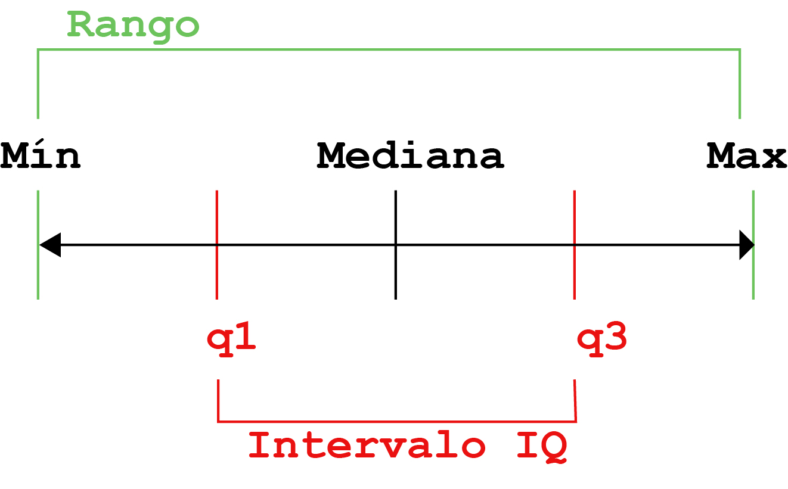
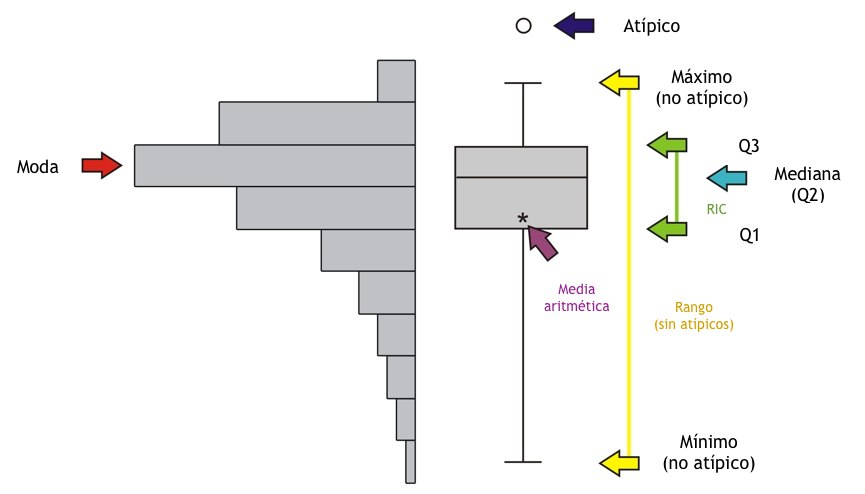

# Resumen de variables en R

La estadística descriptiva (en el sentido amplio del término) es una rama de la estadística cuyo objetivo es resumir, describir y presentar una serie de valores o un conjunto de datos. La estadística descriptiva suele ser el primer paso y una parte importante en cualquier análisis estadístico. Permite comprobar la calidad de los datos y ayuda a "entender" los datos al tener una visión clara de los mismos. Si está bien presentada, la estadística descriptiva es clave para permitir a cualquier lector una idea rápida y precisa de nuestro conjunto de datos. 

Obviamente la forma en que resumiremos una variable dependerá del tipo de variable que estemos resumiendo.

## Resumen de variables categoricas
Las variables presentadas como categorías se pueden resumir a través de la **frecuencia** es decir el número de datos que adoptan tal o cual categoría de la variable, la **frecuencia relativa** es una medida similar pero que tienen en cuenta el número total de observaciones (en pocas palabras es el _porcentaje_ de los datos que adoptan tal o cual categoría)

## Resumen de variables numéricas

Existen muchas medidas para resumir datos pero en términos generales las vamos a dividir en dos tipos:

1. Medidas de posición y tendencia central
2. Medidas de dispersión


Las _medidas de posición_ permiten ver "dónde" se sitúan los datos, es decir a puntan a valores concretos como "el medio de los datos" o "el mayor de los datos", por ejemplo. 
Las _medidas de tendencia central_ son un tipo especial de medidas de posición que nos permiten suponer el valor en donde se encuentra el medio de nuestros datos. Las medidas de posición son:

* Mínimo
* Máximo
* 1er, 3er, o 4to cuartil
* **Media**
* **Mediana**
* **Moda**

Estas últimas tres son medidas de tendencia central.

Las _medidas de dispersión_ permiten a quien las lea generarse una idea de cuan cercanos (o no) estan los valores entre sí y con la medida de tendencia central que lo representa. Las medidas de dispersión más comunes son:

* Desvío estándard
* Varianza
* Intervalo intercuartil
* Coeficiente de variación
* Rango

Veamos con un ejemplo sencillo que queremos decir con ello:

Creemos dos sets de números y calculemos sus medias (en este caso una medida de tendencia central.

```{r}
set1<-c(15,16,17,18,19,20,21,22,23,24,25,26,27)
set2<-c(7,9,11,13,15,17,19,21,23,25,27,29,31,33,35)

mean(set1)
mean(set2)
```
Son iguales!!!


Ahora veamos como son sus desvíos estándares (medida de dispersión):

```{r}
sd(set1)
sd(set2)
```

Claramente son distintos, si sólo hubiéramos reportado la medida de tendencia central el lector tendría a pensar que ambas series de casos son iguales sin embargo difieren significativamente en la dispersión de los datos como vimos al crearlas.


La mejor forma de resumir numéricamente una variable es reportando siempre una medida de tendencia central acompañada de una de dispersión. 


## Antes de empezar

En este capítulo exploraremos varios paquetes para analizar y resumir nuestros datos en R.

Trabajaremos con los datos del PBI del paquete gapminder y la base iris de Fisher (si llegaron a este capítulo sin leer los anteriores en el capítulo 5 explicamos de donde venían estas bases).

Si ya no tienen estas bases en el ambiente pueden correr las siguientes líneas para tenerlos a mano:

```{r}

library("gapminder")

data<-gapminder

flores<-iris
```


## Estadística descriptiva básica

Muchas de las funciones que veremos en este sección las hemos usado intuitivamente en capítulos anteriores así que haremos un repaso a vuelo de pajaro de las mismas.


### Medidas de posición

#### Media

Desde la secundaria que estamos familiarizados con el concepto de la media o promedio. La media es el resultado de un cálculo aritmético, que nos permite estimar el valor central de los datos o, en otras palabras, el centro de gravedad de los mismos. La media se obtiene sumando todos los valores y dividiendo esta suma por el número de observaciones (denominado _n_).


Vamos a plantear un ejemplo que nos ayude a visualizar mejor porque decimos que es el "centro de gravedad de los datos".

Imaginemos que un alumno se saca en estadística un 2, dos 8s y un 10. ¿La media sería de 7, no?. Bueno imaginemos que estamos en una especie de sube y baja con casillas de igual tamaño que representan las notas y cada nota es un pelota. El 7 sería el casillero en donde ambos "pesos" quedan equilibrados, o sea donde deberiamos poner el fulcro si queremos que este sube y baja quede balanceado. 

Algo así:

```{r echo=FALSE}
knitr::include_graphics("img/mean_ruler.jpg")
```

Como todo estudiante sabe, agregar valores (notas) en los extremos del sube y baja cambia notablemente donde debemos poner el centro de gravedad (porque hacen "palanca" en los datos), como si nos sacaramos un 0, en el próximo parcial, la situacion quedaría así:

```{r echo=FALSE}
knitr::include_graphics("img/mean_ruler_2.jpg")
```

La media sería de 5,6, hubiera variado casi dos puntos en una escala de 10.

Si en cambio la nota siguiente no fuera un 0, sino un valor muy cercano a la media, como un 6 digamos, pasía algo así


```{r echo=FALSE}
knitr::include_graphics("img/mean_ruler_3.jpg")
```

La media hubiera sido de 6,8; es decir prácticamente no se hubiera movido.

Resumiendo, lo que cualquier alumno (o niño que use un sube y baja) sabe, adicionar a la muestra nuevos valores cercanos a la media no la hacen variar prácticamente, mientras que adicionar valores extremos generan una variación enorme (por un efecto de "apalancamiento" de los datos). Esta circunstancia hace que la media sea extremadamente susceptible a la aparición de valores atípicos o outliers. Los valores atípicos pueden originarse por una serie de circunstancias  (como un error), y son pocos (sino no serían atípicos), si tienen una posición de privilegio en la determinación del centro de los datos puede ser que estemos creando un "centro atípico" o falso. Es por esta razón en que la media no siempre es la mejor medida para calcular el centro de una variable. 

Bueno una vez que pasamos esta pequeña introducción, veamos como calcularla en R.

Super simple, calculemos la media de el PBI en la base que cargamos:

```{r}

mean(data$gdpPercap)

```

Un punto **importante**, si en nuestra base falta aunque sea un sólo valor esta formula da error, a menos que agreguemos un argumento que se lee como "remover los vacíos". Y sería algo así.

```{r}
mean(data$gdpPercap,na.rm = TRUE)
```
#### Mediana

La mediana se interpreta como el valor a partir del cual  hay tantas observaciones por debajo como por encima. En otras palabras, el 50% de las observaciones están por debajo de la mediana y el 50% de las observaciones están por encima de la mediana.
Se obtiene ordenando los valores de menor a mayor y seleccionando el que ocupa la condición que los divide en dos. A diferencia de la media es muy resistente a los valores atípicos, veamos como funciona en el ejemplo anterior:

```{r echo=FALSE}
knitr::include_graphics("img/median-01.jpg")
```

Como vemos la mediana es una medida mucho mas estable ante los valores extremos.

¿Como la calculamos?


```{r}
median(data$gdpPercap,na.rm = TRUE)
```
#### Cuartiles

Si la media es el valor que divide a la muestra (ordenada) en la mitad. Los cuartiles la dividen en cuatro segmentos, el primer cuartil deja un cuarto de la muestra por debajo y 3 por encima, el segundo cuartil dos cuartos por abajo y dos por arriba (si eso les suena igual a dejar media muestra por arriba y media por abajo, es porque sí, el segundo cuartil es la mediana) y el tercer cuartil deja 3 cuartos por debajo y uno por arriba.
Los Percentiles son similares a los cuartiles y dividen la muestra en 100 segmentos (obviamente el percentil 25 es lo mismo que el primer cuartil, el 50 la mediana y el 75 y el tercero)

Los cuartiles se calculan de la siguiente manera

```{r}
#si queremos ver todos los cuartiles
quantile(data$gdpPercap) 
```

```{r}
#si sólo queremos el primer cuartil
quantile(data$gdpPercap, 0.25) 
```
```{r}
#o si sólo queremos el tercer cuartil
quantile(data$gdpPercap, 0.75) 
```

#### Mínimo y máximo

Definimos como mínimo al valor más pequeño de la muestra y máximo al más grande.
Su calculo es muy sencillo

```{r}
min(data$gdpPercap)

max(data$gdpPercap)

```


### Medidas de dispersión

#### Rango

La más simple de las medidas de dispersión, simplemente nos dice cual es la distancia entre el menor y el mayor de los valores.

Existe una función rango, pero nos dice sencillamente el minimo y el maximo (o sea los determinantes del rango)

```{r}
range(data$gdpPercap)
```
Para calcular el rango propiamente dicho deberiamos restar ambos valores

```{r}
max(data$gdpPercap)-min(data$gdpPercap)
```


#### Desvío estándard

El desvío estándar es la medida de dispersión más común en estadística. Indica cuál es la desviación "normal" de los datos. En realidad, calcula la _desviación promedio_ de todos los valores con respecto a la media. Cuanto mayor es la desviación estándar, más dispersos están los datos. Por el contrario, cuanto menor sea la desviación estándar, más centrados estarán los datos en torno a la media. 

A continuación una representación visual de la desviación estándar:

```{r echo=FALSE}
knitr::include_graphics("img/SD.png")
```

también el cálculo del desvío estándar es muy simple

```{r}
sd(data$gdpPercap)

```

#### Intervalo intercuartil

El desvío estandard es una medida de dispersión "basada" en la media, esto hace que la misma presente los mismos defectos para cierto tipo de muestra. Si necesitáramos usar la mediana para describir mejor a una población, la medida de dispersión que mejor la representa es el _intervalo intercuartil_. Este es la distancia entre el 1er cuartil y el 3ero. De esta forma:

```{r echo=FALSE}

```
El cálculo del intervalo intercuartil puede hacerse de la siguiente manera:

```{r}

IQR(data$gdpPercap)

```

### Medidas de frecuencia

Como explicáramos antes podemos calcular la frecuencia o la frecuencia relativa de variables categóricas.

La frecuencia absoluta puede obtenerse a traves de la funcion _table()_

```{r}
table(flores$Species)
```


Es importante recordar que esta función necesita que nuestra variable categórica este definida como un factor.


Para calcular la frecuencia relativa no existe una función pero podemos recurrir a combinar un par de ellas, sabemos que la función _length()_ nos da el numero total de observaciones y sabemos que la frecuencia relativa es el n de esa categoria sobre el n total de observaciones o sea:

```{r}
table(flores$Species)/length(flores$Species)
```
### Tablas cruzadas

Es frecuente que las variables dicotómicas sean de nuestro interés presentarlas además divididas por grupos, por ejemplo cuantos hombres y mujeres hay entre los casos y entre los controles.

A esto se lo llama **tablas cruzadas**

Veamos como se puede hacer eso en forma sencilla

Antes que nada para ello necesitamos una base con al menos dos variables categóricas, como nuestras bases de práctica no tienen, vamos a crear una nueva variable y agregarla para poder trabajar, para eso esta línea a continuación:


```{r}
flores$origen<-sample(c('Cortada', 'Cultivada'), 150, replace=TRUE)
```

(Sólo para satisfacerles la curiosidad, la función `sample()`crea un vector aleatorio de lo que le pidamos, en este caso cortada o cultivada y el segundo argumento es la cantidad de veces, para meterlo en nuestro dataset lo asigne a una nueva fila con el signo $)

Bueno ahora que el dataset flores tiene dos variables categóricas podemos hacer una tabla cruzada, para ello la forma más sencilla es usar la función `table()` pero esta vez con dos argumentos. El orden de los argumentos sigue la eterna lógica de R, primero las filas y después las columnas

```{r}
table(flores$Species, flores$origen)
```

## Estadística descriptiva en bloque

```{r echo=FALSE}

```


Como ya habremos aprendido por las malas encarar las cosas 1 a 1, puede traer problemas. En este caso no es para nada cómodo ir evaluando variable por variable cada uno de estos indicadores. Es por eso que en esta sección exploraremos formas simples de analizar un volumen más grande de variables con menos código. 

### Función lapply()

La función `lapply()` es una función genérica de R que nos permite "aplicar" otra función a un conjunto de objeto, esta función tiene una hermana melliza: `sapply()` que hace fundamentalmente lo mismo pero difieren en la salida (sapply reporta la salida más sencilla y lapply la más informativa), a los efectos que veremos ahora son práctiocamente la misma.


Como dijimos, esta función nos permite aplicar otras funciones a un "conjunto de objetos", en este caso vamos a usarla para pedirle que nos de la media de todas las variables numericas de nuestro dataset. Veamos como, la estructura de la función es así `lapply(list, function)`. El primer argumento debe ser una lista de objetos (en este caso las variables) y el segundo la función que queremos que aplique


```{r}
lapply(data[,4:6], mean)
```

¿Vamos a _leer_ que hicimos aquí? Tomamos la función lapply que dice: _a esta lista, hacele esto_; creamos una lista que es las tres columnas de mi data set donde estan expectativa de vida, población y PBI (para eso use el método _phill collins_) y en el segundo argumento le pedi la media

Recuerden que puede que nuestra base tenga valores faltantes, en ese caso la línea de código debería ser así.

```{r}
lapply(data[,4:6], mean, na.rm=TRUE)
```
Este método se puede utilizar para todas las medidas de resumen que vimos en la sección anterior


```{r}
lapply(data[,4:6], mean)

lapply(data[,4:6], sd)

lapply(data[,4:6], median)

lapply(data[,4:6], IQR)

```

El problema de este método es que si bien nos ahorramos varias líneas de código repetidas (que cuando tenemos una gran base de datos puede ser horas y horas de copy+paste sin sentido) nos permite sólo calcular una medida por vez. Lo mejor de lo mejor sería tener una sóla función para hacer todo, ¿no? Tranquilos que ya va a llegar.


### Función summary()

Con esta función estamos familiarizados desde capítulos anteriores así que ya se imaginaran lo sencillo que es (esta vez) poder obtener todas las medidas de cada variable del dataset acorde al tipo de variable que es.

```{r}
summary(flores)
```

Como verán, esta función es bu-e-ní-si-ma, pero requiere que seamos muy cuidadosos en la definición del tipo de variable previamente. Si miran el resultado de origen pueden ver que no tenemos la frecuencia porque la _clase_ de este vector es carácter en lugar de factor. Solucionemoslo:

```{r}
flores$origen<-as.factor(flores$origen) #cambie la clase del vector

summary(flores)

```

También es cierto que hay algunas medidas (como el IQR) que no están y que deberemos buscar otras estrategias si las necesitamos, como `lapply()` o ir una por una.

Hemos avanzado muchísimo pero se nos abre ante nosotros un largo viaje, estas medidas de resumen son usualmente utilizadas por los investigadores para mostrarle a sus lectores como es su muestra, esto generalmente se hace en la famosa **tabla 1** de un paper, cerraremos este capítulo con instrucciones para hacerlo pero antes nos esperan **ejercicios integradores** y aprender una herramienta más,el diagnóstico de **parametricidad**


## <i class="fa fa-wrench" aria-hidden="true"></i> Ejercicios:


Para estos ejercicios vamos a trabajar con un nuevo dataset "cars", incluido en un paquete a instalar lleno de datasets de práctica el paquete se llama "datasets".

Dicho dataset contiene  datos indican de velocidad de coches y las distancias que tardan en detenerse. Tengan en cuenta que los datos se registraron en la década de 1920 (no se escandalicen).

Nuestro ejercicio consiste en 

1. Instalar el paquete "datasets"

2. Activar el paquete

3. Asignar la base de datos "cars" al objeto data 

Y responder las siguientes preguntas: 

4. ¿Cuántos registros tiene?

5. ¿Cual es la velocidad media dentro del dataset?

6. ¿y la maxima?

7. ¿Cuál es la velocidad media de los primeros 25 registros del dataset?


## <i class="fa fa-cog" aria-hidden="true"></i> Respuestas:

Bueno aquí van nuestars respuestas (recuerden que no hay un sólo modo de hacer las cosas, este es el nuestro)

```{r}
library(datasets)

data<-cars

str(data) # me permite concoer la base y saber cuantos registros hay

mean(data$speed)
max(data$speed)

summary(cars) #una forma de contestar dos preguntas más rápido


mean(data[1:25,1]) #nos aprovechamos del método "Phil Collins"
```


## Parametricidad

Como seguramente habran visto en la clase del curso que complementa este libro, que una muestra o población siga una distribución normal o Gaussiana es un prerrequisito importante para el uso de ciertas medidas de resumen (como la media) y de varios test de comparación (como el test t)

Por ello es importante que antes de empezar a trabajar podamos estar seguros del cumplimiento de este requisito (veremos mas adelante que el nombre adecuado es _supuesto_)

Para diagnosticar la normalidad de una variable se pueden recurrir a:

1. Métodos gráficos
  + Histograma
  + Boxplot
  + Gráficos de densidad
  + QQ plot
2. Métodos analíticos
  + Test de komogoroiv smirnof
  + Tets de Shapiro Wilk


### Métodos gráficos:

**Histograma**

Los historgramas pueden ser una de las estrategias más sencillas para evaluar si una variable sigue una distribución normal, como vemos en estos ejemplos es facil darse cuenta cuando no, fundamentalmente porque son una medida indirecta de la densidad (la linea que a veces se suma a los histogramas)

Los histogramas pueden hacerse en forma sencilla con la función `hist()`

```{r}
hist(flores$Sepal.Width)
```

Si quisieramos agregar una líneas de densidad podríamos verlo así:

```{r}
hist(flores$Sepal.Width, 
 prob = TRUE)
lines(density(flores$Sepal.Width))
```
Los histogramas permiten decidir si una distribución se acerca a la forma de la normal o no.

Veamos este caso, aquí vemos una distribución (un caso extremo) que no cumple criterios para ser considerada normal, cuando la mayoría de los datos se distribuyen a la izquierda (en valores bajos del eje x) hablamos de distribución desviada a la izquierda (o de colas pesadas por su forma en los box plots) como es el ejemplo de la siguiente. Estas distribuciones son frecuentemente resultado de distribuciones teóricas logarítimicas. Otras variables con comportamiento exponencial, como los casos acumulados de covid, producen distribuciones desviadas a la derecha. Como muchos de ustedes intuirán, describir el numero de casos acumulados de covid con la media desde el inicio de la pandemia no es un enfoque "representativo"

```{r}
library(stats)
desv_izq<-rlnorm(600, meanlog =20 , sdlog = 1)
hist(desv_izq)
```

**Box plot**

Los gráficos de box plot o como se llaman en español "gráficos de caja" o "diagramas de cajas y bigotes", son una forma muy útil de graficar varios parámetros de la distribución que permiten diagnosticar su "grado de normalidad". El gráfico consiste en una caja cuyos límites superior son el 1er. cuartil (Q1) y el 3 cuartil (Q3) -por lo tanto la caja es tan alta como el rango intercuartil (RIC), la mediana se grafica comoo una linea dentro de la caja. El gráfico incluye los "bigotes" cuyo largo representa el rango total de la variable o 1.5 el RIC sobre o por debajo de Q1 y Q3 (lo que ocurra antes). Eventualmente se puede graficar la media con un asterisco para ver su coincidencia con la mediana.  
Los valores que pueden quedar por debajo o por encima de los bigotes se les clasifica como "atípicos" y se grafican por separado. Los atípicos pueden o no ser outliers (un concepto más complejo).

Estos valores son homologables al histograma aunque es más preciso para 

```{r echo=FALSE}

```


Cuando una distribución presenta demasiados valores a la izquierda el bigote se hace muy largo hacia abajo, como si pesara, a estas distribuciones las llamamos de "colas pesadas", y en el caso de las desviadas a la izquierda son de "colas livianas"

Veamos como se construye con nuestros datos

```{r}
boxplot(flores$Sepal.Width)
```

**QQ plot**

El gráfico Q-Q normal o QQ plot es un método gráfico de evaluación de la normalidad alternativo al histograma y es muy útil en tamaños de muestra pequeños (en donde los histogramas suelen verse "feos", al graficar).  Se llama así para abrevir su nombre correcto que sería "gráfico (plot) cuantil (Q) a cuantil (Q)". 
En este tipo de gràficos se grafica la dispersión de cada dato sobre el supuesto de una distribución normal perfecta.  
Esto se logra dividiendo la muestra en múltiples cuantiles y la distribución normal teórica de esa muestra de la misma forma. Si la muestra es "perfectamente" normal, cada cuantil muestral es igual a un cuantil teórico y se  vería como una linea recta con pendiente 1 (y=x). En los qqplots se grafica esta situación "ideal" (en una recta) junto con la situación "real" (como puntos)

Para que los datos se consideren normalmente distribuidos, la dispersión debe estar lo más cerca posible de la línea "ideal", sin que haya un patrón evidente que se aleje de ella.  Veamos como se construye uno con nuestros datos


```{r}
library(stats)
qqnorm(flores$Sepal.Width, pch = 1, frame = FALSE) #esta línea grafica los puuntos
qqline(flores$Sepal.Width, col = "steelblue", lwd = 2) # esta línea grafica la línea teórica
```


### Métodos analíticos:

También existen test analíticos específicos para comprobar la normalidad. Es importante tener en cuenta que el mejor enfoque es utilizar màs de un mètodo y convinar mètodos analíticos y gràficos.  Esto último se debe a que la mayoría de las pruebas son sensibles a los valores atípicos y están influenciadas por el tamaño de la muestra.

Los test más importantes para la demostración de normalidad son **el test de Kolmogorov-Smirnov** y **la prueba W de Shapiro-Wilk**.

***Importante***

Ambas pruebas tienen como hipótesis nula: _los datos se distribuyen normalmente_.  Esto quiere decir que **si p> 0,05, se puede suponer la normalidad.**
Esto puede sonar a veces contraintuitivo y por lo tanto es importante recordarlo siempre


Ambos test son útiles pero existen algunos criterios para preferir uno o el otro:

* Para muestras más pequeñas, es _menos probable_ que se detecte la no normalidad. Por esto, es preferible usar la prueba de Shapiro-Wilk, ya que suele ser más sensible.

* Para muestras más grandes (> 100), las pruebas de normalidad son demasiado conservadoras y la hipótesis de normalidad suele rechazarse con demasiada facilidad (razón por la cual hay que acompañarla de mètodos gráficos). En estos casos Kolmogorov-Smirnov es preferioble por su especificidad

* La prueba de Kolmogorov-Smirnov sirve para comparar distribuciones (una real con una teórica, o dos reales entre sí). Para calcular la parametricidad debemos aclarar que la prueba compara la distribución de mis datos con la teórica normal 


```{r, warning=FALSE,message=FALSE}
library(stats) #estos test se encuentran dentro del paquete stats
shapiro.test(flores$Sepal.Width)
ks.test(flores$Sepal.Width, "rnorm") # el argumento "rnorm" indica que el K-S compara con la teórica normal
```

### Resumen de parametricidad

Como vimos hay varias formas de testearlo (ninguna definitiva), a lo largo de esta sección vimos el analisis de una sola variable en todos los métodos. Al llegar aquí han notado seguramente que tenemos resultados _"contradictorios"_. ¿Qué hacer en estos casos? Bueno, utilizar los conocimientos adquiridos y tomar una _decisión_. Recordemos: a) combinar graficos con analíticos, b) decidir el analítico que mejor se ajusta al problema c) saber que toda decisión implica un margen de error que hay que tolerar. 

En este caso nos la jugaremos por decir que la variable Sepal.width tiene un grado de parametricidad "tolerable"


## La tabla 1


Bueno ha llegado el momento, vamos a estructurar los datos en estadísticas de resumen en un formato agradable para pegar en nuestro paper. Vamos a ver dos paquetes muy útiles para ello.

***Importante***
Al llegar a este punto es importante que todas nuestras variables tengan su correcta **definición de clase** (Si no recurdan/saben que es esto visiten el capítulo 3.3.2). Los paquetes automatizados para la creación de tablas van a _decidir_ como resumir las variables en función del tipo que son (como vimos al inicio de este capítulo de resumen de los datos)


### Paquete table1

El paquete table1 crea tablas html de aspecto profesional, les permite resumir variables en uno o varios grupos y tiene una sintaxis muy sencilla

Como deciamos la sintaxis de table1 es muy sencilla, necesita (en este orden):

* Las lista de las variables, inicia con una virgulilla (es este símbolo, ~) y separadas por un +

* La variable que los divide en grupos (si no los hay dejarla vacia) detrás de una barra recta |

* El nombre de la base de datos detrás de una ,


```{r echo=FALSE}

```


veamos que significa esto, vamos a construir una tabla que tenga el ancho y el alto del petalo y el sepalo por especie de nuestra base de flores la sintaxis sería mas o menos asi

>table1(~Sepal.Length+Sepal.Width+Petal.Length+Petal.Width+origen|Species, flores )


¿Leemos el código?  A las variables _Sepal.Length_,  _Sepal.Width_, _Petal.Length_, _Petal.Width_ y _origen_ agrupémoslas en sus _species_ y todos los datos saquemoslos de la base _flores_

Veamos que obtenemos

```{r}
library(table1)

table1(~Sepal.Length+Sepal.Width+Petal.Length+Petal.Width+origen|Species, flores )

```
En este caso podemos ver como resumió todas las variables en media y desvío estandard debido a que son continuas y a la variable _origen_(que és categórica)en frecuencias absolutas y relativas


### Función tbl_summary()

La función tbl_summary() es parte de un paquete muy útil para muchas tablas el paquete **gtsummary** tiene un comportamiento similar a la función table1 pero con una ventaja extra...tachan tachan...Usa la _sintaxis de dplyr_ eso quiere decir que vamos a usarlo con el operador **>%>** y podemos combinar con todas las funciones de manipulación de variables, y eso serñoras y señores, es muy muy útil

Veamos como funciona, si quisieramos resumir toda la base como hicimos recién deberíamos escribir lo siguientes

> flores %>% tbl_summary(by=Species)


¿Lo leemos? Sería algo así: a la base _flores_ **apliquemosle** la función _tbl_summary_ separada por _Species_

Veamos el resultado:

```{r, warning=FALSE,message=FALSE}
library(gtsummary)
flores %>% tbl_summary(by=Species)
```
El resultado es muy similar al otro método pero... más simple (recuerden que mientras menos escribamos más agradable es nuestro código)

Pero el verdadero poder de esta función es su poder de combinar con otras funciones dplyr

Veamos un ejemplo, supongamos que queremos crear una tabla que contenga _sólo_ el largo de los petalos y los sepalos de las flores cortadas de las variedades setosa y versicolor. Podríamos resolverlo así:

```{r, warning=FALSE,message=FALSE}
library(dplyr)
library(gtsummary)
flores %>% filter(origen=="Cortada" & Species != "virginica") %>%
  select(Petal.Length, Sepal.Length, Species) %>%
  tbl_summary(by="Species")
```
Leamos el código que usamos. A la base _flores_ **apliquémosle** filtrar por la condición que _origen_ sea igual a cortada _y_ que _species_ **no sea (!=)** virginica (o sea las otras dos) después **apliquémosle** seleccionar y seleccionamos solo las variables que necesitamos (los largos y la variable de grupo)y a todo esoo **apliquenosle** hacer una tabla agrupada por la especie

(la columna de las virginicas quedó vacía porque la dejamos afuera)


Pero, pero, pero...una buena tabla 1 tiene test de hipótesis que testean el parecido (o no) de los grupos. Con este paquete es muy sencillo, solo hay que pedirle que **aplique** la forma de obtener las p

Veamos:

```{r, warning=FALSE, message=FALSE}

flores %>% filter(origen=="Cortada" & Species != "virginica") %>%
  select(Petal.Length, Sepal.Length, Species) %>%
  tbl_summary(by="Species") %>%
  add_p()
```
Más sencillo, imposible. El paquete permite mucha más fucnionalidad (como elegir las medidas de resumen y el test a utilizar), pero ustedes ya saben como averiguar.

```{r echo=FALSE}

```

Ahora que nuestra tabla 1 tiene todo lo que tiene que tener. Cerremos este capítulo.
Nos vemos en los gráficos...


