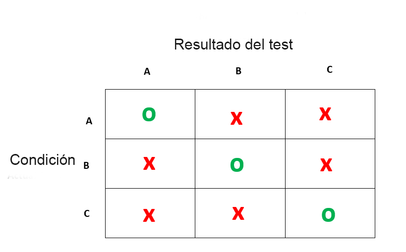

# Matriz de confusión 


En esta sección veremos algunos conceptos sencillos sobre las matrices de confusión. Estas son herramientas para medir la precisión de un test tanto de laboratorio, clínico como estadístico. Los que se dediquen a la medicina y sus afines seguramente estarán habituados a ellos aunque no las conozcan por ese nombre


Una matriz de confusión es una tabla que categorizará las predicciones frente a los valores reales. Incluye dos dimensiones, entre ellas una indicará los valores predichos (el resultado de un test) y otra representará los valores reales. 

Cada fila de la matriz de confusión representará los valores predichos y las columnas serán responsables de los valores reales. También puede ser a la inversa. Aunque las matrices son fáciles, la terminología que hay detrás parece compleja. 

La matriz de confusión más intuitiva es esta:

```{r echo=FALSE}

```

Esta es una matriz de las que llamamos 2x2, es decir contrastamos una variable con dos niveles, con otra con dos niveles. Vamos a despegarnos por un segundo del concepto de salud/enfermedad porque las matrices de confusión sirven para detectar condiciones. 
A veces la condición es "ganar la lotería" y otras veces es "tener una metástasis de cerebro" por ende dejar asociado a cada columna conceptos con valoraciones positivas o negativas no tiene sentido. Generalicemos:

```{r echo=FALSE}

```

Estamos de acuerdo que son matrices de 2x2, pero es importante saber que las matrices pueden tener la dimensión que sea necesaria, podemos usar un test como la glucemia para diagnostica "normal", "prediabetes" y "diabetes". Lo que sí deben tener las matrices de confusión es simetría, es decir la condición real a diagnosticar y el test deben tener los mismos niveles.

Nuestro caso de la glucemia se vería así:

```{r echo=FALSE}

```


## Componentes de la matriz de confusión

Vamos a hablar un poco de la terminología

Como habrán notado en los esquemas hay circulos verdes y x rojas en donde hay discordancia.

Las _discordancias_ se llaman ***falsos*** y las _concordancias_ ***verdaderos***

La _ocurrencia de la clase de interés_ se llama ***positivo***, independiente de la valoración del resultado del test (un test de embarazo positivo y un test de cancer positivo, son positivos independiente de la felicidad o la tristeza que da cada uno) _el resto  de las clases_ serán negativas (esto es muy importante si la variable tiene más de dos niveles, hay que decir cuál es el evento de interés y todos los demás son negativos). 

De esta forma, con esto dos conceptos se construyen 4 categorías: 

* ***Verdadero positivo (VP)*** - El test detecta la presencia de la clase de interes y la clasifica correctamente ya que la condición se produce en realidad.
* ***Verdadero negativo (VN)*** - El test ***no*** detecta la presencia de la clase de interes y la clasifica correctamente ya que la condición ***no*** se produce en realidad.

* ***Falso positivo (FP)*** - El test detecta equivocadamente la aparición del evento de interés pero ***no*** se ha producido en la realidad

* ***Falso positivo (FN)*** - El test equivocadamente ***no** detecta la aparición del evento de interés pero sí se ha producido en la realidad.


## Análisis de la matriz de confusión

Muchos de ustedes estarán familiarizados con los términos que expusimos anteriormente y los que seguirán a continuación, pero siempre vale la pena refrescarlos


### Sensibilidad


Consideremos el ejemplo de una prueba médica para diagnosticar una enfermedad. La sensibilidad se refiere a la capacidad de la prueba para detectar correctamente a los pacientes que padecen la enfermedad. En el ejemplo de una prueba médica utilizada para identificar una enfermedad, la sensibilidad (a veces también denominada _tasa de detección_ en un entorno clínico) de la prueba es la proporción de personas que dan positivo en la prueba de la enfermedad entre las que la padecen. 


Algo así:

```{r echo=FALSE}
knitr::include_graphics("img/sens.jpg")
```

   

Un resultado negativo en una prueba con alta sensibilidad es útil para descartar la enfermedad. Una prueba de alta sensibilidad es fiable cuando su resultado es negativo, ya que rara vez diagnostica mal a quienes tienen la enfermedad. Una prueba con una sensibilidad del 100% reconocerá a todos los pacientes con la enfermedad al dar un resultado positivo. Un resultado negativo de la prueba descartaría definitivamente la presencia de la enfermedad en un paciente. Sin embargo, un resultado positivo en una prueba con alta sensibilidad no es necesariamente útil para descartar la enfermedad. Supongamos que un kit de pruebas "falso" está diseñado para dar siempre un resultado positivo. Cuando se utiliza en pacientes enfermos, todos los pacientes dan un resultado positivo, lo que da a la prueba una sensibilidad del 100%. Sin embargo, la sensibilidad no tiene en cuenta los falsos positivos. La prueba falsa también da un resultado positivo en todos los pacientes sanos, lo que le confiere una tasa de falsos positivos del 100%, lo que la hace inútil para detectar o "descartar" la enfermedad.


### Especificidad

Consideremos el ejemplo de una prueba médica para diagnosticar una enfermedad. La especificidad se refiere a la capacidad de la prueba para rechazar correctamente a los pacientes sanos sin una enfermedad. La especificidad de una prueba es la proporción de personas que realmente no tienen la enfermedad y que dan un resultado negativo en la prueba.


```{r echo=FALSE}
knitr::include_graphics("img/spe.jpg")
```

Un resultado positivo en una prueba con alta especificidad es útil para descartar una enfermedad. La prueba rara vez da resultados positivos en pacientes sanos. Un resultado positivo significa una alta probabilidad de la presencia de la enfermedad. Una prueba con una especificidad del 100% reconocerá a todos los pacientes sin la enfermedad con un resultado negativo, por lo que un resultado positivo descartaría definitivamente la presencia de la enfermedad. Sin embargo, un resultado negativo de una prueba con una alta especificidad no es necesariamente útil para descartar la enfermedad. Por ejemplo, una prueba que siempre da un resultado negativo tendrá una especificidad del 100% porque la especificidad no tiene en cuenta los falsos negativos. Una prueba de este tipo daría un resultado negativo para los pacientes con la enfermedad, lo que la haría inútil para descartar la enfermedad. 


### Valores predictivos positivos y negativos


Los valores predictivos positivos (VPP o **PPV** por sus siglas en inglés) y negativos (VPN o **NPV**) son las proporciones de resultados positivos y negativos en pruebas diagnósticas que son verdaderos resultados positivos y verdaderos resultados negativos, respectivamente.

El VPP y el VPN describen el rendimiento de una prueba diagnóstica u otra medida estadística. Un resultado elevado puede interpretarse como una indicación de la precisión de dicha estadística.

Matemáticamente se definen de la siguiente forma:

```{r echo=FALSE}
knitr::include_graphics("img/vpp.jpg")

knitr::include_graphics("img/vpn.jpg")
```


Pese a que parezcan compementarios VPP y VPN no lo son, sus complemntarios son los llamados ***indice de omision falsa (FOR)*** y  ***indice de deteccion  falsa (FDR)***


### Indice de omision falsa (False Omission Rate) e indice de deteccion  falsa (False Discovery Rate)

El ***FOR*** es el complementario del Valor predictivo negativo y se estima de la siguiente forma:

>1-NPV

El ***FDR*** es el complementario del Valor predictivo positivo y se estima de la siguiente forma:

>1-PPV


## Análisis de la matriz de confusión con R


Para el análisis de la matriz de confusión, R cuenta con un pauqete muy util el paquete ***caret***

Vamos a hacer un ejemplo en donde crearemos dos variables, una condicion y:

a) contruiremos su matriz de confusión

b) calcularemos parámetros habituales relacionados a la matriz

```{r, message=FALSE, warning=FALSE}

library(caret)
 
#Vamos a crear un par de vectores
resultado <- factor(c(1,0,1,0,1,1,1,0,0,1))
condicion <- factor(c(1,0,0,1,1,1,0,0,0,1))
 
#Vamos a crear la matriz de confusión
mat <- confusionMatrix(data=resultado, reference = condicion)


```

Hemos creado un objeto de la clase "lista"

Si lo exploramos vemos que contiene los siguientes objetos:

* ***table***: los resultados de la tabla sobre los datos y la referencia

* ***positive***: la referencia de que argumento se tomo como una ocurrencia "positiva"

* ***overall***: un vector numérico con los valores de precisión global y del estadístico Kappa

* ***byClass***: la sensibilidad, la especificidad, el valor predictivo positivo, el valor predictivo negativo, la precisión, el recuerdo, la F1, la prevalencia, la tasa de detección, la prevalencia de detección y la precisión equilibrada para cada clase. Para los sistemas de dos clases, esto se calcula una vez utilizando el argumento positivo


Podemos obtener toda la información _imprimiendo_ el objeto creado, o sólo la que necesitemos escribiendo por ejemplo ***mat$table***

```{r}
mat
```

Como vemos, el propio paquete ha calculado todos los argumentos necesarios pero ojo: ***siempre chequear la condicion de referencia positiva*** en este caso el paquete tomo a 0 como la referencia, en nuestro modelo: 1 era el test positivo asi que debemos cambiar esto.


```{r}
mat <- confusionMatrix(data=resultado, reference = condicion, positive = c("1"))

mat
```
Ahora sí, fijense como el valor de la sensibilidad y la especificidad se han invertido. Esta es la forma correcta.


En esta oprotunidad usamos vectores hechos a propositos pero piense que una variable dentro de un dataset es en definitiva un vector, en el caso que todos los datos esten en una tabla podrán introducirlo de esa manera sin dificultad

