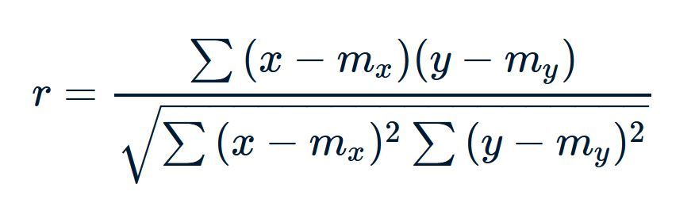

# Correlaciones


En este capítulo veremos como explorar la relación entre dos variables continuas. Estos análisis suelen ser utilizados para "darnos una idea" de la naturaleza de las relaciones, eso quiere decir que probablemente sólo sean utilizados como una puerta de entrada a análisis más sofisticados


La correlación es una medida estadística que expresa hasta qué punto dos variables están relacionadas **linealmente**. En otras palabras, cuan probable es que cambien conjuntamente con una tasa constante. Es una herramienta común para describir relaciones simples _sin hacer afirmaciones sobre causa y efecto_.


Uno de los aspectos por lo que no se pueden hacer afirmaciones de causa y efecto es que las correlaciones son _bivariadas_. Esto quiere decir que lo que estamos evaluando es como cambian dos variables **conjuntamente**, o sea, si se incrementa el valor de x, lo hace el de y o si incrementa y, lo hace x. No hay una hipótesis de dependencia y no sabes cual es causa de cual, sólo que se _mueven_ juntan


Veamos que quiere decir esto y exploremos algunas relaciones entre datos continuos. Vamos a volver a nuestro dataset "iris" entre el largo del pétalo ("petal.length"), y el ancho ("petal.width"), vamos a hacer lo mismo con el sépalo. ¿Recuerdan que una buena forma de **explorar** es hacer gráficos rápidos?

```{r}

flores<-iris


plot(flores$Petal.Length, flores$Petal.Width)


```
```{r}

plot(flores$Sepal.Length, flores$Sepal.Width)
```


¿Qué vemos?, pareciera que a medida que crece el largo del pétalo lo hace el ancho (¿o viceversa no?). Y este cambio lo hace con una tendencia más o menos lineal (describe una recta ascendente). Cuando miramos el sépalo no ocurre tan así, los puntos están muy separados y no es claro encontrar una tendencia. 


Entonces puede que ambas variables se muevan juntas, pero unas lo hacen con mucho más precisión (cuando se mueve una la otra lo hace casi casi igual), esto describe un conjunto de datos más o menos apretados con respecto a una recta. 

La dirección de la recta (su pendiente) da una idea de la naturaleza de asociación:

* **positiva**: la recta asciende indicando que x e y  aumentan en una proporción semejante, o disminuyen con la misma proporción, pero siempre en igual sentido

* **negativa**: le recta desciende de izquierda a derecha indicando que la relación entre las variables es _inversamente proporcional_: cuando una aumenta, la otra baja

La cercanía de los puntos a la recta imaginaria determina la _intimidad_ de la asociación, mientras más juntos estén los datos a esa recta la correlación es más **fuerte**. Veamoslo con un ejemplo gráfico

```{r echo=FALSE}
knitr::include_graphics("img/Correlation.png")
```

Pese a que este enfoque es muy intuitivo, y ya tenemos una idea de la asociación de las variables en el dataset flores. Deberíamos cuantificar para ello están los test de correlaciones. Los test de correlaciones sirven para poner en número a la respuesta de dos preguntas:

* ¿Cuál es la naturaleza de la asociación?: si es positiva o negativa, fuerte o débil. Se va a interpretar a partir de un estadístico **r** o **coeficiente de correlación**

* ¿Esta asociación existe o es fruto del azar?: se va a contestar con un test de hipótesis y un **p-valor**


Todas las correlaciones suponen una relación lineal, a esto la llamamos **supuesto de linealidad**, hay ocasiones en los que los datos no son lineales, en estos casos las correlaciones son erróneas


Empecemos con la primera de las correlaciones para entender.


## Coeficiente de correlación de Pearson

La correlación de Pearson (r), como toda correlación, mide una dependencia lineal entre dos variables (x e y). También se conoce como prueba de correlación paramétrica porque depende de la distribución de los datos. **Sólo puede utilizarse cuando x e y provienen de una distribución normal.**


Veamos porque, esta es la fórmula del coeficiente de correlación de Pearson

```{r echo=FALSE}

```


Como ven, parte (el denominador) de la fórmula es la _sumatoria de la multiplicación de la distancia de cada valor en x con la media de x y de cada valor de y con la media de y_. Es decir que para que esta fórmula tenga sentido las medias deberían ser buenos descriptores de la variable x y la variable y, por ende **ambas variables deben ser normales**

Analicemos un poco el término del denominador, es una sumatoria de multiplicaciones, en cada multiplicación se testea la distancia de un punto en las dos medias, o sea la posición de un individuo en ambos ejes. 
Si cada vez que un individuo adopta valores en x por encima de la media de x adopta valores en y por encima de la media de y, el término de la multiplicación da positivo. Además  si cada vez que un individuo adopta valores en x por debajo de la media de x adopta valores en y por debajo de la media de y, el término de la multiplicación también da positivo (porque menos por menos, es más). En la sumatoria si predominan este tipo de términos positivos el valor de r **va a ser positivo**, en otras palabras _cada vez que subió x, subió y; y cada vez que bajó x bajó y_. Por el contrario si cada x por encima de la media se asocia con una y por debajo de la media, da negativo (menos por mas, es menos);  y cada x por debajo de la media tiene una y por encima de la media (mas por menos es menos), el valor de r va a ser **negativo**

En definitiva: 

* **el signo del estadístico _r_** nos indica la dirección de la relación 

* **el número absoluto**, la fuerza de la relación. Mientras más cercana a 1 más fuerte y más cercana a 0, más inexistente.

* **test de hipótesis**, nos permite obtener un p-valor que sopesa la posibilidad de que esa relación sólo sea fruto del azar (p<0.05, rechaza la hipótesis del azar)


¿Nos animamos con un ejemplo?:


```{r}

cor.test(flores$Petal.Length, flores$Petal.Width, 
                    method = "pearson")
```
En este caso obtuvimos un _coeficiente r_ de 0.96, una correlación muy fuerte y un _p-valor_ < 2.2e-16 lo que indica que no es fruto del azar. Algo que intuíamos viendo el gráfico.

Veamos que pasa con los sépalos

```{r}

cor.test(flores$Sepal.Length, flores$Sepal.Width, 
                    method = "pearson")
```
La correlación no es significativa (eso quiere decir que es muy probable que la correlación no exista o sea fruto del azar), si miramos su coeficiente también es muy bajo o sea que si existiera también sería una correlación muy muy débil.


### Supuestos del coeficiente de correlación de Pearson

Los supuestos del coeficiente de correlación de Pearson son los siguientes: nivel de medición, pares relacionados, ausencia de valores atípicos, normalidad de las variables, linealidad y homocedasticidad.


* **Nivel de medición** se refiere a cada variable. Para una correlación de Pearson, cada variable debe ser continua.  Si una o ambas variables son de medición ordinal, entonces se podría realizar una correlación de Spearman en su lugar.
 
* **Pares relacionados** se refiere a los pares de variables. Cada participante u observación debe tener un par de valores. Así, si la correlación es entre el peso y la altura, cada observación utilizada debe tener un valor de peso y otro de altura.

* **Normalidad** ambas variables tienen que tener una distribución aproximada a la normal 

* **Ausencia de valores atípicos** se refiere a no tener valores atípicos en ninguna de las variables. La presencia de un valor atípico puede sesgar los resultados de la correlación, ya que la línea de mejor ajuste formada por la correlación se desvía demasiado en una u otra dirección.  Normalmente, un valor atípico se define como un valor que está a 3,29 desviaciones estándar de la media
 
* **La linealidad y la homocedasticidad** se refieren a la forma de los valores formados por el gráfico de dispersión. Para la linealidad, debe formarse una relación de "línea recta" entre la variable.  Si se traza una línea entre todos los puntos que van de izquierda a derecha, la línea debe ser recta y no curva.  La homocedasticidad se refiere a la distancia entre los puntos a esa línea recta. La forma del gráfico de dispersión debe tener forma de tubo. Si la forma es cónica, la homocedasticidad no se cumple.


## Correlaciones no paramétricas de Kendal y Spearman

Mientras se cumplan los supuestos de linealidad, nivel de medición, pares relacionados y ausencia de valores atípicos (estos últimos siempre pueden ser removidos), se puede realizar una correlación. El supuesto de normalidad es una condición infranqueable para calcular el coeficiente _r_ de Pearson, sin embrago existen otros métodos cuando la normalidad no se cumpl:

* **Coeficiente de correlación de rangos de Kendall** o el estadístico _tau_ de Kendall se utiliza para estimar una medida de asociación basada en rangos. Esta prueba puede utilizarse si los datos no proceden necesariamente de una distribución normal bivariada.

** **Coeficiente rho de Spearman** también se utiliza para estimar una medida de asociación basada en el rango y también es válida en casos de no cumplirse la normalidad.


El cálculo de ambas es muy sencillo:


```{r}
cor.test(flores$Petal.Length, flores$Petal.Width, 
                    method = "kendall")


```
Como ven,tanto los coeficientes como los p-valores difieren entre las técnicas, ya que estas últimas tienen menos sensibilidad al cambio (pero también menos vulnerabilidad a la pérdida de normalidad)


Hagamos un ejercicio

## <i class="fa fa-wrench" aria-hidden="true"></i> Ejercicios:

Vamos a instalar un paquete nuevo con un dataset, el paquete se llama "datasauRus" (búsquenlo e instalenlo), y vamos a utilizar una base que se llama "datasaurus_dozen_wide"


```{r}
library(datasauRus)

data<-datasaurus_dozen_wide

```

Vamos a calcular dos correlaciones, una entre "away_x" y "away_y", y otra entre "dino_x" y "dino_y". No olviden chequear normalidad antes de decidir cada método.  

## <i class="fa fa-cog" aria-hidden="true"></i> Respuestas:

Bueno seguramente todos han hecho algo más o menos así:

**Chequeamos la normalidad

```{r}
# (sólo haremos boxplots para no hacerla muy larga)

boxplot(data$away_x)
boxplot(data$away_y)
boxplot(data$dino_x)
boxplot(data$dino_y)

```

**Y vamos con Pearson

```{r}
cor.test(data$away_x, data$away_y, 
                    method = "pearson")
```
```{r}
cor.test(data$dino_x, data$dino_y, 
                    method = "pearson")
```

Ambas correlaciones son prácticamente igual... pero


```{r echo=FALSE}
knitr::include_graphics("img/emosido.jpg")
```


¿Por qué?, hagamos un gráfico de cada una de las correlaciones.

```{r}
plot(data$away_x, data$away_y)
```
```{r}
plot(data$dino_x, data$dino_y)
```

¡No chequeamos el supuesto de linealidad! Ninguna de estas variables, pese a ser normales, cumplen una relación de linealidad, por ende nuestras correlaciones son erróneas. 


## Matriz de correlación

En ocasiones como investigadores nos enfrentamos con bases enormes (cientos y cientos de variables). Una forma muy útil de enfrentar a estos leviatanes es empezando por tener un pantallazo general de las relaciones entre las variables. Para ello es posible que nos interese estudiar todas las correlaciones que las variables tienen entre sí, esta tarea se hace muy sencilla cuando creamos una **matriz de correlaciones**. Estas "matrices" son tablas de doble entradas con las variables en el encabezado y en la primera fila, las celdas que determinan la intersección contienen el coeficiente de correlación entre las dos variables.

Veamos como es esto con un ejemplo:

Vamos a volver a utilizar la base "mtcars" para recordar tiene las siguientes variables:

* _mpg_  Millas/(US) galón

* _cyl_  Número de cilindros

* _disp_ Desplazamiento (cu.in.)

* _hp_ Caballos de fuerza

* _drat_ Relación del eje trasero

* _wt_ Peso (1000 lbs)

* _qsec_ Tiempo de 1/4 de milla

* _vs_ Motor (0 = en forma de V, 1 = recto)

* _am_ Transmisión (0 = automática, 1 = manual)

* _gear_ Número de marchas adelante

* _carb_ Número de carburadores

Vamos a tomar de esta base sólo las variables continuas. 

Para computar una matriz de correlaciones directamente vamos a usar la  función **cor()**


```{r, message=FALSE, warning=FALSE}
library(dplyr) #la active para poder seleccionar variables

autos<-mtcars %>% select(mpg, disp, hp, drat, wt, qsec )


cor(autos)
```
Ahora podemos saber de un vistazo que el desplazamiento, el peso y los caballos de fuerza se relacionan inversamente con el tiempo que el auto tarda en alcanzar un 1/4 de milla (lógico no, parecen determinantes de la velocidad). Pero así como exploramos una relación podemos explorar muchísimas más. Este enfoque permite ver un bloque de datos e ir descubriendo asociaciones. Muy útil si se sale "a pescar" ;)

Sin embargo la matriz de correlaciones sirve para "re pensar la base", no para reportar, ya que como vimos no tiene por detrás una hipótesis de causalidad. En cambio es muy útil para señalar, donde ir a buscar.


Esta tabla que hemos creado son muchas correlaciones de Pearson, ¿pero que p-valor tienen? Para eso también podemos construir una matriz de p-valores


Para esto vamos a usar el paquete **Hmisc**

```{r, message=FALSE, warning=FALSE}
library("Hmisc")
 rcorr(as.matrix(autos))
```
Ahora tenemos dos tablas, una con los coeficientes y otras con el p valor, para divertirnos...bueno diviértanse.

Sí sí, leer tablas es casi el antónimo de diversión, por eso vamos a ver si podemos ver todo esto en un gráfico

### Visualización de matriz de correlaciones, Corrplot 

La matriz de correlaciones puede visualizarse como un gráfico, que además de más prolijo, permite dar un pantallazo aún más rápido a las relaciones, a ese gráfico lo llamamos **correlation plot** o **corrplot** (para los amigos).

Para ello vamos a instalar el paquete **corrplot**

```{r, warning=FALSE, message=FALSE}

library(corrplot)
library(Hmisc)#porque tiene la función de la correlación

co<- rcorr(as.matrix(autos)) #computamos las matrices pero las guardamos porque las vamos a usar
#el objeto co es una lista que tiene la matriz de coeficientes (r), las de p(p) y el n  

corrplot(co$r) #le pedimos que grafique las correlaciones

```


Ahora tenemos un gráfico que nos muestra el tamaño de la relación en burbujas y el valor de r en una escala de colores, si quisiéramos que reúna las correlaciones mas importantes por un lado, podríamos pedirles que cree "clusters" agregando argumentos.

```{r}
corrplot(co$r, order = "hclust")
```
 
 Re ordenó el gráfico para que las asociaciones positivas se vean juntas y las negativas también.
 
 Pero, sabemos que no todas estas asociaciones son significativas, el valor de r importa poco si la asociación es por el azar, sería bueno removerlo. Vamos a complejizar este gráfico
 
 
```{r}
corrplot(co$r, #le digo donde están los coeficientes
         order="hclust", #le pido que los ordene por clusters
         p.mat = co$P, #le digo donde estan las p 
         sig.level = 0.01, #que valor de p quiero usar como pto de corte 
         insig = "blank" #le digo que hacer con los no sig, "déjalo en blanco"
         )
```
 
Ahora podemos estudiar mucho mejor todas las asociaciones. este tipo de visualizaciones es muy útil cuando las bases son excesivamente grandes en variables, permitiendo al estadístico, "ver de un vistazo" donde están los rojos y los azules. 

