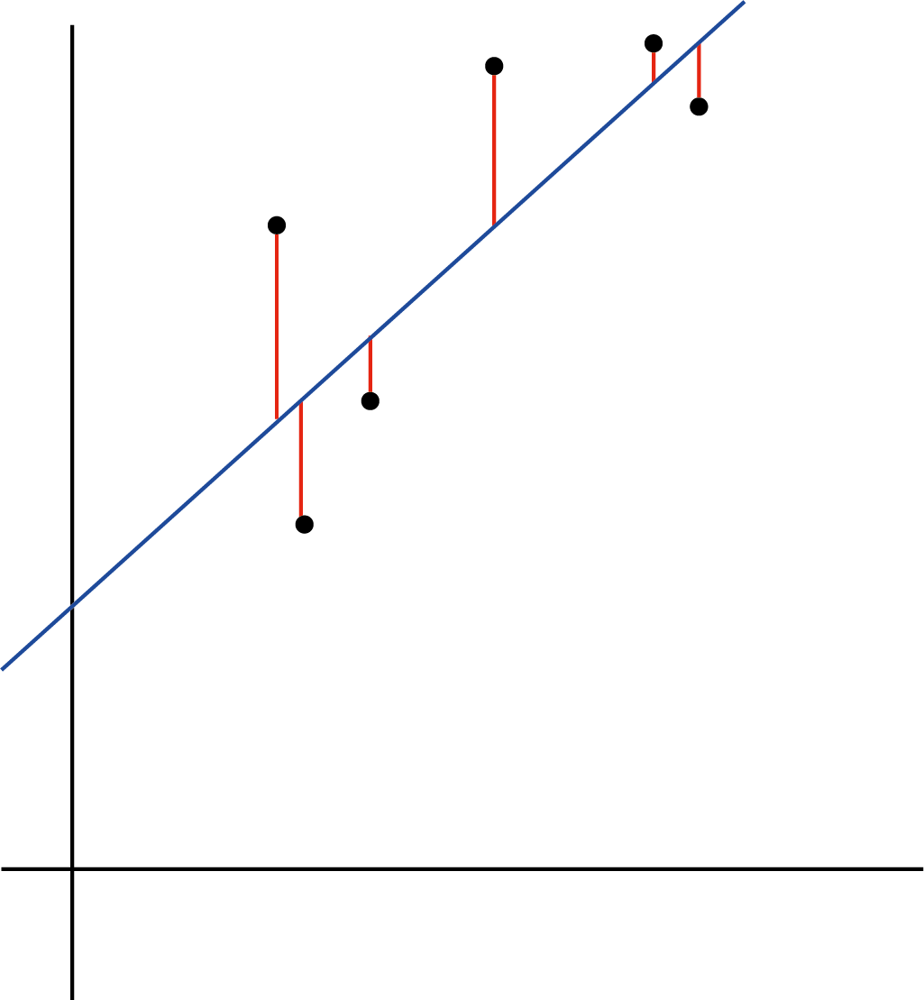

# Regresión y regresión lineal


En esta sección veremos algunos conceptos centrales sobre el hecho de regresionar. Veremos la regresión lineal como ejemplo de una forma de explicar una relación lineal entre variables continuas


## Concepto de regresión 

Un análisis de regresión es un conjunto de procesos estadísticos para estimar las relaciones entre una variable dependiente (a menudo denominada variable de "resultado"  o "y") y una o más variables independientes (a menudo denominadas "predictores", "covariables", "variables explicativas" , "características" o sencillamente "x"). En toda regresión se **ajusta** una función que es capaz de explicar (aunque sea en parte) el comportamiento de la dependiente _en función de_ la independiente. Cuando esa función es una función lineal, la regresión se llama **regresión lineal** pero son posibles tantas regresiones como funciones existen, cada una tiene un uso particular y sirve para describir una relación particular de datos.

El análisis de regresión se utiliza principalmente para dos fines:

* ***Inferir relaciones causales*** entre las variables independientes y dependientes. Al describir una variable  y en función del comportamiento de una x, estimamos que x es causa de y. Al testear la significancia de esta relación estamos viendo la probabilidad de que esta sea posible, la causalidad de esa forma esta siendo medida indirectamente.

* **Predicción y el pronóstico**, al construir una función (es decir, una fórmula que explica como calcular y en función de x), construimos un _modelo predictivo_, eso quiere decir que podemos incorporar nuevos valores de la variable independiente a la formula y obtener nuevos valores de la dependiente, lo que es equivalente a decir predecir que valores tomara y en función de nuevos valores de x. 


Es importante destacar que las regresiones por sí mismas sólo revelan las relaciones entre una variable dependiente y un conjunto de variables independientes en un conjunto de datos fijo. Para utilizar las regresiones para la predicción o para inferir relaciones causales, respectivamente, un investigador debe justificar cuidadosamente por qué las relaciones existentes tienen poder predictivo para un nuevo contexto o por qué una relación entre dos variables tiene una interpretación causal. Esto último es especialmente importante cuando los investigadores esperan estimar las relaciones causales utilizando datos observacionales


## Regresión lineal

Una regresión lineal es un modelo estadístico que analiza la relación entre una variable de respuesta (a menudo llamada y) y una o más variables y sus interacciones (a menudo llamadas x o variables explicativas). Este tipo de relaciones son muy intuitivas, las establecemos en nuestra cabeza todo el tiempo, por ejemplo, cuando calculamos la edad de un niño en función de su altura, asumimos que cuanto mayor sea, más alto será. Otro ejemplo es estimar el tiempo de viaje restante si de Córdoba a Rosario (mitad del viaje a Buenos Aires), demoramos 3 horas, en 6 habremos llegado a Buenos Aires. 


La regresión lineal es uno de los modelos estadísticos más básicos que existen, sus resultados pueden ser interpretados por casi todo el mundo, y existe desde el siglo XIX. Esto es precisamente lo que hace que la regresión lineal sea tan popular. Es sencilla y ha sobrevivido durante cientos de años. 

La regresión lineal sirve para **explicar el resultado de una variable dependiente continua** en función de una o más variables independientes continuas o categóricas. Cuando explicamos una variable en función de una sola la llamamos **regresión lineal simple** y cuando lo hacemos en función de un conjunto las llamamos **regresión lineal multivariante**


### Regresión lineal simple

En esta sección vamos a ver como ajustar e interpretar un modelo de regresión lineal de sólo un par de variables usando los datos de la base "mtcars".


Supongamos que queremos estudiar la relación entre el consumo de combustible de un auto (mpg) con los caballos de fuerza (hp)

Podemos hacerlo con un gráfico de dispersión y una correlación

```{r}
autos<-mtcars

plot( autos$hp, autos$mpg)
cor.test(autos$hp, autos$mpg, method = "pearson")
```
Vemos que hay una asociación significativa con sentido negativo, a mayor potencia mas consumo (o viceversa). Recordemos que las correlaciones no tienen una hipótesis de dependencia. 
Ahora si nosotros quisiéramos _explicar el consumo en función de la potencia_, ya tenemos una **hipótesis de causalidad** y deberíamos hacer con una regresión lineal.

Lo haríamos de esta forma:

```{r}
r_lineal<-lm(formula = mpg ~ hp, data=autos)

summary(r_lineal)
```

Presten atención que estimamos una función lineal, que le dijimos a R sospechamos es así:

> formula = mpg ~ hp

lo que se lee _mpg en función de hp_, o sea que estamos pidiendo que cree algo así

> mpg= "ordenada al origen (b0)" + "coeficiente(b1)"x hp

Y es lo que R nos dió:

veamos que hay una tabla de coeficientes, cada uno tiene un  estimador, un termino de error, un estadístico y un p-valor

El p-valor dice que ese coeficiente explica algo de la variabilidad de mpg y no es fruto del azar. ¿Como interpretamos el resto?

El estimador de "Intercept" es la ordenada al origen o b0 y el estimador de hp es b1.

Si quisíeramos reconstruir la fórmula deberíamos tener algo así

> mpg= 30.09 -0.068 x hp


Si  por ejemplo quisiéramos **predecir** cuantas millas haría con un galón un vehículo de 100 caballos de fuerza, basta con incorporar el dato a la fórmula


> mpg= 30.09 -0.068 x **100** =23.29


Hicimos una predicción.

Cambien podríamos sacar otras conclusiones:

1. Las millas por galón dependen significativamente del número de caballos de fuerza

2. Las millas por galón descienden 0.068 por cada caballo de fuerza añadido


Como ven la interpretación de la regresión y sus coeficientes e es muy sencilla


### Regresión lineal múltiple

Nuestro modelo funciona para predecir, pero como todo en este mundo real, no obedece a una sola causa, y las causas se combinan para determinar consecuencias. Entonces tal vez es útil explicar las millas por galón con más de un factor

Supongamos que además de los caballos de fuerza, el peso del auto debe influir en el gasto (debe ser más costoso mover un auto más pesado). Entonces vamos a explicar la variable "millas por galón" con dos coeficientes los "caballos de fuerza" y el "peso" del auto. A esto lo llamamos una **regresión lineal múltiple.


```{r}

r_lineal<-lm(formula = mpg ~ hp + wt, data=autos)

summary(r_lineal)


```
Como ven creamos otro término, que también es significativo, o sea que ahora estamos explicando la variación en "millas por galón" con esta fórmula:


> mpg= 37.22 -0.031 x hp -3.88 x wt


Esta interpretación es un poco más compleja ahora podemos decir que:

1. millas por galón se reduce 0.031 por cada caballo de fuerza **entre autos de igual peso**

2. el peso reduce 3.88 millas por galón por cada 100 libras siempre y cuando **no se modifique la potencia del auto**

Ahora estamos explicando una variable en función de dos o podríamos decir explicando una en función de la otra, ajustando por una tercera (o covariable). Fíjense que el poder de los coeficientes cambia ya que es necesario que la otra variable este estable.

También es posible agregar variable categórica o dicotómicas. En la unidad de comparaciones de variables continuas vimos que el tipo de motor ("vs") influía en el consumo, agreguemoslo a la fórmula sabiendo que es una variable dicotómica  donde 0=en "v" y 1=recto 


```{r}

r_lineal<-lm(formula = mpg ~ hp + wt+ vs, data=autos)

summary(r_lineal)


```
El tipo de motor no agrega diferencias significativas, pero por un momento supongamos que sí.

Si así lo fuera tendríamos ahora dos fórmulas:

* una fórmula para los motores en v (donde la variable vs es 0):

> mpg= 35.38 -0.025 x hp -3.78 x wt + 1.36 x vs

como vs es igual a cero la formula sería

> mpg= 35.38 -0.025 x hp -3.78 x wt


* una fórmula para el motor recto  (donde la variable vs = 1)

> mpg= 35.38 -0.025 x hp -3.78 x wt + 1.36 x 1

o mas correctamente:

> mpg= 36.74 -0.025 x hp -3.78 x wt 


### Parámetros de corrección del modelo

En las secciones anteriores construimos tres modelos distintos para explicar la misma variable, ¿pero cual de esos es un mejor modelo? Veremos varios conceptos para diagnosticar esta situación

#### Residuos

Una buena forma de comprobar la calidad del ajuste del modelo es observar los residuos o las diferencias entre los valores reales y los valores predichos. Miremos esta gráfica, la línea recta (de ajuste) representa los valores que son predichos por la fórmula, mientras que los puntos la verdadera posición. La línea vertical roja que va de la línea recta al valor de los datos observados es el residuo.O sea la variación entre la observación y su predicción

```{r echo=FALSE}

```

Si una recta ajusta "bien" a los datos, la suma de los residuos será aproximadamente cero o lo más baja posible, ya que hay tantos errores, por arriba de la recta como por debajo.  En la vida real, la mayoría de los casos no seguirán una línea perfectamente recta, por lo que se esperan residuos. En el resumen en R de la función lm, se pueden ver estadísticas descriptivas sobre los residuos del modelo. Veamos nuestro ejemplo:


```{r}

r_lineal<-lm(formula = mpg ~ hp + wt, data=autos)

summary(r_lineal)


```
Los residuos tienen una mediana muy cercana a 0, no es la mejor aproximación, pero no es tan mala. 


#### Test de bondad de ajuste

Una medida muy utilizada para comprobar la calidad del modelo es el coeficiente de determinación o R². Esta medida se define por la proporción de la variabilidad total explicada por el modelo de regresión.


```{r echo=FALSE}
knitr::include_graphics("img/reg.jpg")
```

Su lectura es muy intuitiva
miremos el funcionamiento de nuestros tres modelos 

* ***modelo 1*** lm(formula = mpg ~ hp, data = autos): Multiple R-squared:  0.6024, Adjusted R-squared:  0.5892 

* ***modelo 2*** lm(formula = mpg ~ hp + wt, data = autos): Multiple R-squared:  0.8268, Adjusted R-squared:  0.8148 

* ***modelo 3*** lm(formula = mpg ~ hp + wt + vs, data = autos): Multiple R-squared:  0.8329, Adjusted R-squared:  0.815 


Como vemos el primer modelo sólo explica el 60% de la variación en mpg y el segundo y el tercero mas del 83%. La medida de R² se ve influenciada por el numero de variables (sean estas significativas o no) por eso sube del modelo dos al tres, para ello es que existe el R²ajustado, que corrige eso. Si miráramos ese el modelo 2 y 3 son exactamente iguales y deberíamos decidirnos por el primero ya que es más simple de explicar


