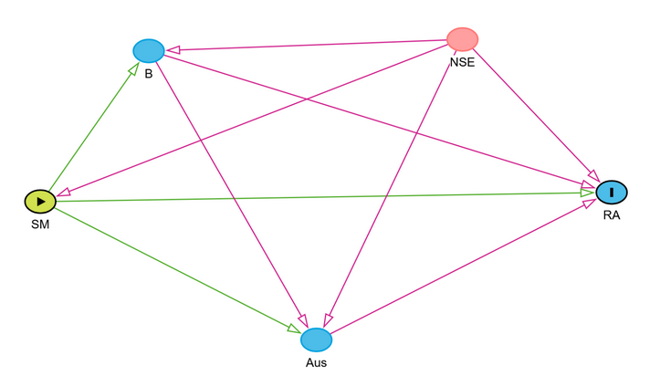

# Grafos acíclicos dirigidos (DAGS)

```{r}
#| echo: false

source("../R/_common.R")
```

Los grafos acíclicos dirigidos[^dags-1] son una herramienta para representar visualmente las relaciones causales presentes en nuestro diseño experimental, ni más ni menos. Estos nos permiten representar gráficamente las variables aleatorias involucradas en un proceso que queremos estudiar y las relaciones causales entre ellas. Además, existen herramientas que, a partir de características de los DAGS, nos permiten decidir cuál es el modelo estadístico cuyo parámetro será una estimación del efecto causal que queremos estudiar.

[^dags-1]: A partir de ahora DAGS, del inglés *Directed acyclic graphs*.

## Definiciones, características y ejemplos

Un DAG es una representación gráfica de una cadena de efectos causales. Los nodos -los circulitos o cuadraditos que vamos a ver más adelante- representan variables aleatorias y las flechas que los unen indican la dirección de la relación causal entre ellas.  Por ejemplo, pensemos que queremos estudiar el efecto de tomar una aspirina en la intensidad de nuestro dolor de cabeza cuando nos duele la cabeza. Tenemos dos variables: Aspirina (**A**) e Intensidad del dolor (**I**). Esta relación la podemos expresar en el siguiente DAG:

```{r}
#| echo: false
#| fig-cap: "DAG que representa la relación entre tomar una aspirina (A) y la intensidad del dolor (I)."
#| fig-width: 4
#| fig-align: center

dag <- dagitty::dagitty('dag {
A [exposure,pos="-2.200,1.5"]
I [outcome,pos="1.400,1.5"]
A -> I
}')

tidy_dag <- tidy_dagitty(dag)
ggdag(tidy_dag) +
  theme_dag()
```

::: {.callout-warning icon="false"}
## DAGS en R

Para realizar los DAGS que aparecen en este capítulo utilizamos la librería *{ggdag}*. Para esto, primero debemos hacer un esquema de nuestro DAG en [Daggity](https://www.dagitty.net/dags.html#) y luego copiar parte del código en la definición de nuestro DAG en **R**. En el desarrollo del capítulo utilizaremos algunas de las herramientas de *{ggdag}*, varias de las cuales pueden encontrar en [este tutorial](https://ggdagcand3.netlify.app/?panelset1=using-dagitty.net2#1). Sin embargo, para una revisión pormenorizada de sus funciones recomendamos repasar la [documentación de este mismo](https://r-causal.github.io/ggdag/).
:::

¿Así de simple? Sí y no. ¿Qué pasa cuando las cosas se empiezan a complicar? Pensemos en el clásico ejemplo del mantra "correlación no implica causalidad": la relación entre venta de helados (**Hel**) y accidentes por mordidas de tiburón en Australia(**Sh**). Si nosotros planteáramos que el aumento de la venta de helados causa el aumento de los accidentes no tendría mucho sentido, ¿no? Entonces, ¿qué está pasando? ¿qué pinta tiene el DAG? Bueno, como ya comentamos cuando hablamos de correlación, en este caso lo que tenemos es una causa común a ambos fenómenos que, a modo de simplificar, la podríamos resumir como la temperatura (**T**). Entonces, cuando sube la temperatura sube la venta de helados, pero también los accidentes por mordidas de tiburón. Una posible relación causal entre ambas variables podría ser esta:

```{r, fig.height=4}
#| echo: false
#| fig-cap: "DAG que representa la relación entre las ventas de helados (Hel), los accidentes por mordida de tiburón (Sh) y la temnperatura (T) en las playas de Australia."
#| fig-align: center

dag <- dagitty::dagitty('dag {
Hel [exposure,pos="-1.50,1.5"]
Sh [outcome,pos="1.500,1.5"]
T [pos="0,0"]
T -> Hel
T -> Sh
Hel -> Sh
}')

tidy_dag <- tidy_dagitty(dag)
ggdag(tidy_dag) +
  theme_dag()
```

Todo muy lindo, pero ¿para qué?

## El criterio de las puertas de atrás

Una de las principales ventajas de plantear un DAG para estudiar una relación causal es que nos permite ajustar un modelo en el cual uno de sus parámetros es un estimador de la relación causal que queremos estudiar. Empecemos planteando los caminos posibles para llegar desde **Hel** a **Sh**. En este caso serían dos:

$$
\begin{array}
_Hel    \longrightarrow Sh \\
Hel \longleftarrow T \longrightarrow Sh
\end{array}
$$

El primero es lo que se llama un *camino directo* y es la relación causal que queremos estudiar. Por otro lado, el segundo ($Hel \leftarrow T \rightarrow Sh$) es lo que se llama una *puerta de atrás* y lo identificamos porque, al menos en alguna de sus relaciones causales, la flechita va para la izquierda. Identificar estos caminos *puerta de atrás* es una parte fundamental de controlar la variabilidad espúrea en nuestras relaciones causales. En particular, en este ejemplo tenemos un claro confusor y lo que queremos es controlar por **T**.

Simulemos esta relación y veamos que pasa:

```{r}
#| echo: true
set.seed(1414)
helados <- tibble(
  Temperatura = rnorm(1000, 20, 5),
  Helados     = 1 + 1*Temperatura + rnorm(1000),
  Ataques     = 1 + 2*Temperatura + 0*Helados + rnorm(1000)
)
```

Veamos qué **Temperatura** es una variable aleatoria con distribución normal con media $20$ y desviación estándar $5$. Tomamos $1000$ muestras de esta y después generamos las variables **Helados** y **Ataques** como una combinación lineal de **Temperatura** más un error aleatorio de media $0$ y desviación estándar $1$. En la definición de **Ataques** podemos ver explícitamente que la influencia de **Helados** en **Ataques** es $0$. Sin embargo, miremos la relación que existe entre ambas variables:

```{r}
#| echo: false
#| message: false
#| fig-cap: "DAG que representa la relación entre las ventas de helados (Hel), los accidentes por mordida de tiburón (Sh) y la temperatura (T) en las playas de Australia."
#| fig-width: 6
#| fig-align: center
helados  %>% ggplot(aes(x = Helados, y = Ataques)) +
  geom_point(alpha = .2) +
  geom_smooth(color = "red", method = "lm", se = F) +
  theme_bw()
```

Vemos que ambas variables están altamente correlacionadas, de hecho, su *r* de Pearson vale `r round(cor(helados$Ataques, helados$Helados), 3)`. Sin embargo, nosotros sabemos que esta correlación es espúrea, que no hay una relación causal entre ventas de helados y ataques de tiburón, y que algo tenemos que hacer. Seguramente habrán escuchado muchas veces que lo que tenemos que hacer es "controlar" por la temperatura, lo que en el contexto de la regresión lineal no significa otra cosa que agregar **Temperatura** como una covariable. Ajustemos dos modelos de regresión, uno con la **Temperatura** como covariable y otro sin ella, y comparemos las estimaciones de los efectos causales ($\hat\beta_H$)[^dags-2] :

[^dags-2]: Donde $\epsilon_i$ y $\tau_i$ son los términos de error i.i.d. distribuidos normalmente con $\mu=0$ y $\sigma=1$.

$$
\begin{array}
_lm_1&:& Ataques_i = \alpha + \beta_{H} Helados_i + \epsilon_i \\
lm_2&:& Ataques_i = \alpha + \beta_{H} Helados_i +  \beta_{T} Temperatura_i + \tau_i
\end{array}
$$ En la siguiente tabla podemos ver las estimaciones de $\hat\beta_H$ para cada uno de los modelos:

```{r, results='asis'}
#| echo: false
#| label: tbl-helados
#| tbl-cap: "Estimaciones de los parámetros de los modelos lm1 y lm2 definidos anteriormente."
lm_1 <- lm(Ataques ~ Helados, helados)
lm_2 <- lm(Ataques ~ Helados + Temperatura, helados)
stargazer(lm_1,lm_2, type = "html",
          column.labels = c("Sin controlar por Temp.", 
                            "Controlando por Temp."))
```

Como podemos ver, si no controlamos por **Temperatura** la estimación de $\hat\beta_H$ tiene un valor cercano a $1$, mientras que si controlamos por **Temperatura** tiene un valor cercano a $0$, que es el valor "real" del parámetro $\beta_H$. Todo muy lindo pero, ¿qué tiene que ver esto con los DAGS? Bueno, cuando planteamos un DAG existe algo que se llama *el criterio de las puertas traseras* que dice que para estimar el efecto causal que nos interesa debemos "cerrar" todas las puertas traseras que conectan la causa y elefecto. Y "cerrar", en este contexto, es simplemente controlar por la variabilidad de alguna de las variables presentes en la *puerta trasera*. En este caso, al controlar por **Temperatura** cerramos la única puerta trasera y, por lo tanto, estimamos el verdadero efecto causal que nos interesa.

<!-- ## Causalidad sin correlación -->

<!-- Muchas veces escuchamos que "correlación no implica causalidad" pero ¿Causalidad implica correlación? Respondamos esta pregunta con un ejemplo. Supongamos que hay una relación causal entre el ingreso (**I**) y la satisfacción (**S**), a más ingreso más satisfacción.  -->

## *Colliders*

Hasta ahora tuvimos que lidiar casi únicamente con *confusores*, pero existe otro tipo de variables en el contexto de un camino causal que se denomina *collider*. Veamos un ejemplo y apliquemos *el criterio de las puertas traseras*. Pensemos el siguiente ejemplo. Supongamos que queremos estudiar el efecto del factor de riesgo edad (**Age**) en la infección de COVID-19 (**Cov**), pero lo hacemos a través de datos voluntarios recabados por una aplicación móvil (**App**). Un DAG muy simplicado que podríamos plantear es el siguiente:

```{r, fig.height=4}
#| echo: false
#| fig-cap: "DAG que representa la relación entre la edad (Age), la infección por COVID-19 (Cov) y el uso de la aplicación móvil de autoreporte (App)."
#| fig-align: center

dag_cov <- dagitty::dagitty('dag {
Age [exposure,pos="-1.50,1.5"]
Cov [outcome,pos="1.500,1.5"]
App [pos="0,0"]
Age -> Cov
Age -> App
Cov -> App
}')

tidy_dag <- tidy_dagitty(dag_cov)
ggdag(tidy_dag) +
  theme_dag()
```

Ya que sabemos que la edad tiene un efecto en el uso de aplicaciones móviles y, podemos suponer, que las personas que se infectan de COVID-19 tienden a reportar más sus datos en la aplicación. Ahora veamos los caminos:

$$
\begin{array}
_Age    \longrightarrow Cov \\
Age \longrightarrow App \longleftarrow Cov
\end{array}
$$ 

Repitamos el ejercicio de simulación que utilizamos en el ejemplo de los confusores, solo que esta vez **Cov** es una variable dicotómica y, por lo tanto, debemos muestrearla de una distribución Bernoulli[^dags-3]:

[^dags-3]: Para más detalles sobre como simular una variiable con distribución Bernoulli (binomial con $n=1$) podemos ver el siguiente [link](https://library.virginia.edu/data/articles/simulating-a-logistic-regression-model).

```{r}
#| echo: true
set.seed(123)
covid <- tibble(
  Age   = rnorm(1000, 40, 10),
  Covid = rbinom(1000, 1, prob = 1/(1+exp(10-.25*Age))),
  App   = 1 - 1*Age + 1*Covid +rnorm(1000)
)
```

Puede verse que la verdadera relación entre **Cov** y **Age**, en términos de parámetros de una regresión logística, es $0.25$. Veamos como se ve la edad de los infectados y no infectados:

```{r}
#| echo: false
#| fig-cap: "Infectados y no infectados de COVID-19 en función de la edad."
#| fig-width: 6
#| fig-align: center
#| warning: false
#| message: false
covid  %>% 
  mutate(Covid = if_else(Covid==1, "Infectado", "No infectado")) %>%
  ggplot(aes(x = Covid, y = Age)) +
  geom_jitter(alpha = .2, width =.2) +
  stat_summary(color = "red") +
  theme_bw()
```

Según el *criterio de las puertas traseras* deberíamos controlar por **App** para así cerrar ese camino. Ajustemos estas dos regresiones logísticas y veamos sus estimaciones de los parámetros:

$$
\begin{array}
_glm_1&:& logit(Covid_i) = \alpha + \beta_{Age} Age_i + \epsilon_i \\
glm_2&:& logit(Covid_i) = \alpha + \beta_{Age} Age_i + \beta_{App} App_i + \epsilon_i
\end{array}
$$

En la siguiente tabla podemos ver las estimaciones de $\hat\beta_{Age}$ para cada uno de los modelos:

```{r, results='asis'}
#| echo: false
#| label: tbl-covid
#| tbl-align: center
#| tbl-cap: "Estimaciones de los parámetros de los modelos glm1 y glm2 definidos anteriormente."
glm_1 <- glm(Covid ~ Age, family = "binomial", data = covid)
glm_2 <- glm(Covid ~ Age + App, family = "binomial", data = covid)
stargazer(glm_1,glm_2, type = "html",
          column.labels = c("Sin controlar por App", 
                            "Controlando por App"))
```


La estimación del efecto correcta sería la del modelo sin controlar, pero ¿por qué pasa esto? Cuando tenemos un *collider* podemos considerar ese camino como *cerrado por defecto* y, al controlar por él, ese camino se abre. Entonces, si bien teníamos dos posibles caminos causales, solo uno estaba abierto y no necesitábamos controlar por **App** Esto se debe a **App**, App al no causar ninguna de mis otras dos variables, ese camino causal está cerrado. Para reflexionar un poco en por qué ese camino se abre al controlar por un *collider* les recomendamos las reflexiones del capítulo 8 de [@huntington2021effect].

::: {.callout-tip icon="false"}
## El criterio de las puertas traseras

En resumen, el **criterio de las puertas traseras** nos dice que para estimar la relación causal principal debemos cerrar todas las *puertas traseras* (en otras palabras, todos los caminos causales entre la causa y el efecto que queremos estudiar que tienen alguna flecha hacia atrás). Recordemos que para cerrar esos caminos debemos controlar por alguna de las variables que lo componen, lo que en la práctica significa agregarla como covariable a nuestro modelo estadístico. Por último, recordemos que cuando tenemos un *collider* el camino está cerrado y al controlar por él lo abrimos.
:::

## Un ejemplo
Analicemos un ejemplo que tiene un poquito de todo. En este queremos estudiar el efecto de las vitaminas (**Vits**) en los defectos de nacimiento (**BD**). Además de esta relación, podemos identificar otras variables que podrían influir en ellas: la dificultad para concebir un embarazo (**DC**); el cuidado pre-natal (**PNC**); el status socioeconómico (**SES**); y aspectos genéticos (**Gen**). El flujo de causalidad propuesto entre las variables puede verse representado en el siguiente DAG[^dags-4]:

[^dags-4]: Recuerden que el diagrama causal no es un problema estadístico, sino que se plantea previo a cualquier consideración estadística, a partir del conocimiento del dominio que tenemos.

```{r, fig.height=4}
#| echo: true
#| fig-cap: "DAG que representa la relación causal entre las vitaminas y los defectos de nacimiento."
#| fig-align: center
dag_Vit <- dagitty::dagitty('dag {
                          BD [outcome,pos="0.109,0.631"]
                          DC [pos="0.117,-1.517"]
                          Gen [pos="0.850,-0.411"]
                          PNC [pos="-0.837,-0.433"]
                          SES [pos="-1.839,-1.468"]
                          Vits [exposure,pos="-1.844,0.645"] 
                          DC -> PNC
                          Gen -> BD
                          Gen -> DC
                          PNC -> BD
                          PNC -> Vits
                          SES -> PNC
                          SES -> Vits
                          Vits -> BD
                          }')

tidy_dag <- tidy_dagitty(dag_Vit)
ggdag(tidy_dag) +
  theme_dag()
```

Si tenemos todos estos datos observados y queremos estimar el efecto causal de las vitaminas en los defectos de nacimiento, lo primero que tenemos que hacer es plantear todos los caminos abiertos. Esto lo podemos hacer a ojo, pero también nos podemos ayudar con la función `ggdag_paths` del paquete *{ggdags}*[^dags-5]. A continuación vemos un ejemplo de uso de esta función:

[^dags-5]: Esto resulta especialmente útil cuando los DAGS se empiezan a complicar.

```{r, fig.height=8, fig.asp=1.2}
#| echo: true
#| fig-cap: "Usando ggdag_collider para identificar colliders en nuestro DAG."
#| fig-align: center
dag_Vit %>% ggdag_paths(from = "Vits", to = "BD", shadow = TRUE) +
  theme_dag() +
  theme(legend.position = "bottom")
```

Podemos ver que los caminos abiertos son:

$$
\begin{array}
_Vits \longrightarrow BD\\
Vits \longleftarrow PNC \longrightarrow BD\\
Vits \longleftarrow PNC \longleftarrow DC \longleftarrow Gen \longrightarrow BD \\
Vits \longleftarrow SES \longrightarrow PNC \longrightarrow BD 
\end{array}
$$

Pero ¿por qué no está abierto el camino $Vits \leftarrow SES \rightarrow PNC \leftarrow DC \leftarrow Gen \rightarrow BD$? ¡Exacto! Está cerrado porque, en este camino, **PNC** es un *collider*, ya que está causada tanto por **SES** como por **DC**. Resulta importante notar que una variable puede ser un collider en el contexto de un camino causal particular, sin que esto implique que lo sea en todos los caminos. De hecho, podemos ver que **PNC** actúa como un confusor en el camino $Vits \leftarrow PNC \rightarrow BD$. La función `ggdag_collider` también nos puede ayudar a identificar un *collider*.

```{r}
#| echo: true
#| fig-cap: "Uso de ggdag_collider para identificar colliders en nuestro DAG."
#| fig-width: 6
#| fig-align: center
dag_Vit %>% ggdag_collider() +
     theme_dag() +
     scale_color_brewer(palette = "Dark2")
```

Entonces, tenemos cuatro caminos abiertos: el que queremos estudiar y tres *puertas de atrás*. Sin embargo, todo indica que tenemos que controlar por **PNC** y listo, ¿no? Apliquemos esto agregando el parámetro `adjust_for = "PNC"` a la función `ggdag_paths`:

```{r}
#| echo: true
#| fig-cap: "Caminos causales abiertos luego de controlar por PNC."
#| fig-width: 8
#| fig-align: center
dag_Vit %>% ggdag_paths(from = "Vits", to = "BD",
                       adjust_for = "PNC", shadow = TRUE) +
  theme_dag() +
  labs(hue = NULL) +
  theme(legend.position = "bottom")
```

Sin embargo, podemos ver que, aún controlando por **PNC**, los caminos abiertos son:

$$
\begin{array}
_Vits \longrightarrow BD\\
Vits \leftarrow SES \rightarrow PNC \leftarrow DC \leftarrow Gen \rightarrow BD
\end{array}
$$

¿Qué pasó? Bueno, lo que pasó es que al controlar por un *collider* abrimos un camino que estaba cerrado. Miremos qué pasa si controlamos por **PNC** y **DC**:

```{r}
#| echo: true
#| fig-cap: "Caminos causales abiertos luego de controlar por Diab y Smok."
#| fig-width: 8
#| fig-align: center
dag_Vit %>% ggdag_paths(from = "Vits", to = "BD",
                       adjust_for = c("PNC", "DC"), shadow = TRUE) +
  theme_dag() +
  labs(hue = NULL) +
  theme(legend.position = "bottom")
```

Ahora sí, el único camino abierto es $Vits \rightarrow BD$, que es la relación causal que queremos estudiar. Finalmente, el modelo que deberíamos ajustar es:

$$
BD_i = \alpha + \beta_{Vits} Vits_i + \beta_{PNC} PNC_i + \beta_{DC} DC_i + \epsilon_i
$$

Donde $\beta_{Vits}$ es un estimador del efecto causal que queremos estudiar.

Para más ejemplos y detalles sobre los DAGS pueden consultar [@cunningham2021causal] o [@huntington2021effect]. El canal de [YouTube de Nick Huntington-Klein](https://www.youtube.com/@NickHuntingtonKlein) también es un excelente recurso para profundizar sobre estos temas[^effect-1].

[^effect-1]: Nick es el autor de [@huntington2021effect].

## Preguntas de repaso

1. ¿Qué es un DAG? ¿Qué representan los nodos y qué representan las flechas? 

2. ¿Qué es un confusor en el contexto de un DAG? ¿Qué problema genera para la estimación del efecto causal? ¿Cómo se lo identifica en el DAG?

3. ¿Qué es una puerta de atrás? ¿Cómo se la identifica en un DAG? ¿Qué implica su existencia para la estimación del efecto causal de interés?

4. Explica el criterio de las puertas traseras. ¿Qué significa "cerrar" una puerta de atrás? ¿Cómo se hace en la práctica en un modelo de regresión?

5. ¿Qué es un collider? ¿Por qué un camino que contiene un collider está cerrado por defecto? ¿Qué sucede cuando controlamos por este?

6. ¿Qué es un mediador? ¿Se controla por este?

7. Una variable puede ser *collider* en un camino y confusor en otro. ¿Cómo puede ocurrir esto? ¿Qué implica para la decisión de controlar o no por esa variable?

8. ¿Cuál es la diferencia entre correlación y causalidad en el contexto de los DAGs? ¿Por qué una correlación observada entre dos variables no implica necesariamente que existe una flecha entre ellas en el DAG?

## Dos casos aplicados para pensar

1. Estás estudiando el efecto del uso frecuente de herramientas de inteligencia artificial para redactar textos, sobre la performance en una tarea de redacción para la materia escritura y oratoria. 

    Tenés información sobre las siguientes variables:

      - **Uso de AI**: Uso frecuente de IA para redactar (binaria: sí/no) 
      - **Score**: Puntaje obtenido en la tarea de redacción
      - **Habilidad Previa**:  Nivel de habilidad previa en escritura 
      - **Motivación**:  Nivel de motivación del estudiante 
      - **Tiempo Dedicado**: Tiempo que dedicó a la tarea 
      - **Años de educación**: Nivel educativo del estudiante
      - **Dislexia**: Presencia de dislexia u otras dificultades del lenguaje (binaria) 
      - **Estilo Texto**:  Estilo del texto redactado 
      - **Rendimiento Académico**:  Rendimiento académico general en la materia
      - **Feedback**: el feedback que recibe de la tarea de redacción

    Las relaciones causales entre variables son las siguientes:

      - Los años de educación influyen en la habilidad previa en escritura.
      - La habilidad previa en escritura afecta el puntaje en la tarea, la probabilidad de usar IA y el estilo del texto.
      - La presencia de dislexia afecta negativamente el puntaje y aumenta la probabilidad de usar IA.
      - La motivación influye en el uso de IA y en el tiempo dedicado a la tarea.
      - El uso de IA afecta el tiempo dedicado a la tarea, el estilo del texto, y el puntaje.
      - El tiempo dedicado a la tarea influye en el puntaje.
      - El estilo del texto afecta el puntaje.
      - El puntaje influye en el rendimiento académico.
      - El uso de IA también influye en el rendimiento académico.
      - El feedback depende del estilo del texto y del tiempo dedicado a la tarea 
      - Años de educación afecta al puntaje

    a. Usando las relaciones descritas, armar el DAG
    b. Identifica todos los caminos causales, y menciona cuales están abiertos y cuáles están cerrados
    c. Clasifica las variables según confusoras, mediadoras o colliders y explica que pasa cuando ajustas por ellas.
    d. Según la clasificación y los caminos causales, propone el modelo que ajustarías 
  
2. El gobierno de Neuquén implementó un programa que incorpora profesionales de salud mental (psicólogos y trabajadores sociales) en escuelas secundarias públicas de zonas vulnerables. El objetivo es evaluar si la presencia de estos profesionales mejora el rendimiento académico, medido como el promedio de notas al final del año de la escuela. Las escuelas fueron seleccionadas para participar del programa en base al nivel socioeconómico del barrio en el que se encuentran: aquellas ubicadas en barrios de menor NSE fueron las seleccionadas.

    Un equipo de investigación identificó las siguientes variables relevantes, todas medidas a nivel escuela:
      
      - **SM**: presencia del programa de salud mental en la escuela (tratamiento, variable binaria)
      - **RA**: promedio de notas de los estudiantes al final del año (outcome)
      - **NSE**: índice socioeconómico del barrio donde se ubica la escuela, construido a partir de datos censales (ingreso promedio del hogar, nivel educativo de los padres, hacinamiento)
      - **B**: índice de bienestar estudiantil promedio de la escuela, medido al inicio del año con una encuesta a estudiantes que incluye dimensiones de salud mental, vínculos con pares y sentido de pertenencia
      - **Aus**: tasa de ausentismo promedio de los estudiantes durante el año, medida como porcentaje de días de clase con inasistencia

    El equipo propone el siguiente DAG, basado en evidencia de la literatura:
    
    Con este DAG, respondé las siguientes preguntas:

{fig-alt="*Praying Hands* de Albrecht Durero." fig-align="center" width="400"}

      a. Describí el DAG completo. Identificá cuál es el camino directo entre SM y RA, y cuáles son las puertas traseras. ¿Cuáles de esas puertas están abiertas?
      b. Identificá todos los caminos causales entre SM y RA, en donde indiques para cada uno si está abierto o cerrado y por qué.
      c. ¿Hay algún *collider* en este DAG? Identificalo y explicá por qué es un *collider* en el contexto de al menos un camino específico. ¿Qué pasaría si el equipo controlara por esa variable?
      d. Aplicando el criterio de las puertas traseras, ¿por qué variables habría que controlar para estimar correctamente el efecto causal de SM sobre RA? Justificá cada decisión.
      e. Escribí el modelo de regresión que deberías ajustar para estimar el efecto causal de interés, según lo que determinaste en la pregunta anterior.
      f. El equipo propone controlar por Aus porque "es una variable importante que afecta el rendimiento". ¿Estás de acuerdo?
