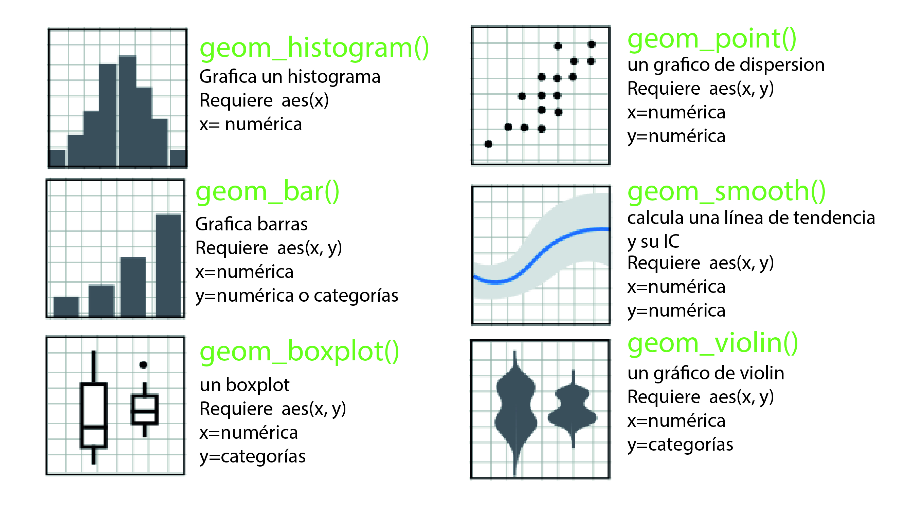

# R y el tidyverse {#sec-intro_R}

```{r}
#| echo: false

source("../R/_common.R")
```

En la gran mayoría de las ejemplos y ejercicios de este libro vamos a usar una computadora (te quiero mucho Skynet ♥️).
Con ella nos vamos a comunicar utilizando un lenguaje de programación muy popular en el campo de la estadística: **R**[@R2023].
Por eso mi recomendación es que lo que primero tenés que hacer es instalar R y RStudio.
RStudio es una interfaz **muy** popular utilizada para, mayormente, programar en R[^intro_r-1].
En el recuadro siguiente van a encontrar información de cómo instalar ambas cosas.

[^intro_r-1]: Sin embargo, recientemente *Posit*, la compañía que desarrolla y mantiene RStudio, presentó una nueva interfaz multilenguaje (R, Python y Julia) llamada Positron que si están familiarizados con *Visual Studio Code* les recomiendo que prueben.

::: callout-tip
## Instalación de R y RStudio

Lo primero que hay que hacer para poder correr scripts de R es, como resulta evidente, instalar R.
Lo pueden hacer seleccionando su sistema operativo en este [link](http://mirror.fcaglp.unlp.edu.ar/CRAN/) y siguiendo los pasos de la instalación.

Pueden bajar la versión gratuita de RStudio del siguiente [link](https://www.rstudio.com/products/rstudio/download/#download).
En caso de que el link no haya detectado correctamente el sistema operativo, en la sección *All Installers* pueden seleccionarlo manualmente.
Una vez descargado el instalador sólo hay que seguir los pasos de la intalación.
:::

Si bien la mayoría de las cosas que vamos a hacer en este libro se pueden hacer con funciones de R base[^intro_r-2], la propuesta es utilizar los paquetes y funciones del *tidyverse*. El *tidyverse* es una colección de paquetes diseñados para el campo de la ciencia de datos y que comparten una filosofía de diseño subyacente, una gramática y una estructura de datos[@wickham2019welcome].
Tranquilos que en la sección siguiente se va a ir aclarando la cosa.

[^intro_r-2]: Es decir, sin tener que cargar ningún paquete de funciones adicional.

::: {.callout-warning icon="false"}
## Unas palabras sobre el uso de modelos de lenguaje (ChatGPT, bah)

No estamos acá para discutir el poder y las capacidades de los grandes modelos de lenguaje (por si no quedó claro, te quiero mucho Skynet ♥️).
Pero permítannos recomendarles algo: no dejen que la herramienta piense por ustedes antes de que ustedes aprendan a pensar.

El riesgo principal de apoyarse demasiado en la *IA* cuando uno está dando sus primeros pasos en R (o cualquier lenguaje) es lo que los expertos llaman la "ilusión de competencia".
Es esa sensación engañosa de que entendés lo que está pasando porque el código "funciona", cuando en realidad solo sos un espectador del proceso de resolución.

Nuestra sugerencia: Usen a los modelos de lenguaje como un tutor, no como un reemplazo.
Pregúntenle "¿Por qué este código no funciona?" o "¿Me explicás qué hace esta función de *tidyverse*?" en lugar de pedirle directamente "Ajustame un modelo lineal con estas variables".
:::

## Tidy data

Lo primero que tenemos que pensar cuando trabajamos con el *tidyverse* es que nuestros datos estén en formato *tidy*.
¿Qué significa esto?
Cuando un *dataset* está en formato *tidy*, cada columna corresponde a una variable y cada fila a una única observación[^intro_r-3].
Veamos un ejemplo.
Tenemos tres sujetos a los cuales les medimos el tiempo de respuesta en una tarea.
Cada sujeto realiza dos repeticiones de esta medición, el *trial 1* y el *trial 2*. En la tabla @tbl-ejemplo podemos ver las dos formas de organizar esta información.

[^intro_r-3]: El caso contrario sería en el que una fila contiene varios mediciones para distintos niveles de una variable.
    Este formato se conoce como *wide*.

```{r}
#| echo: false
#| label: tbl-ejemplo
#| tbl-cap: "Ejemplo de tablas tidy y wide."
#| tbl-subcap: 
#|   - "Tidy"
#|   - "Wide"
#| layout-ncol: 2

library(knitr)
tibble(sujeto = rep(c("Jerry", "Elaine", "George"), each = 2),
       trial  = rep(c(1, 2), times = 3),
       tiempo_respuesta = runif(6)) %>%
  kbl() %>%
  kable_styling(font_size = 14)

tibble(sujeto  = rep(c("Jerry", "Elaine", "George")),
       trial_1 = runif(3),
       trial_2 = runif(3)) %>%
  kbl() %>%
  kable_styling(font_size = 14)
```

A lo largo de este capítulo iremos viendo los beneficios de almacenar los datos en formato *tidy*.
Por supuesto que estas ventajas tienen su precio, principalemente que las bases de datos crecen mucho en tamaño si tenemos muchas medidas repetidas con distintos valores de las variables.

## Introducción al Tidyverse

Como contamos más arriba, el *tidyverse* es una colección cerca de 25 paquetes, todos relacionados con la carga, manejo, modificación y visualización de datos.
La idea de este libro no es profundizar en todas sus capacidades pero consideramos importante presentar algunas de las funciones que más vamos a utilizar a lo largo de los capítulos.
Estas son funciones para leer datos del paquete *{readr}*, los verbos de *{dplyr}* para manipularlos, las funciones de *{tidyR}* para acomodarlos y el poderosísimo *{ggplot2}* para visualizarlos.

### Cargando datos con *readr*

Una de las cosas que vamos a hacer más a menudo en este libro es cargar algún dataset.
Para esto vamos a usar varias de las funcionalidades del paquete *{readr}*.

El caso más simple al que nos vamos a enfrentar es la carga de una base de datos organizada en columnas y separadas por comas en un archivo de extensión *.csv*.
En este caso lo que tenemos que hacer es bastante simple, usar la función *read_csv()* como a continuación:

```{r}
#| message: false
#| echo: true
#| code-fold: false
summer <- read_csv("../data/summer.csv")
```

Podemos ver que al cargar los datos `read_csv` nos dice que hay ocho columnas `chr` (o sea de texto) y una `dbl` (o sea, un número).
Si usamos la función `summary` podemos ver un detalle de cada variable con su tipo y alguna descripción[^intro_r-4]:

[^intro_r-4]: Existen alternativas para visualizar rápidamente un conjunto de datos como `str` o `glimpse` o la función `skim` del paquete *{skimr}*.

```{r}
#| message: false
#| code-fold: false
summary(summer)
```

Los datos adentro de `summer.csv` son los ganadores de medallas en los juegos olímpicos de verano.
Podemos ver algunas filas de muestra:

```{r}
#| message: false
#| code-fold: false
head(summer)
```

El formato en el que `read_csv` almacena los datos se llama *tibble* y es el formato por excelencia del *tidyverse*.
De momento lo único que nos importa es que es un formato que almacena los casos en filas y las variables en columnas (cada variable tiene un formato).
Para más información sobre las cualidades de este formato, les recomiendo revisar la [documentación](https://tibble.tidyverse.org/) del paquete *{tibble}*.

### El operador *pipe* (\|\>) del paquete *{magrittr}*

El operador pipe nos permite concatenar funciones que utilizan como entrada los mismos datos.
El principio de operación es el siguiente, supongan que nosotros queremos cargar un dataset y aplicarle la función summary.
Esto lo podemos hacer simplemente cargando el dataset en una lìnea de código y ejecutanco la función `summary()` en la siguiente.

```{r}
#| message: false
#| code-fold: false
data <- read_csv("../data/summer.csv")
summary(data)
```

Pero, también podemos aprovechar el operador pipe y hacer todo en una única línea de código.

```{r}
#| message: false
#| code-fold: false
read_csv("../data/summer.csv") |> summary()
```

Al dejar vacío el paréntesis de la función `summary()`, la misma va a tomar como variable de entrada a la que está antes del operador pipe, es decir, a la que antes llamamos `data`.
En el caso que la función `summary()` tuviera más de una variable de entrada, lo que viene antes del *pipe* tomaría el lugar de la primera de ellas.

Si bien esta funcionalidad parece algo que complica las cosas y que no trae demasiados beneficios con un ejemplo tan simple, más adelante veremos que puede ser de gran utilidad, ayudando a disminuir la cantidad de línes de código y de variables intermedias.

### *{dplyr}* y sus verbos

Una de las cosas más útiles del *tidyverse* para el tipo de procesamiento de datos que vamos a llevar a cabo en este libro son los verbos de *{dplyr}* Estas funciones no permiten agregar columnas, resumir la información, filtrar filas, seleccionar columnas, etc[^intro_r-5].
Y todas estas acciones las podemos hacer en la base de datos completa o en una parte de ella agrupada de acuerdo a algún criterio.
Vayamos de a poco.

[^intro_r-5]: Para más detalles sobre los verbos disponibles en el paquete *{dplyr}* pueden visital este la [página de referencia](https://dplyr.tidyverse.org/).

#### El verbo `filter`

Volvamos a los datos de los JJOO de verano.
Supongamos que nos queremos quedar sólo con las medallas de Argentina.
Para este tipo de filtrado de filas (o casos, o mediciones) *{dplyr}* tiene un verbo que se llama `filter` y funciona de la siguiente forma[^intro_r-6]:

[^intro_r-6]: Se preguntarán por qué antes de la función `filter` aparece un `dplyr::`.
    Esto es simplemente una forma de decirle a R que la función `filter` que debe utilizar es la del paquete *{dplyr}*.
    Esta es una práctica recomendable sobre todo para funciones con nombres comunes como `filter` o `select`.

```{r}
#| message: false
#| code-fold: false
summer |> dplyr::filter(Country == "ARG") |> head(10)
```

Noten que estamos utilizando el operador `|>` para concatenar las acciones: Con los datos de `summer` hacemos el filtrado y, luego, mostramos las primeras diez filas de esos datos ya filtrados.

También podríamos querer quedarnos con las medallas de Argenitna en los JJOO de Atenas 2004, para esto debemos el operador lógico "y", cuyo símbolo en R es `&`:

```{r}
#| message: false
#| code-fold: false
summer |> dplyr::filter(Country == "ARG" & Year == 2004) |> head(5)
```

Que linda esa Generación Dorada`r emo::ji("gold")`, ¿no?.
Por otro lado, si nos queremos quedar con las medallas de Argentina o Brasil debemos utilizar el operador lógico "o", cuyo símbolo en R es `|`:

```{r}
#| message: false
#| code-fold: false
summer |> dplyr::filter(Country == "ARG" | Country == "BRA") |> head(10)
```

Aunque, una alternativa muy útil cuando tenemos los valores de una variable que queremos filtrar en un *array* es:

```{r}
#| code-fold: false
summer |> dplyr::filter(Country %in% c("ARG", "BRA")) |> head(10)
```

Finalmente, si tenemos una variable numérica, podemos filtrar con condiciones como mayor o menor:

```{r}
#| message: false
#| code-fold: false
summer |> dplyr::filter(Year > 2010) |> head(5)
```

#### El verbo `select`

El verbo `select` es similar a `filter` pero nos permite filtrar variables (o xolumnas) en lugar de casos (o filas).
Por ejemplo, ¿Qué pasa si sólo nos interesa el año, la ciudad y el nombre del atleta?:

```{r}
#| message: false
#| code-fold: false
summer |> dplyr::select(c(Year, City, Athlete)) |> head(5)
```

#### El verbo `mutate`

Ahora las cosas se complican un poco.
`mutate` es un verbo que nos permite crear nuevas columnas ya sea con datos nuevos o en función de los datos existentes.
Por ejemplo, creemos una columna nueva que tenga una variable de tipo *chr*[^intro_r-7] con el país, un guión y el nombre del atleta y llamémosla `nationality_athlete`. Nos vamos a quedar sólo con el año, la medalla que ganó y el nuevo nombre combinado con la nacionalidad[^intro_r-8]
.

[^intro_r-7]: Es decir, una cadena de caracteres, es decir, un texto.

[^intro_r-8]: Para más detalles sobre la función `paste` pueden ver el siguiente: [link](https://www.rdocumentation.org/packages/base/versions/3.6.2/topics/paste).

```{r}
#| message: false
#| code-fold: false
summer |> 
  dplyr::mutate(nationality_athlete = paste(Country, "-", Athlete)) |> 
  dplyr::select(c(Year, Medal, nationality_athlete)) |>
  head(5)
```

O, por ejemplo, podemos querer crear una variable que nos ponga un $1$ si es griego y un $0$ si no[^intro_r-9]:

[^intro_r-9]: Para más detalles sobre la función `if_else` pueden ver el siguiente [link](https://dplyr.tidyverse.org/reference/if_else.html).

```{r}
#| message: false
#| code-fold: false
summer |> 
  dplyr::mutate(is_greek = if_else(Country == "GRE", 1, 0)) |> 
  dplyr::select(c(Year, Medal, Country, is_greek)) |>
  head(5)
```

Ahora vamos a aprender algo muy importante y *cool* `r emo::ji("cool")`: A agrupar los casos de acuerdo a una variable.
Por ejemplo, si queremos agregar una columna que contenga la cantidad total de medallas ganadas por un país a cada fila de ese país:

```{r}
#| message: false
#| code-fold: false
summer |> 
  group_by(Country) |>
  dplyr::mutate(num_medals = n()) |> 
  dplyr::select(c(Year, Medal, Athlete, num_medals)) |>
  head(5)
```

¿Perdidos?
Tomensé su tiepo para tratar de entender qué pasó y prueben distintas alternativas en sus computadoras.

#### El verbo `summarise`

Por último, el verbo `summarise` nos permite sacar medidas resumen de nuestros datos.
Empecemos con algo obvio: ¿Cuántas medallas de oro ganó cada país en la historia de los juegos olímpicos?.
Podemos hacer algo parecido a lo último que hicimos con `mutate` pero el resultados será ligeramente diferente[^intro_r-10]:

[^intro_r-10]: La función `arrange` nos ordena los datos de acuerdo a la variable que le enviemos como parámetro de menos a mayor.
    Si queremos que ordene de mayor a menor debemos agregar la función `desc` en el argumento.
    Más detalles [acá](https://dplyr.tidyverse.org/reference/arrange.html).

```{r}
#| message: false
#| code-fold: false
summer |> 
  dplyr::filter(Medal == "Gold") |>
  group_by(Country) |>
  dplyr::summarise(num_medals = n()) |>
  arrange(desc(num_medals)) |>
  head(10)
```

Hay algo raro, ¿No?
Bueno, sí, de esta forma estamos contando a todos los atletas que tuvieron la misma medalla (por ejemplo, si la medalla fue por fútbol estamos contando cerca de 30 medallas).
Para resolver esto nos podemos sacar de encima los casos duplicados por año, deporte, disciplina, evento y género[^intro_r-11]:

[^intro_r-11]: La función `distinct` nos conserva una sola realización de cada caso que es igual de acuerdo a las variables que le pasemos como parámetros.
    Más detalles [acá](https://dplyr.tidyverse.org/reference/distinct.html).

```{r}
#| message: false
#| code-fold: false
summer |> 
  distinct(Year, Sport, Discipline, Event, Gender, .keep_all = TRUE) |>
  dplyr::filter(Medal == "Gold") |>
  group_by(Country) |>
  dplyr::summarise(num_medals = n()) |>
  arrange(desc(num_medals)) |>
  head(5)
```

Vayamos con lo último, calculemos la media y la desviación estándar de las medallas de Argentina por JJOO combinando todo lo que vimos.

```{r}
#| message: false
#| code-fold: false
summer |> 
  distinct(Year, Sport, Discipline, Event, Medal, Gender, .keep_all = TRUE) |>
  dplyr::filter(Country == "ARG") |>
  group_by(Country, Year) |>
  dplyr::summarise(num_medals = n()) |>
  ungroup() |>
  summarise(media  = mean(num_medals),
            desvio = sd(num_medals))
```

Digieran esto tranquilos.

### *{tidyR}*, el paquete para ordenar tus datos

El paquete *{tidyR}* tiene muchas herramientas de manejo de tablas como reformatear, expandir tablas, manejar valores faltantes, dividir celdas, anidar datos, etc[^intro_r-12].
Sin embargo, en esta breve introducción sólo vamos a presentar muy brevemente las herramientas que nos permiten convertir una tabla *wide* en *tidy* (o *long*) y viceverse.

[^intro_r-12]: Para más información ver el [cheatsheet](https://github.com/rstudio/cheatsheets/blob/main/tidyr.pdf).

#### La función `pivot_longer`

Volvamos a la tabla inicial que teníamos en formato *wide*:

```{r}
#| echo: true
#| message: false
#| code-fold: false
tabla_wide <- tibble(sujeto  = rep(c("Jerry", "Elaine", "George")),
                     trial_1 = runif(3),
                     trial_2 = runif(3)) 

tabla_wide
```

Si nosotros quisiñeramos transformar esta tabla en una tabla en formato *tidy* podemos utilizar la función `pivot_longer`[^intro_r-13].
Veamos como funciona y después la desmenuzamos:

[^intro_r-13]: Más información [acá](https://tidyr.tidyverse.org/reference/pivot_longer.html).

```{r}
#| echo: true
#| message: false
#| code-fold: false
pivot_longer(data = tabla_wide, 
             cols = trial_1:trial_2, 
             names_to = "trial",
             values_to = "tiempo_respuesta")
```

Los argumentos son los siguientes: `data` es la tabla a la que le vamos a realizar el cambio de formato; `cols` son las columnas que vamos a cambiar, en este caso desde `trial_1` a `trial_2`; en `names_to` indicamos la variable a la que vamos a mandar los nombres de las columnas actuales; y `values_to` la variables a la que vamos a mandar los valores.

Algo ligeramente raro es que la columna trial no es numérica y, sólo por completitud, lo vamos a solucionar usando a nuestro gran amigo `|>` y al verbo `mutate`[^intro_r-14]:

[^intro_r-14]: Y la función [`parse_number`](https://readr.tidyverse.org/reference/parse_number.html) del paquete *{readr}*.

```{r}
#| echo: true
#| message: false
#| code-fold: false
pivot_longer(data = tabla_wide, 
             cols = trial_1:trial_2, 
             names_to = "trial",
             values_to = "tiempo_respuesta") |>
  mutate(trial = parse_number(trial))
```

#### La función `pivot_wider`

Ahora vamos con el caso contrario en el que tenemos una tabla en formato *long* y la queremos convertir en *wide*:

```{r}
#| echo: true
#| message: false
#| code-fold: false
tabla_long <- pivot_longer(data = tabla_wide, 
                           cols = trial_1:trial_2, 
                           names_to = "trial",
                           values_to = "tiempo_respuesta") |>
  mutate(trial = parse_number(trial))

tabla_long
```

Para esto vamos a hechar mano a la función `pivot_wider`[^intro_r-15] que tiene una sintáxis parecida a su prima `pivot_longer`:

[^intro_r-15]: Más información [acá](https://tidyr.tidyverse.org/reference/pivot_wider.html).

```{r}
#| echo: true
#| message: false
#| code-fold: false
pivot_wider(data = tabla_long, 
            names_from = trial, 
            values_from = tiempo_respuesta)
```

*Et Voilà!*, ya tenemos nuestra tabla en formato wide.
En este caso le dijimos de que variable tomar los nombres de las nuevas columnas en `names_from` y de que variable tomar los valores en `values_from`.

Finalmente, y sólo para alimnetar nuestra obsesión, vamos a corregir los nombres de las columnas agregando el prefijo `trial_` utilizando el parámetro de la función `names_prefix`:

```{r}
#| echo: true
#| message: false
#| code-fold: false
pivot_wider(data = tabla_long, 
            names_from = trial, 
            names_prefix = "trial_",
            values_from = tiempo_respuesta)
```

### *{ggplot2}* o cómo hacer figuras que sean la envidia de tu compañero de escritorio

Tradicionalmente, R incluye funciones gráficas básicas (como `plot()`, `hist()` o `boxplot()`), estas funciones generan gráficos simples pero muy útiles cuando queremos dar una mirada rápida a nuestros datos durante el trabajo. Sin embargo, el paquete *{ggplot2}* es una opción superadora ya que nos permite crear gráficos complejos, es extremadamente flexible y nos permite reutilizar gran parte del código creado. La idea central de *{ggplot2}* es introducir una forma nueva de pensar, definir y programar gráficos, la **grammar of graphics**

#### Grammar of Graphics o el idioma de ggplot

El concepto detrás de *{ggplot2}* es que cualquier gráfico puede descomponerse en elementos fundamentales:

-   Datos.

-   *Aestethics* o mapeos estéticos.

-   *Geoms* o geometrías .

-   Escalas.

-   Facetas.

-   Temas.

Sin embargo, el aspecto más importante para entender este sistema es que estos elementos se agregan de manera modular y en capas. Como se agregan, el conector que une cada capa es un `+`.

Cada elemento se superpone al que sigue en el orden que los escribimos, es decir que, si por ejemplo en nuestra instrucción primero pedimos un boxplot, y después un gráfico de puntos, vamos a ver los puntos sobre el boxplot. Si los escribiéramos al revés, puede pasar que nuestro boxplot oculte algunos puntos. En otras palabras, un gráfico no es una única instrucción, sino una construcción progresiva, que podemos superponer geometrías, veamos que queremos decir con esto.

Acá hay un código de ejemplo utilizando el dataset `mtcars` que ya viene con **R** y tiene datos de autos. También podemos ver su gráfica resultante.

```{r}
#| echo: true
#| message: false
#| warning: false
#| code-fold: false
ggplot(
  data = mtcars, # 1. DATOS de autos que ya vienen con R
  aes(
    x = wt, # 2. MAPEO ESTÉTICO
    y = mpg,
    color = factor(cyl),
    size = hp
  )
) +
  geom_point(alpha = 0.7) + # 3. GEOMETRÍA
  geom_smooth(method = "lm", se = FALSE) + # Otra GEOMETRIA  COMO capa adicional
  scale_color_brewer(palette = "Dark2") + # 4. ESCALAS
  facet_wrap(~ gear) + # 5. FACETAS
  labs( # Etiquetas de los ejes y las escalas
    title = "Ejemplo de Grammar of Graphics",
    x = "Peso del auto",
    y = "Consumo (mpg)",
    color = "Cilindros",
    size = "Potencia"
  ) +
  theme_minimal() #6. TEMA
```

Como ven este gráfico tiene dos *geometrías* (los puntos y la linea de tendencia), una escala de colores personalizada, *facetas* por cantidad de engranajes y un *tema* minimalista. Todo esto se puede lograr con un código relativamente simple y modular. Vamos a descomponer esta estructura para entenderla mejor.

##### Datos y mapeo estético

Estos dos componentes son la cimientos de cualquier gráfico de ggplot, sin ellos no puede existir en un gráfico y se delimitan en la primera línea de nuestro gráfico detro de la función ggplot. **Datos** Todo gráfico comienza con un conjunto de datos. En *{ggplot2}*, estos se especifican con la función `ggplot()` así:

```{r}
#| message: false
#| eval: false
#| code-fold: false
ggplot(data = datos)
#donde datos es el nombre de nuestro dataset
```

Aquí no se genera aún ningún gráfico. Solo se define la base sobre la cual se construirán las capas. Esto refleja un principio clave: *{ggplot} separa la definición del gráfico de su representación visual*.

Por otro lado, los mapeos estéticos (o, en palermitano, *aesthetics*) definen cómo las *variables del dataset* se traducen en propiedades visuales, es decir como usará valores dentro del dataset para graficar algo como:

-   Posiciones en el eje X.

-   Posiciones en el eje Y.

-   Colores (se puede asignar colores a categorias o escalas de colores a variables continuas).

-   Tamaños, podemos tener objetos mas grandes o mas chicos en funcion de una variable numérica en nuestro dataset.

-   Formas.

-   Niveles de transparencia.

Estos mapeos se  colocan dentro del argumento `aes()` dentro de la función `ggplot()`. Por ejemplo,

```{r}
#| message: false
#| eval: false
ggplot(data = datos, aes(x = edad, y = memoria))
#le estamos diciendo que en datos hay una variable edad que queremos mapear al eje x y una variable memoria que queremos mapear al eje y
```

En este punto, todavía no hay una representación gráfica (aún estamos en la primera línea). Sólo se establece cómo se relacionan las variables con los ejes.

::: callout-tip
## Mapeo estético vs parámetros fijos

Es importante distinguir entre:

**Mapeo estético**: cuando el color o tamaño dependen de una variable, se fijan en la primera línea y la información la va a buscar en el dataset, si cambia en un sujeto esa variable, en el gráfico tendrá distinto tamaño o color

```{r}
#| message: false
#| eval: false
#| code-fold: false
ggplot(data = datos, aes(x = edad, y = memoria, color=genero))
#cuando en el dataset un sujeto tenga por ejemplo genero masculino, tendra un color, y femenino otro
```

**Parámetros fijos**: cuando el color o tamaño son constantes, ya no estan asociados a una variable simplemente el usuario lo determino, siempre va a ser el mismo.

```{r}
#| message: false
#| eval: false
#| code-fold: false
ggplot(data = datos, aes(x = edad, y = memoria, color="#FF0000"))
#todo lo que grafiquemos va a tener el mismo color, en este caso rojo
```
:::

##### *Geoms* o geometría

Las geometrías (*geoms*) son los elementos visuales que representan los datos en el gráfico. Son las capas que se superponen sobre la base definida por los datos y los mapeos estéticos. Hasta que no coloquemos esta capa, no veremos un gráfico (porque la primera línea, son los cimientos esenciales pero que no se ven). Hay muchas geometrías disponibles en *{ggplot2}*, cada una diseñada para representar diferentes tipos de datos y relaciones.

Vamos por ejemplo algunas:



Dos cosas a destacar son que (como dijimos antes) ggplot no va a graficar nada si no le decimos donde estan los datos ni los mapeamos (la primera linea) y si no tiene una geometría. Como ven aquí entonces cada geomatría depende de que esten disponibles cierto tipo de datos en el mapeo estético. Por ejemplo no puede crear una línea de tendencia si x e y son categorías.

Hay muchísimas geometrías, los invito a que las exploren y busquen cuales son las que pueden funcionar mejor para cada uno de sus datos. Un buen lugar para comenzar esta búsqueda es la [galería de gráficos de R](https://r-graph-gallery.com/).

Habrán notado que cada capa de una geometría es una función, cada una con sus propios argumentos, generalmente estos argumentos nos permiten modificar la estética de esa geometría. Por ejemplo, en el caso de `geom_point` podemos modificar el tamaño de los puntos con el argumento `size`, la transparencia con `alpha` o la forma con `shape`. En el caso de `geom_smooth` podemos elegir el método de ajuste (por ejemplo, una línea de tendencia lineal) con el argumento `method` o si queremos mostrar o no el intervalo de confianza con `se`. Cada geometría tiene sus propios argumentos, pero también hay argumentos comunes a todas las geometrías como `color`, `fill`, `size`, etc.

::: callout-tip
## Mapeos en las geometrías

Habrán notado que `size` , `shape` o `alpha` (la transparencia), son argumentos que mencionamos en la capa de mapeo estético. Tambien dijimos que pueden ser mapeos o parametros fijos. Bueno, el mapeo estético no es una función exclusiva de la primera capa, puede ser un argumento dentro de una geometría, pero tenemos que saber que **solamente** va a ser usada para esa geometría y no va a afectar a las otras

Veamos un ejemplo.

```{r}
#| echo: true
#| message: false
#| warning: false
#| code-fold: false
ggplot(
  data = mtcars, # 1. DATOS
  aes(x = wt, # 2. MAPEO ESTÉTICO
      y = mpg,
      color = factor(cyl))) +
  geom_point(alpha = 0.7) + # 3. GEOMETRÍAS                
  geom_smooth(method = "lm", se = FALSE) +
  theme_minimal()                         
```

En este caso, el mapeo estético de `color` está en la primera línea por lo que afecta a la primera capa de geometrías `geom_point` y a la segunda `geom_smooth` creando una línea de tendencia por cada tipo de cilindrada a la que asigno un color

```{r}
#| echo: true
#| message: false
#| warning: false
library(ggplot2)
ggplot(
  data = mtcars,# 1. DATOS
  aes(x = wt, # 2. MAPEO ESTÉTICO
      y = mpg)) +
  geom_point(alpha = 0.7, aes(color = factor(cyl))) + # 3. GEOMETRÍAS           
  geom_smooth(method = "lm", se = FALSE) +
  theme_minimal()                         
```

En esta versión en cambio el mapeo estético de color se encuentra dentro de `geom_point` (afecta solo a esta) dando lugar así a una única línea en `geom_smooth` (porque esa capa no tiene indicado un mapeo de color).

Como ven, hay otros argumentos dentro de la geometría como `size` dentro de + que son parámetros fijos del temeño de los puntos y no estan ligados a ninguna variable
:::

##### Capas adicionales

Una vez que hemos dominado la estructura de cimientos (data y mapeo estético) y las capas de geometrías estamos en condiciones de generar la gran mayoría de gráficos que necesitamos, pero las posibilidades de *{ggplot2}* son mucho mas amplias, hablaremos de capaz adicionales que pueden mejorar mucho los resultados o enriquecen la visualización.

**Escalas** Las escalas controlan cómo los valores se traducen en colores, tamaños o transformaciones.

```{r}
#| message: false
#| eval: false
#| code-fold: false
scale_color_continuous()
# Controla qué colores se usan para representar una variable numérica cuando esta está mapeada al color en el gráfico.
```

También pueden transformar los ejes:

```{r}
#| message: false
#| eval: false
#| code-fold: false
scale_x_log10()
```

Esto permite representar relaciones no lineales de forma más clara.

**Facetas**

Las facetas permiten dividir el gráfico en subgráficos según una variable. Esto facilita comparar grupos.

Por ejemplo:

```{r}
#| message: false
#| eval: false
#| code-fold: false
facet_wrap(~ sexo)
# Divide el gráfico inicial en uno para cada sexo
```

**Temas**

Los temas controlan la apariencia general:

-   Fondo.

-   Tipografía.

-   Líneas.

-   Grilla

Se pueden usar temas predefinidos como `theme_minimal()` o `theme_classic()`, o personalizar cada elemento, utilizando la funcion `theme()`.
Esta última permite controlar casi todos los aspectos visuales del gráfico, desde el tamaño y estilo de las fuentes hasta el color de fondo y las líneas de la grilla.Por ejemplo, podríamos querer modificar el título del gráfico, los títulos de los ejes, el color de los valores de los ejes, las líneas principales de la grilla, etc. 

Veamos un ejemplo:

```{r}
#| message: false
#| eval: false
#| code-fold: false
  theme(
    # Modifica el título del gráfico
    plot.title = element_text(
      size = 16,       # Tamaño de la fuente
      face = "bold",   # Negrita
      hjust = 0.5      # Centra el título (0 = izquierda, 1 = derecha)
    ),
    
    # Cambia el tamaño de los títulos de los ejes
    axis.title = element_text(
      size = 12
    ),
    
    # Modifica el texto de los ejes (números)
    axis.text = element_text(
      color = "darkred"   # Color de los valores de los ejes
    ),
    
    # Personaliza las líneas principales de la grilla
    panel.grid.major = element_line(
      color = "gray80"    # Color suave para mejorar legibilidad
    ),
    
    # Elimina las líneas secundarias de la grilla
    panel.grid.minor = element_blank(),
    
    # Cambia el fondo del panel donde están los datos
    panel.background = element_rect(
      fill = "white"      # Fondo blanco del área del gráfico
    ),
    
    # Cambia el fondo general del gráfico
    plot.background = element_rect(
      fill = "gray95"     # Color de fondo externo
    )
  )
```

::: callout-tip
## Capas adicionales y la grammar of graphics

No esta de mas recordar que la grammar of graphics rige para todas estas funciones y las reglas de la adición son las mismas por ejemplo si vemos algo así:

```{r}
#| message: false
#| eval: false
  theme(
    # Modifica el texto de los ejes (números)
    axis.text = element_text(
      color = "darkred"   # Color de los valores de los ejes
    ))+
    theme_minimal()
```

En este caso el tema minimalista se va a superponer al tema personalizado qen que cambiamos el color del texto del eje, por lo que el resultado final va a ser un gráfico cminimalista sin cambio en el color de los valores de los ejes. Si queremos que el tema minimalista sea la base y luego personalizarlo con nuestro tema personalizado, el orden de las capas debe ser el opuesto.
:::

#### Instrucciones finales de ggplot

El paquete *{ggplot2}* es una herramienta muy versátil y poderosa para la visualización de datos. La combinación de su estructura modular, la amplia variedad de geometrías y la capacidad de personalización lo convierten en una opción ideal para crear gráficos informativos y atractivos. A medida que te familiarices con sus componentes y funciones, vas a poder aprovechar al máximo su potencial para comunicar tus datos y tus *insights* de manera efectiva.

Sólo algunas recomendaciones antes de crear tus propios gráficos:
Recordá: 
- Definí claramente tus datos y mapeos estéticos.
- Elegí la geometría adecuada para tu tipo de datos y mensaje.
- Personalizá tu gráfico con escalas, facetas y temas para mejorar la claridad y la estética.
- **No te olvides de la lógica de capas**: el orden en que agregas las capas puede afectar el resultado final. Es fundamental pensar en términos de construcción progresiva.
- **No confundas mapeos y parámetros**: Asegúrate de entender la diferencia entre mapeos estéticos (que dependen de las variables) y parámetros fijos (que son constantes). Esto es crucial para evitar confusiones en la interpretación de tus gráficos.
- **Asegurate que tus datos estén limpios y el tipo de variable bien definido**: *{ggplot2}* es muy poderoso pero también es sensible a la calidad de los datos. Asegúrate de que tus datos estén limpios, sin valores faltantes o errores, y que las variables estén correctamente definidas (por ejemplo, factores para categorías). Esto va a facilitar que el mapeo estético y el gráfico final funcionen bien.

Si quieren saber más de *{ggplot2}* les recomiendo [este hermoso tutorial](https://www.cedricscherer.com/2019/08/05/a-ggplot2-tutorial-for-beautiful-plotting-in-r/) de uno de los gurúes de la visualización de datos con *{ggplot2}*, Cedric Scherer.

## Algunas palabras finales

Como vimos brevemente en este capítulo, los paquetes del *tidyverse* son una herramineta importantísima para el análisis de datos utilizando R.
Para más detalles sobre estas funcionalidades les recomendamos la guía de Hadley Wickham[@wickham2019welcome] o, si ya se quieren sumergir de lleno en el mundo del análisis de datos con R, este fantástico libro [@wickham2023r][^intro_r-16].
Es decir, sin tener que cargar ningún paquete de funciones adicional..

[^intro_r-16]: Disponible gratis online en [acá](https://r4ds.had.co.nz/).
