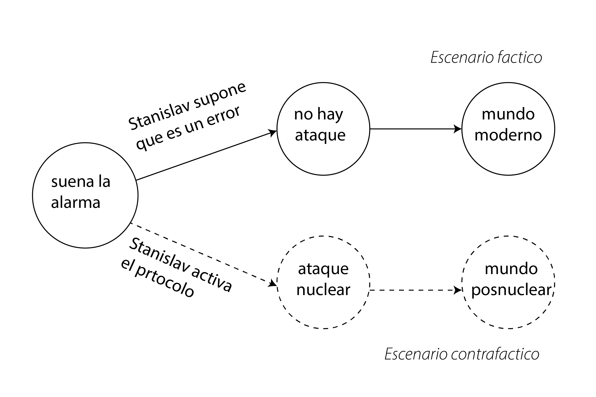
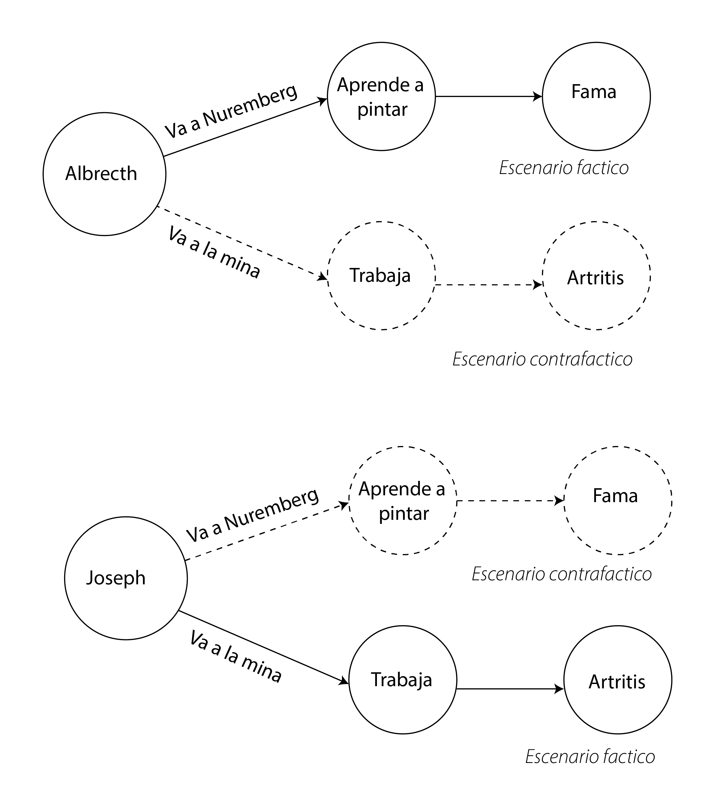

# *Potential outcomes* {#sec-pot-outcomes}

```{r}
#| echo: false

source("../R/_common.R")
```

## Guerra fría, manos y contrafácticos.

Son las 3 de la mañana del 26 de septiembre de 1983. Con una taza de café en mano, Stanislav Petrov vigila las alarmas de una estación de monitoreo de ataques nucleares a las afueras de Moscú. De pronto, los paneles se iluminan con un rojo furioso: tres misiles intercontinentales están en camino a la cúpula del Kremlin... o, quizás, el sistema tiene un error y se trata de una falsa alarma.

Stanislav no duda. Sigue el protocolo y llama al Kremlin. En menos de tres minutos, Rusia lanza un ataque nuclear contra las principales ciudades de EE. UU. La contrarespuesta estadounidense borra Leningrado y Stalingrado unos 40 minutos después. Además de millones de muertos, los ataques levantan tal cantidad de polvo en la atmósfera que el mundo se sume en un invierno nuclear durante 30 años, provocando hambruna en gran parte del hemisferio norte. Menos afectada por los ataques, la economía africana mejora lentamente y se convierte en el principal proveedor de alimentos del mundo. Para 2025, el Imperio Panafricano es la principal potencia económica global.

Todos sabemos que esto nunca ocurrió. Lo que realmente pasó fue que Stanislav Petrov pensó que se trataba de un error y nunca avisó a nadie (pueden ver la historia [aquí](https://www.bbc.com/mundo/noticias/2013/09/130926_internacional_ruso_detuvo_ataque_nuclear_jrg)).

Este mundo posnuclear es un mundo donde los hechos ocurrieron de manera completamente distinta: un mundo alternativo, un *what if*, un escenario contrafáctico. Podemos especular sobre lo que habría sucedido si los eventos se hubieran desarrollado de otra forma, pero la realidad es que nunca ocurrieron. Por lo tanto, un contrafáctico, aunque posible, es siempre especulativo.

{fig-align="center"}

::: callout-tip
## De qué hablamos cuando hablamos de contrafactuales

Utilizando el marco conceptual de los *potential outcomes* de Rubin[@rubin1974estimating], un contrafactual es el resultado que hubiera ocurrido para una unidad experimental (por ejemplo, una persona, un paciente, un animal de laboratorio o un país) si hubiera recibido un tratamiento diferente del que realmente recibió. Este concepto es fundamental para entender los efectos causales. Nos permite definir lo que entendemos por causa: la diferencia entre lo que realmente sucedió y lo que hubiera sucedido en un escenario alternativo.

En pocas palabras:

-   **Para alguien que recibió el tratamiento, el contrafactual es lo que habría sucedido si no hubiera recibido el tratamiento**. Por ejemplo, si un paciente recibió un nuevo medicamento y se recuperó, el resultado contrafactual es su estado de salud si no hubiera recibido el medicamento. Esto nos ayuda a aislar el efecto del medicamento.

-   **Para alguien que no recibió el tratamiento, el contrafactual es lo que hubiera sucedido si hubiera recibido el tratamiento**. Por ejemplo, si un estudiante no asistió a un programa de tutoría y reprobó un examen, el contrafactual es su calificación hipotética si hubiera asistido al programa.

Dado que cada unidad recibe solo un tratamiento, solo podemos observar un resultado: el resultado real. El resultado contrafactual es, por definición, inobservable. Esto se conoce a menudo como el **problema fundamental de la inferencia causal**. Debido a que no podemos observar simultáneamente ambos resultados potenciales para el mismo individuo, vamos a usar métodos y suposiciones estadísticas para estimar los efectos promedio del tratamiento en grupos de individuos. Más de esto en los próximos capítulos.
:::

¿Para qué sirve entonces construir contrafácticos, imaginar cosas que no ocurrieron y que nunca ocurrirán? Veamos otra historia.

Este cuadro que se ve a continuación se llama *Praying Hands* y fue pintado por Albrecht Durero. Es una de las obras más importantes de su siglo.

{fig-alt="*Praying Hands* de Albrecht Durero." fig-align="center" width="300"}

Los Durero eran una familia de mineros pobres del sur de Alemania. Dos de sus hijos, Albrecht y Joseph, tenían talento para el dibujo y decidieron hacer un pacto: uno estudiaría en Núremberg durante cuatro años mientras el otro trabajaría en las minas para pagar su educación. Decidirían quién haría qué cosa lanzando una moneda al aire. Pasado ese tiempo, intercambiarían lugares.

El azar favoreció a Albrecht. Durante esos cuatro años, se convirtió en un pintor famoso y regresó a casa para cumplir su parte del acuerdo. Sin embargo, al llegar, Joseph lo recibió con una triste noticia: era demasiado tarde. El arduo trabajo en la mina le había provocado una artritis severa, impidiéndole sostener un pincel. Como único tributo a su sacrificio, Albrecht decidió pintar sus manos.

Ahora tenemos dos escenarios contrafacticos, lo que le hubiera sucedido a Albretch si se quedaba en la mina, y lo que le hubiera sucedido a Joseph si se iba a estudiar a Nuremberg. De modo que el escenario seria asi.



Ambos son hermanos, y uno podría creer que, entre otra cosas, comparten cierto talento y sensibilidad artística. Asimismo, uno podria suponer que el destino de Joseph podría servir para suponer con mayor precisión lo que le paso "le hubiera pasado a Albretch de no ir a Nuremberg" (escenario contrafactico) y el destino de Albetch "lo que le hubiera pasado a Joseph si hubiera podido ir a Nuremberg" (escenario contrafáctico). Entonces imaginar escenarios contrafácticos nos permiten estimar el efecto de ir a Nuremberg o de quedarse. 

Ahora bien, es Joseph lo mismo que Albrecth, si la moneda hubiera favorecido a Joseph, ¿habría un Durero pintor famoso? Bueno no estamos seguros de eso, lo que si podemos estar seguros es que pese a parecidos, ellos no son exactamente la misma persona y quizás había diferencias en talentos o en suceptibilidad a la artritis lo que hace que el destino de uno funcione como un símil o proxy de su destino contrafáctico pero no el destino en si mismo. Con estas ideas podemos armar un marco teóprico donde esos efectos se puedan estimar. 

Supongamos que quiero evaluar la efectividad de la aspirina para mitigar el dolor de cabeza. Me duele la cabeza y lo quiero es saber el efecto diferencial entre tomar y no tomar esa aspirina. Es decir, en el tiempo 0 estoy yo con dolor de cabeza y en el tiempo 1 debería haber dos versiones mías (como si una no fuera suficiente), la que tomó la aspirina y la que no. A cada una de ellas les tendría que preguntar cuánto les duele la cabeza, el *outcome* de mi comparación. No hace falta ser demasiado astuto para darse cuenta que esto es imposible ya que sólo nos será posible obsevar una de esas versiones mientras que la otra será un contrafáctico.

De esto vamos a hablar en este capítulo, utilizando como marco teórico a los *potential outcomes*. Estas ideas terminan de tomar forma en la versión que conocemos en las ciencias sociales propuestas por Rubin[@rubin1974estimating].

## *Potential outcomes*

Lo que nos proponen los *potential outcomes* es la definición del efecto causal como la comparación de dos estados del mundo. En una versión del mundo, la "actual" (u obsevada), me tomo una aspirina y a las dos horas registro la severidad de mi dolor de cabeza mientras que en la otra versión del mundo, la "contrafactual", no me la tomo y las dos horas registro la severidad del dolor. A partir de esto, la tradición de los *potential outcomes* define al efecto causal de tomar una aspirina en el dolor de cabeza como la diferencia entre esas dos mediciones.

Todo muy lindo, pero como ya estarán sospechando es imposible calcular un efecto que está expresado en función de un contrafactual, ya que este contrafactual no lo podemos observar. Pero no se preocupen que le vamos a encontrar la vuelta.

Empecemos con un poco de notación que nos va a ayudar a acomodar las ideas. Por simplicidad vamos a asumir una variable binaria para la asignación del grupo experimental (por ejemplo, tratamiento y control). Esta variable vale $1$ si la unidad *i* recibe el tratamiento y $0$ si no, o sea, si pertenece al grupo control. Cada unidad $i$ va a tener dos *potential outcomes*: $Y_i^1$ si la unidad recibió el tratamiento y $Y_i^0$ si no. Esto significa que una unidad experimental en el mismo momento del tiempo va a recibir y no recibir el tratamiento, o sea, alguno de estos va a ser contrafactual[^potential_outcomes-1].

[^potential_outcomes-1]: De ahí el nombre de *potential*, porque se trata de posibles estados del mundo. Un estado en el que la unidad $i$ recibe el tratamiento y uno en el que no.

Los *outcomes* observables difieren de los potenciales. Los potenciales son variables aleatorias parcialmente latentes — solo uno de sus valores se revela por unidad —, mientras que los observables son sus realizaciones medibles. Hay una ecuación que nos permite definir el *outcome* observable ($Y^i$) en función de los potenciales, se llama la *switching equation*:

$$
Y_i = D_i Y_i^1 + (1-D_i) Y_i^0 
$$ {#eq-switching}

Donde $D_i$ vale $1$ si la unidad *i* recibió el tratamiento (entonces $Y_i=Y_i^1$) y $0$ si no (entonces $Y_i=Y_i^0$). Vale la pena notar que $Y_i$, el *outcome* observable, no tiene ningún supraíndice ya que no es más potencial. Esto tambien es una forma de hacer explicito el problema del *outcome observable*, porque dependiendo el valor que adopte $D_i$ uno de los términos se vuelve cero. Si $D_i=0$, $Y_i=Y_i^0$ ya que el término $D_i Y_i^1$ vale 0. Si por el contrario $D_i=1$, $Y_i=Y_i^1$ porque el término $(1-D_i) Y_i^0$ vale cero. Esta es una forma sofisticada de decir que el outcome observable sólo es posible en una de las dos formas de $D_i$.

Usando esta notación definimos el efecto causal del tratamiento para una unidad $i$ como: 

$$
\delta_i = Y_i^1 - Y_i^0 
$$ {#eq-deltai}

Donde queda claro que para estimar el efecto causal de acuerdo a la tradición de los *potential outcomes* debemos conocer dos estados del mundo a los que es imposible acceder simultáneamente. Y aqui yace el problema funcamental de la inferencia causal: Para calcular el efecto causal se requiere acceso a datos que siempre nos van a faltar: los contrafácticos[@rubin1974estimating].

## Efecto promedio del tratamiento

Al igual que los *potential outcomes*, el efecto para la unidad $i$ ($\delta_i$) también es una variable aleatoria, y su esperanza es lo que vamos a llamar el efecto promedio del tratamiento (**ATE**[^potential_outcomes-2]). El **ATE** va a ser la magnitud de interés en nuestros experimentos, el efecto promedio de mi tratamiento. El mismo se define de la siguiente forma:

[^potential_outcomes-2]: Del inglés *Average treatment effect*.

$$
\begin{array}
_ATE &=& E[\delta_i] \\
&=& E[Y_i^1 - Y_i^0] \\
&=& E[Y_i^1] - E[Y_i^0] 
\end{array}
$$ {#eq-ATE}

Ahora vamos a definir el efecto promedio, pero para el grupo tratado (es decir, los participantes asignados al grupo tratamiento, con $D_i=1$):

$$
\begin{array}
_ATT &=& E[\delta_i|D_i=1] \\
&=& E[Y_i^1 - Y_i^0|D_i=1] \\
&=& E[Y_i^1|D_i=1] - E[Y_i^0|D_i=1] 
\end{array}
$$ {#eq-ATT}

Esta magnitud se llama **ATT**[^potential_outcomes-3] y se calcula de la misma forma que el **ATE** pero condicionando los $\delta_i$ al valor de $D_i$ igual a 1. De manera análoga, definimos el efecto promedio pero para el grupo no tratado[^potential_outcomes-4]($D_i=0$)

[^potential_outcomes-3]: Del inglés *Average treatment effect for the treated*.

[^potential_outcomes-4]: Del inglés *Average treatment effect for the untreated*.

$$
\begin{array}
_ATU &=& E[\delta_i|D_i=0] \\
&=& E[Y_i^1 - Y_i^0|D_i=0] \\
&=& E[Y_i^1|D_i=0] - E[Y_i^0|D_i=0] 
\end{array}
$$ {#eq-ATU}

Ojo con confundir estos tres conceptos. Creo que el **ATE** es autoexplicativo, pero se suele confundir **ATT** y **ATU**. En el primer caso, el **ATT** e,s como su nombre lo indica, el *efecto promedio del tratamiento para el grupo de tratamiento*. Estamos calculando la esperanza de los $\delta_i$ para los individuos pertenecientes al grupo tratamiento. Esto involucra tanto sus $Y^1_i$ como sus $Y^0_i$. En el segundo caso, el **ATU** es el *efecto promedio del tratamiento para el grupo de no tratamiento*, es decir, la esperanza de los $\delta_i$ para los individuos pertenecientes al grupo control.

Es una confusión común confundir estos efectos promedios con magnitudes no potenciales pero, como se observa de sus fórmulas, tanto estos últimos dos como el **ATE** no se pueden calcular en la práctica.

En las secciones siguientes vamos a ver como, cumpliendo ciertas condiciones[^potential_outcomes-5], podemos estimar el **ATE** a partir de los *outcomes* observables.

[^potential_outcomes-5]: *Spoiler*: Asignación aleatoria de las unidades experimentales a los grupos.

## Diferencia de medias simple

¿Qué es lo que sí podemos observar? Una magnitud que a priori podríamos creer que va a estar relacionada con el **ATE** y que podemos observar es la diferencia de medias entre los *outcomes* observados del grupo tratamiento y el grupo control. La vamos a llamar **SDO**[^potential_outcomes-6] y se calcula de la siguiente forma:

[^potential_outcomes-6]: Del inglés *simple difference in outcomes*.

$$
\begin{array}
_SDO &=& E[Y_i^1|D_i=1] - E[Y_i^0|D_i=0] \\
&=& \frac{1}{N_T} \sum_{i=1}^{N_T} (y_i|d_i=1) - \frac{1}{N_C} \sum_{i=1}^{N_C} (y_i|d_i=0)
\end{array}
$$ {#eq-SDO}

Donde $N_T$ y $N_C$ son la cantidad de individuos en el grupo tratamiento y control respectivamente (y $N_T + N_C = n$). Todo muy lindo, pero operemos un poquito para ver hasta que punto el **SDO** es un estimador insesgado del **ATE**. Empecemos escribiendo el **ATE** como una suma pesada del **ATT** y el **ATU**:

$$
\begin{array}
_ATE &=& \pi ATT + (1-\pi) ATU \\
&=& \pi E[Y_i^1|D_i=1] - \pi E[Y_i^0|D_i=1] + \\
& & (1-\pi) E[Y_i^1|D_i=0] - (1-\pi) E[Y_i^0|D_i=0] \\
&=& \bigl\{ \pi E[Y_i^1|D_i=1] + (1-\pi) E[Y_i^1|D_i=0] \bigl\} - \\
& & \bigl\{ \pi E[Y_i^0|D_i=1] + (1-\pi) E[Y_i^0|D_i=0] \bigl\}
\end{array}
$$ {#eq-sesgos}

Con $\pi = N_T/n$ y $1 - \pi = N_C/n$. Es decir $\pi$ es la proporción de individuos tratados y $1 - \pi$ es la proporción de individuos no tratados.

Operando con la @eq-sesgos podemos despejar la diferencia entre los *outcomes* observables (**SDO**) y ver cómo esta se relaciona con el resto de las magnitudes definidas[^potential_outcomes-7].

[^potential_outcomes-7]: Pueden ver el despeje numérico en detalle en el capítulo 4 de [@cunningham2021causal].

$$
\begin{array}
_E[Y_i^1|D_i=1] - E[Y_i^0|D_i=0] &=& ATE \\
&+& ( E[Y_i^0|D_i=1] - E[Y_i^0|D_i=0] ) \\
&+& (1-\pi) (ATT - ATU)
\end{array}
$$

Que podemos reescribir como:

$$
\begin{array}
_\underbrace{\frac{1}{N_T} \sum_{i=1}^{N_T} (y_i|d_i=1) - \frac{1}{N_C} \sum_{i=1}^{N_C} (y_i|d_i=0)}_\text{Diferencia de los outcomes} &=& \underbrace{ATE}_\text{Efecto promedio del tratamiento} \\
&+& \underbrace{( E[Y_i^0|D_i=1] - E[Y_i^0|D_i=0] )}_\text{Sesgo de selección} \\
&+& \underbrace{(1-\pi) (ATT - ATU)}_\text{Sesgo de efecto heterogéneo}
\end{array}
$$ {#eq-SDOdecomp}

Lo que puede verse en @eq-SDOdecomp es que si pudiéramos asegurar de alguna forma que los sesgos de selección y de efecto heterogéneo fueran cero, el **SDO** sería un buen estimador del **ATE** que es, al fin y al cabo, el efecto causal promedio que nos interesa en nuestro experimento.

O sea que la clave del diseño experimental va a ser encontrar la forma de asegurar que esos sesgos sean nulos. Veamos mejor que representan para poder entender como minimizarlos.

### Sesgo de seleccion

Miremos con detenimiento la formula a la que llamamos sesgo de selección $E[Y_i^0|D_i=1] - E[Y_i^0|D_i=0]$. Si la definimos a partir de esta ecuacion representa la diferencia entre los dos grupos si nunca hubiera habido un tratamiento en primer lugar. Es decir, son las diferencias inherentes entre los dos grupos. Estas diferencias aparecen al **seleccionar** individuos en un grupo y no en el otro, por eso lo llamamos sesgo de selección. Por el contrario, mientras mas se parezcan en el outcome $Y_i^0$ los individuos asignados a uno u otro grupo $D$, mas cercano a cero será el sesgo de selección. Entonces, sería ideal medir el sesgo de selección ya que es una medida de cuan lejos está el estimador del **ATE** (el **SDO**) del verdadero valor. Sin embargo el primer término de la ecuación es un contrafáctico. No nos queda otra alternativa que buscar una condición en donde, aunque no podamos medirlo, podamos confiar en que el sesgo de selección tiene esperanza igual a cero.

### Sesgo de tratamiento heterogéneo

Esta tercera componente es un poco más difícil de interpretar, miremoslo bien: $(1-\pi) (ATT - ATU)$. Así definido se puede decir que es la diferencia entre el efecto promedio del tratamiento para el grupo  tratamiento (el **ATT**) y la misma para el grupo control (el **ATU**) multiplicado por la proporción de sujetos que está en el grupo control. A diferencia del sesgo de selección, en este caso no se trata de una diferencia entre los dos grupos si no hubiera habido tratamiento, sino que es la diferencia entre el efecto del tratamiento para el grupo tratado y el efecto del tratamiento para el grupo control. En otras palabras, este sesgo cuantifica las diferencias en *sensibilidad* al tratamiento por cada uno de los grupo. Por ejemplo, si estamos testeando una droga para mejorar la resistencia aeróbica y en nuestro grupo tratamiento tenemos a 90% de asmáticos/as mientras que en el grupo control sólo a un 10%, es esperable que los efectos del tratamiento en cada uno de estos grupos sean distintos. Pero ojo, recordamos que ni el **ATT** y el **ATU** pueden ser medidos porque incluyen contrafácticos en su definición.

Ahora que entendemos qué representa cada sesgo, podemos buscar una condición en donde la esperanza de ambos sesgos sea igual a 0 para que, de esta forma, el SDO sea finalmente un estimador insesgado del ATE. Esa condicion es la independencia.

## Independencia

La definición de independencia en el contexto de los *potential outcomes* es la siguiente:

$$
(Y^0, Y^1) \perp D
$$ 

Momento cerebrito, pensemos una poco qué quiere decir. Esto significa que la asignación de los participantes al grupo control o tratamiento ($D$) no depende de los *outcomes* potenciales de ese individuo [^perp].

[^perp]: El símbolo de perpendicularidad quiere simbolizar eso, que no hay relación entre los *outcomes* potenciales y la asignación a los grupos.

Vamos a pensarlo con un ejemplo concreto. Imaginen que tenemos una grupo de participantes para poner a prueba una cirugía experimental como altenativa a un tratamiento médico establecido no quirúrgico. Si la asingación de individuos al grupo tratamiento la hace un médico en base a lo que cree que va a ser conveniente para él, por ejemplo, no asignando a pacientes de edad avanzada al grupo tratamiento por el riesgo asociado a una cirugía, o asignando a pacientes cuyo pronóstico con el método tradicional vea poco favorable al grupo control. En este caso, la asignación a un grupo **sí** depende de los posibles resultados, por lo tanto, no hay independencia. Si en lugar de eso tiráramos una moneda antes de recibir a cada paciente, podríamos de esa forma asegurar la independencia.

La independencia implica que se cumpla:

$$
\begin{array}
_E[Y^1|D=1] - E[Y^1|D=0] &=& 0 \\
E[Y^0|D=1] - E[Y^0|D=0] &=& 0
\end{array}
$$ {#eq-independencia}

Es decir, que la esperanza de los *outcomes* para los participantes que fueron asignados tanto al grupo tratamiento como al grupo control serían iguales si pudieramos medirlos a ambos en *mundo tratamiento* o en *mundao control*[^potential_outcomes-8]. Ojo que esto no implica que la esperanza del *outcome* para tratamiento en los tratados sea igual a la esperanza para no tratamiento en los controles ($E[Y^1|D=1] - E[Y^0|D=0] = 0$) ni igual a la esperanza no tratamiento de los tratados ($E[Y^1|D=1] - E[Y^0|D=1] = 0$).

[^potential_outcomes-8]: Tengamos en cuenta que tanto $E[Y^1|D=0]$ como $E[Y^0|D=1]$ son escenarios contrafácticos.

¿Qué implicancias tiene las igualdades presentadas en @eq-independencia en los sesgos que vimos en la ecuación @eq-sesgos? Empecemos por el sesgo de selección ($E[Y^0|D=1] + E[Y^0|D=0]$). Vemos que, de acuerdo a la primera línea de @eq-independencia, de ser independiente la asignación del grupo experimental, este sesgo sería cero. Pensemos un poco. Lo que nos está diciendo la condición de independencia es que si ambos grupos fueran no tratados, ambos tendrían el mismo *outcome* lo que pareciera indicarnos que es razonable considerar nulo al sesgo de selección.

La relación del sesgo de efecto heterogéneo ($(1-\pi) (ATT - ATU)$) con la independencia es un poquito más difícil de demostrar. Olvidémonos del $(1-\pi)$ por un momento. Reescribamos los efectos **ATT** y **ATU**:

$$
\begin{array}
_ATT &=& E[Y^1|D=1] - E[Y^0|D=1] \\
ATU &=& E[Y^1|D=0] - E[Y^0|D=0] 
\end{array}
$$

Y ahora restemos ambos términos:

$$
\begin{array}
_ATT - ATU &=& E[Y^1|D=1] - E[Y^0|D=1] - ( E[Y^1|D=0] - E[Y^0|D=0] )\\
&=& \bigl\{ E[Y^1|D=1] - E[Y^1|D=0] \bigl\} + \bigl\{ E[Y^0|D=0] - E[Y^0|D=1] \bigl\} 
\end{array}
$$ {#eq-sesgohet}

Reescrito de esta forma podemos ver los dos primero términos de @eq-sesgohet se hacen cero por la primera línea de @eq-independencia, y los últimos dos se hacen cero por la segunda.

Finalmente, demostramos que si hay independencia en la asignación de los grupos, la diferencia de las medias simple (**SDO**) entre el grupo tratado y el grupo control es un estimador insesgado del **ATE**.

## SUTVA

En este capítulo hemos presentado un marco teórico para definir un efecto causal. A ese efecto causal lo llamamos **ATE** y vimos que es imposible calcularlo por la existencia de contrafácticos pero que puede ser estimado por una medida observable, la **SDO**. También vimos que **SDO** contiene al **ATE** y a un par de sesgos, sesgos que deberían hacerse cero si el supuesto de independencia se cumple. 

¿Podría pasar que un efecto causal no pueda ser estimado con este marco teórico? Sí, hay un límite a este marco en donde todas estos cáclulos (medibles o no) son posibles. Si vamos al corazón mismo de todos los cálculos la condición que debe cumplirse para que todo sea posible es que las $Y_i$ sean *restables*, en otras palabras que representen lo mismo. A este supuesto se lo llama **SUTVA** que es la abreviatura de **stable unit treatment value assumption**. Vamos a reformularlo, **SUTVA** implica que cada unidad $i$ recibe la misma dosis de tratamiento.

El **SUTVA** se cumple siempre que cuando se expone un individuo a un tratamiento; su respuesta sea la misma: 1) Sin importar cómo el participante fue asignado al tratamiento y 2) Sin importar los tratamientos recibidos por las otras unidades.

Sin embargo, en la práctica estos supuestos pueden fallar. En particular, la segunda condición —la ausencia de interferencia entre unidades— puede violarse por fenómenos sociales, conductuales o institucionales que modifican la respuesta de los individuos en función de lo que ocurre con otros. Algunos ejemplos clásicos de estas violaciones son la rivalidad compensatoria, la desmoralización resentida, la difusión o imitación de tratamientos y la ecualización compensatoria de tratamientos.

La rivalidad compensatoria ocurre cuando los individuos del grupo control, al saber (o sospechar) que no están recibiendo el tratamiento, reaccionan esforzándose más para “compensar” esa desventaja. Por ejemplo, en un estudio educativo, los estudiantes que no reciben una nueva intervención pedagógica podrían estudiar más por su cuenta para no quedar atrás. Esto genera que sus resultados mejoren artificialmente, reduciendo la diferencia observada entre tratamiento y control, y por lo tanto subestimando el efecto causal real. En notación de *potential outcomes*, esto se traduce en que el resultado observable ($Y_i^0|D_i=0$) tiene agregado un efecto "compensatorio" que lo hace más grande que su contrafáctico ($Y_i^0|D_i=1$), o sea, la respuesta al no-tratamiento en el grupo tratamiento.

En contraste, la desmoralización resentida aparece cuando los individuos del grupo control, al percibirse en desventaja, se desmotivan o reducen su esfuerzo. Siguiendo el mismo ejemplo, estudiantes que no reciben la intervención podrían perder interés o sentirse injustamente tratados, empeorando su desempeño. En este caso, la diferencia entre los grupos se amplifica, lo que puede llevar a sobreestimar el efecto del tratamiento.

La difusión o imitación de tratamientos (también conocida como *spillover*) ocurre cuando el tratamiento asignado al grupo tratado se filtra hacia el grupo control. Esto puede suceder, por ejemplo, si los participantes comparten información, prácticas o recursos. Como resultado, algunos individuos del grupo control terminan recibiendo, total o parcialmente, el tratamiento, lo que reduce la diferencia entre grupos y tiende a sesgar la estimación hacia cero. En este escenario vuelve a pasar que $Y_i^0|D_i=0$ tiene un efecto agregado (el tratamiento que se derramo en el sujeto) que lo aleja del contrafáctico $Y_i^0|D_i=1$. Por ejemplo, si la intervención del ejemplo anterior es el uso de una tablet por parte de los estudiantes, y asignamos a un estudiantes al grupo *tratamiento* y a su compañero de banco al grupo *control*, resulta razonable pensar que parte de los beneficios de utilizar dispositivos digitales en el aprendizaje llegue al compañero de banco no tratado.

Finalmente, la ecualización compensatoria de tratamientos se da cuando quienes administran el estudio (docentes, médicos, coordinadores, etc.) otorgan recursos adicionales al grupo control para compensar la falta de tratamiento. Por ejemplo, un docente podría dedicar más tiempo o atención a los estudiantes del grupo control para “equilibrar” la situación. Esto también reduce artificialmente las diferencias entre grupos y dificulta identificar el efecto causal puro del tratamiento. En el ejemplo anterior, si la maestra pasa más tiempo asistiendo al estudiante que no tiene tablet, es probable que este, perteneciente al grupo *control* termine recibiendo un beneficio adicional que lo aleja de su contrafáctico $Y_i^0|D_i=1$.

Todos estos fenómenos violan **SUTVA** porque los resultados de una unidad ya no dependen únicamente de su propio tratamiento, sino también de lo que reciben o hacen otros, o incluso de cómo los administradores reaccionan a la asignación. En otras palabras, los resultados potenciales dejan de ser “estables” y comparables, comprometiendo la validez de nuestras estimaciones causales.

