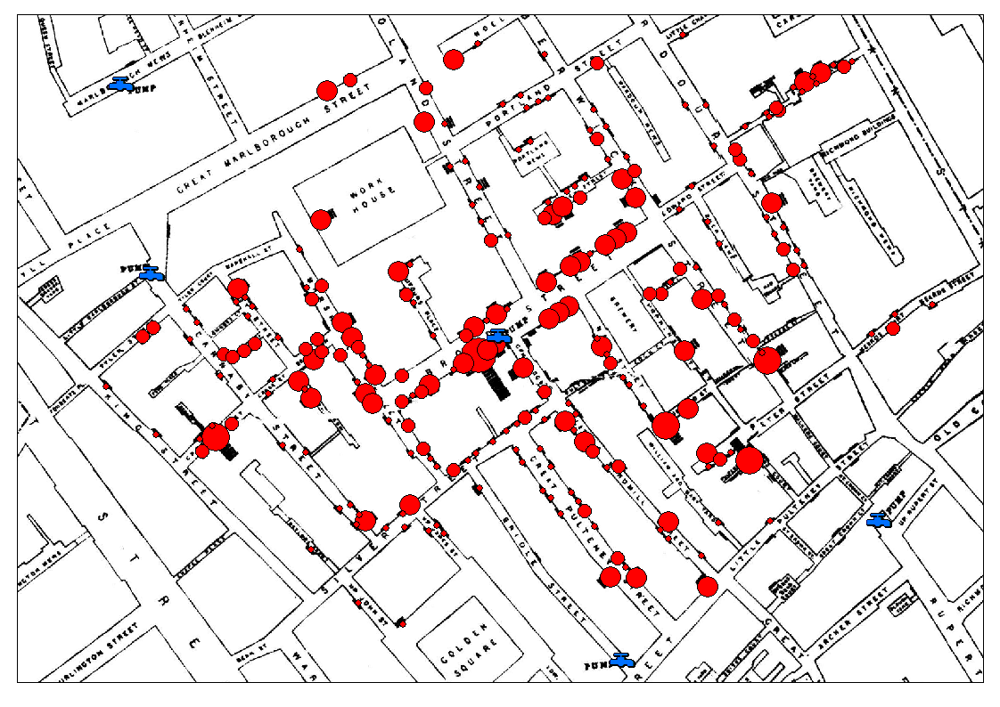
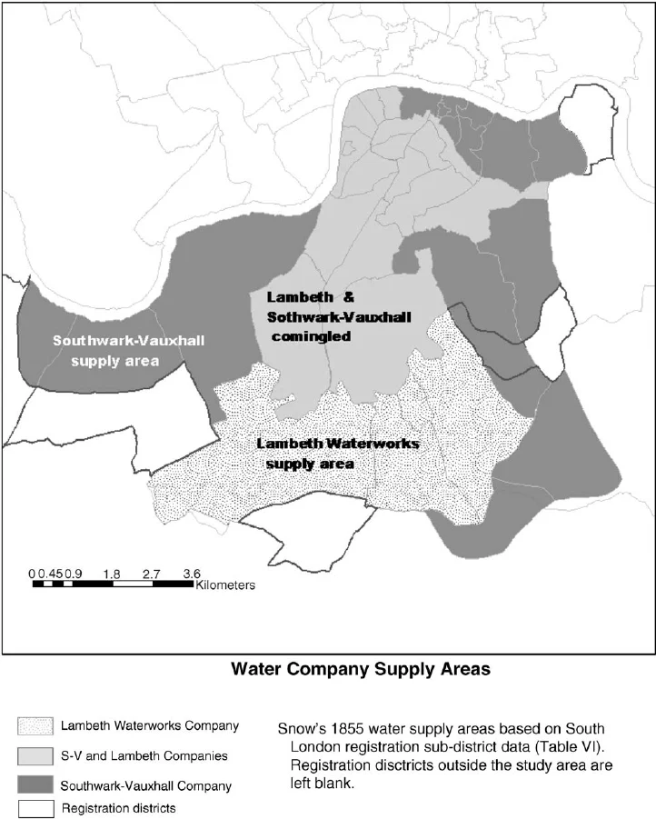

# *Cuando las asignaciones no son aleatorias* 

```{r}
#| echo: false

source("../R/_common.R")
```

## El diseño experimental en tiempos de cólera...

En agosto de 1854 un brote de cólera mataba a una persona cada pocos minutos en el barrio de Soho, en el centro de Londres. La teoría médica dominante de la época culpaba a los *miasmas*, una suerte de aire viciado que se desprendía de la materia en descomposición (spoiler: hoy sabemos que es una bacteria que proviene de la materia fecal de los seres humanos y puede contaminar el agua y los alimentos). Mientras el resto de los médicos de la ciudad se esforzaban en tratar los casos (con poco éxito), uno de ellos llamado John Snow se propuso atacar el problema de raíz.Tenía una hipótesis: el cólera se transmitía por el agua. Para defenderla necesitaba algo más que su intuición. Necesitaba evidencia.

Snow tomó un mapa de la ciudad y empezó a registrar el domicilio de las víctimas. Abajo pueden ver una versión moderna en donde el tamaño de las burbujas representa la cantidad de víctimas en ese punto. La imagen es contundente, el mapa mostraba claramente que las muertes se concentraban alrededor de una fuente de agua pública en Broad Street. Efectivamente el agua de esa bomba estaba contaminada, las autoridades la clausuraron y la epidemia cesó. Una observación salvó miles de vidas.

{fig-align="center"}
Aunque efectiva, ¿alcanzaba la evidencia de Snow para derrocar la teoría de los miasmas? No. La asociación entre la bomba de Broad Street y las muertes podía explicarse por otras cosas: que el barrio era más pobre, que tenía más hacinamiento, que compraban alimentos en el mismo mercado o incluso que compartían la misma intensidad del famoso miasma. Esto es porque pese a su efectividad, el estudio de Snow era un estudio **observacional** y carecen de poder explicativo causal. El lector de este libro se imaginará que la solución es obvia, Snow necesitaba un **experimento aleatorizado** para convencer a sus colegas.Esta simple solución se da de cabeza contra *"cosillas"* como la ética, uno no puede andar repartiendo aleatoriamente agua que cree contaminada con una enfermedad mortal, que la hace imposible.

La cosa no quedó así, en 1855 cuando una nueva epidemia de cólera estalla (con la bomba de Broad St aún cerrada) Snow advirtió una situación externa que solucionar el problema de la causalidad. Dos compañías de agua, *Southwark & Vauxhall* y *Lambeth*, abastecían las mismas calles del sur de Londres (vean el mapa).

{fig-align="center"}
En 1852, tres años antes del brote, Lambeth había mudado su toma de agua río arriba, lejos de las cloacas londinenses. Southwark & Vauxhall seguía sacando agua del Támesis contaminado. Casas vecinas, en la misma cuadra, recibían agua de una u otra compañía según contratos viejos que sus dueños ni recordaban haber firmado. Los habitantes no podían elegir. Al vivir en el mismo barrio, e incluso en la misma cuadra, los que bebían agua de una compañía o la otra eran igual de pobres, con más o menos el mismo hacinamiento,  compraban alimentos en el mismo mercado e incluso respiraban iguales cantidades del *hipotético* miasma.

Snow contó muertes y armó esta tabla.

| Compañía | Casas suministradas | Muertes por cólera | Tasa por 10.000 casas |
|---|---|---|---|
| Southwark & Vauxhall | 40.046 | 1.263 | 315 |
| Lambeth | 26.107 | 98 | 37 |
| Resto de Londres | 256.423 | 1.422 | 59 |

En las casas servidas por Southwark & Vauxhall murieron 315 personas por cada 10 000 viviendas. En las servidas por Lambeth, 37. Una diferencia de casi nueve veces, en barrios idénticos, con el mismo clima, las mismas casas, las mismas miserias. El único factor que distinguía sistemáticamente a un grupo del otro era el agua.

Snow no aleatorizó. Pero la naturaleza, las cloacas y los viejos contratos comerciales habían hecho algo parecido por él. 

Este estudio es quizás el primer **pseudoexperimento** de la historia, y es de lo que va lo que resta de este libro: *estimar efectos causales sin asignación aleatoria.*

Este capítulo es la puerta de entrada. Hasta acá venimos hablando de experimentos donde el investigador asigna los tratamientos por azar y de ahí se sigue, casi gratis, la posibilidad de identificar efectos causales. Eso se terminó. A partir de ahora vamos a meternos en el barro: estudios donde la asignación no es aleatoria, donde el sesgo de selección no es una posibilidad sino la regla, y donde la identificación causal hay que defenderla con argumentos, supuestos y diseño.

## La promesa que se rompe

Repasemos brevemente por qué la aleatorización es tan poderosa. En el capítulo de *potential outcomes* vimos que el problema fundamental de la inferencia causal es que para cada unidad solo observamos uno de sus dos resultados potenciales. El otro queda contrafáctico. Y la diferencia simple de medias entre tratados y no tratados —el **SDO**— solo es un estimador insesgado del **ATE** si los grupos son comparables: si el sesgo de selección y el sesgo de tratamiento heterogéneo se anulan en esperanza.

La aleatorización resuelve eso de un saque. Cuando asignás el tratamiento $D$ por azar, $D$ se vuelve independiente de los resultados potenciales:

$$
(Y^0, Y^1) \perp D
$$

Esa independencia garantiza que los dos grupos son intercambiables en expectativa, y por lo tanto $E[Y|D=1] - E[Y|D=0]$ estima el **ATE** sin trampa. La gracia es que la aleatorización balancea no solo las variables que medimos, sino también las que no medimos: la motivación, la severidad subclínica, el contexto familiar, el humor del día. Por eso es tan barata: no hace falta modelar el mundo.

::: {.callout-tip title="Lo que pierdo cuando pierdo la aleatorización"}

Cuando la asignación no es aleatoria, se rompen tres cosas a la vez:

1. **Los grupos dejan de ser comparables**: tratados y no tratados pueden diferir sistemáticamente en cosas que también afectan al *outcome*.
2. **Dependemos de supuestos**: ya no alcanza con el diseño; hay que defender por qué creemos que la comparación es justa y acordar concesiones.
3. **La inferencia estadística depende del modelo**: ya no hay una distribución del estimador "gratis" garantizada por el sorteo.

Las tres se atacan con distintas herramientas. Este libro las recorre una por una en los próximos capítulos.
:::

La pregunta natural es: ¿por qué no aleatorizamos siempre, entonces?

## ¿Por qué a veces no se puede aleatorizar?

Las razones para no aleatorizar son varias, y cada una de ellas motiva una familia distinta de diseños cuasi-experimentales (o pseudoexperimentales, son sinónimos). 

La razón más obvia es **ética**. No podés asignar al azar a la gente a fumar, a sufrir abuso infantil, a divorciarse, a pasar por una guerra. Cualquier pregunta causal sobre las consecuencias de esas experiencias está vedada al experimento aleatorizado. Si querés estudiar el efecto del tabaquismo sobre el cáncer de pulmón, no vas a poder aleatorizar la exposición. Doll y Hill, en 1950, no aleatorizaron a nadie a fumar: usaron un estudio de casos y controles, observacional, y tuvieron que defender su inferencia causal contra las críticas de Fisher mismo, que sostenía que la asociación entre tabaco y cáncer podía deberse a confusores no medidos. [@white1990]

La segunda razón es la **factibilidad**. No podés aleatorizar políticas nacionales. El salario mínimo, una reforma migratoria, una ley de tránsito, un cambio en el sistema previsional: todas son intervenciones que se aplican a poblaciones enteras, no a individuos. Tampoco podés aleatorizar terremotos, recesiones o pandemias. La geografía, el clima y la historia también escapan del control del investigador.

Una tercera razón es la **retrospectividad**. Muchas veces la pregunta surge después de que el "tratamiento" ya ocurrió. ¿La pandemia de 2020 aumentó la prevalencia de depresión? La pandemia ya pasó. No hay forma de aleatorizar el COVID *post hoc*.

A las que ya nombramos se suman dos más, un poco menos dramáticas pero igual de habituales. El **costo y la escala** vuelven prohibitivos algunos experimentos que en teoría serían posibles: muestras enormes, seguimientos de treinta años, múltiples países simultáneamente. Y el **cumplimiento**: aun cuando lograste aleatorizar, los participantes eligen. El asignado a tratamiento puede no recibirlo, el asignado a control puede conseguirlo por afuera. El estimador *intention-to-treat* sigue siendo causal, pero deja sin contestar la pregunta clínica de fondo, que es qué le pasa al que efectivamente recibe el tratamiento.

Una última razón, más sutil, es la **validez externa**. Un ensayo aleatorizado puede funcionar perfecto en un hospital terciario con voluntarios sanos y bien adheridos, y no decir nada útil sobre la población real, donde los pacientes son más viejos, tienen comorbilidades y abandonan los tratamientos por la mitad. A veces el cuasi-experimento, paradójicamente, gana en validez externa lo que pierde en validez interna respecto al **RCT**.

## ¿Qué es un cuasi-experimento entonces?

Acá conviene poner palabras precisas. 

::: callout
Un **cuasi-experimento** (o pseudoexperimento, dependiendo del autor que leas) es un estudio que busca estimar el efecto causal de un tratamiento sin asignación aleatoria, pero recurriendo a otros recursos (de diseño y de análisis) para aproximar la comparabilidad que el experimento aleatorizado produciría por construcción.
:::

La frase importante de esa definición es *"otros recursos de diseño y análisis"*. Un cuasi-experimento no es un estudio observacional al que después le pegamos una regresión cualquiera. Es un diseño en el que pensamos activamente, antes de mirar los datos, cómo elegir el grupo de comparación, qué variación explotar, qué momento aprovechar. La inferencia causal en un cuasi-experimento se defiende con el diseño primero y con el modelo después.

Es útil distinguir tres tipos de estudio que a veces se confunden:

::: {.callout-tip title="Experimento, cuasi-experimento, observacional"}

- **Experimento aleatorizado**: el investigador controla la asignación al tratamiento y la aleatoriza. La identificación causal sale del diseño. La amenaza principal es el cumplimiento y la validez externa.

- **Cuasi-experimento**: hay una intervención y un grupo de comparación, pero la asignación no es aleatoria. La identificación causal sale del diseño *más* supuestos. La amenaza principal es la selección sobre variables no observadas.

- **Estudio observacional puro**: ni siquiera hay una intervención clara; la "exposición" surge de la vida misma. La identificación causal depende casi enteramente de supuestos. Las amenazas son la confusión y la selección por todos lados.

Las tres familias pueden usar datos parecidos. Lo que las distingue no es el tipo de dato, es de dónde sale la identificación.
:::

Cuando lean un paper, esta clasificación les sirve para diagnosticar de entrada qué nivel de evidencia están viendo. Un ensayo aleatorizado bien hecho descansa sobre el diseño. Un estudio retrospectivo con regresión múltiple descansa, casi enteramente, sobre la fe en que los confusores fueron medidos.


## Las cuatro validez

Al hablar de las diferencias entre diseños introdujimos casualmente los términos de validez y amenaza a esta. Pero, ¿de que se trata?
Shadish, Cook y Campbell usaron el término **validez** para denotar en qué medida una inferencia (sobre un efecto, una medición o una generalización) es correcta [@shadish2002]. Estos autores reconocen entonces que hay ciertos niveles de esa "corrección". No hay una sola validez sino  cuatro variedades clásicas. Las cuatro hacen preguntas distintas sobre el mismo estudio, y un trabajo serio tiene que defenderse en las cuatro.

### Validez estadística

La **validez estadística** pregunta si la covariación que observamos es real o si es ruido. ¿Tenés potencia suficiente para detectar el efecto que esperás? ¿Estás corrigiendo por comparaciones múltiples? ¿La distribución de los datos cumple con los supuestos del test que elegiste? ¿Estás reportando todos los análisis que corriste o solo los que dieron bien?

La neurociencia cognitiva vivió una crisis pública en torno a esto. Bennett y colegas [@bennett2011], en 2009, le hicieron una resonancia magnética funcional a un salmón muerto mientras le mostraban fotos de personas con distintas emociones. Sin corrección por comparaciones múltiples, encontraron "activación" significativa en el cerebro del pez. El punto era didáctico: con 130.000 vóxeles y un umbral de significancia de $p<0{,}001$, los falsos positivos son matemáticamente inevitables. Una conclusión causal apoyada en validez estadística mala no es causal: es un artefacto. 

### Validez interna

La **validez interna** pregunta si esa covariación, dado que es real, es causal. ¿Hay un mecanismo confiable que vaya del tratamiento al *outcome*, o lo que veo podría explicarse por otra cosa? Es el corazón del libro y se la juega contra la lista de amenazas que vemos en la sección siguiente.

Pensá en los estudios pre-post de estimulación magnética transcraneal en depresión resistente sin grupo control: muestran mejorías reales, claramente significativas. Pero la depresión también mejora sola con el tiempo, los pacientes consultan en el pico del episodio y regresan a la media, y la expectativa del tratamiento activo se suma al efecto. La covariación es real; la inferencia causal, en cambio, está armada con palitos.

### Validez de constructo

La **validez de constructo** pregunta si lo que medimos representa el constructo teórico que dijimos estar midiendo. Es la más fácil de pasar por alto, porque vive en el límite entre la psicometría y la teoría.

En neurociencia cognitiva el problema es endémico. "Memoria de trabajo" medida con por ejemplo un test *n-back* de dos no es lo mismo que medida con span de dígitos: las dos tareas correlacionan modestamente y reclutan circuitos parcialmente distintos en el cerebro. Si tu estudio dice "el tratamiento mejora la memoria de trabajo" y solo medís *n-back*, estás haciendo una afirmación más amplia que la que sostienen tus datos. Pasa lo mismo con "atención": test como Stroop, CPT y búsqueda visual miden cosas emparentadas pero no idénticas. En economía vale el paralelo con el desempleo: si el indicador oficial no incluye a los desalentados que dejaron de buscar trabajo, lo que medís deja afuera justo el margen donde más cambian las cosas. La validez de constructo no es un problema de medición sucia: es un problema de definir qué estás midiendo.

### Validez externa

La **validez externa** pregunta si lo que encontramos generaliza a otras personas, otros lugares, otros tiempos, otras dosis. En neurociencia cognitiva la pregunta clásica es si una tarea de laboratorio —con el sujeto inmóvil dentro de un resonador o frente a una pantalla en una habitación oscura— mide algo que se parezca al uso de la atención, la memoria o el control inhibitorio en la vida cotidiana. La crítica de Henrich, Heine y Norenzayan sobre las muestras *WEIRD* (occidentales, educadas, industrializadas, ricas y democráticas) golpea acá: si la evidencia que sostiene una afirmación general se generó con estudiantes universitarios norteamericanos, la generalización a otras poblaciones está sin testear.

En economía experimental la versión equivalente es la del laboratorio. Los participantes —estudiantes, otra vez— juegan con sumas pequeñas, en una computadora, sabiendo que están en un experimento. Las preferencias por el riesgo, la cooperación o la honestidad medidas ahí a veces predicen bien el comportamiento real y a veces no. Cuando no lo hacen, no es que el experimento estaba mal: es que la generalización requiere supuestos que conviene explicitar.

### Jerarquía de la validez

Si bien las cuatro importan, hay una jerarquía operativa. En cualquier diseño es lógico pensar en este orden: Primero si la covariación es real (validez estadística), después, si esta señal es causal (validez interna), después si esto que dije que era realmente lo es (validez de constructo), y recién al final se discute si generaliza (validez externa). Si se falló en alguno de los tres primeros, la discusión sobre validez externa es prematura.

La validez interna es el principal desafío del diseño experimental. La razón está bien resumida en una frase de Reichardt: si la covariación que observamos no es causal, generalizar no-causalidad a otros contextos no tiene sentido. Si fallamos en identificar el efecto causal *acá*, no nos interesa demasiado si "generalizaría" a otra población. Estaríamos generalizando un artefacto. Esto no quiere decir que la validez externa no importe, importa muchísimo en políticas públicas y en clínica, sino que hay un orden. 

## Amenazas a la validez interna

Si es tan importante, la cuestión operativa que sigue es: ¿cómo se evalúa la validez interna? La respuesta breve es que no hay un test. Hay una lista de **amenazas**, cada una con su lógica, y para cada amenaza hay defensas específicas. 

Vamos a las más frecuentes.

### Historia y maduración

Son las dos amenazas más básicas y, por lo mismo, las más subestimadas. La **historia** es cualquier evento externo al tratamiento que ocurre entre la medición pre y post. Por ejemplo, si estás midiendo el efecto de un programa de intervención sobre depresión, y a mitad del seguimiento entra una cuarentena nacional. ¿El cambio observado se debe al programa o a la cuarentena? Sin grupo control, no podés separarlos.

La **maduración** es más sutil. Los participantes cambian con el tiempo sin que nadie haga nada. Un niño con trastorno del lenguaje mejora con seis meses de fonoaudiología, pero también mejora con seis meses sin fonoaudiología, porque maduró. Si comparás antes y después en el grupo tratado y no tenés un grupo control que envejezca al mismo ritmo, no podés separar el efecto del tratamiento de la trayectoria del desarrollo.

Las dos amenazas tienen la misma cura: un grupo de comparación expuesto a la historia y a la maduración pero no al tratamiento. Esa es, no por casualidad, la lógica de varios de los métodos que vienen.

### Testing e instrumentación

El efecto de **testing** aparece cuando tomar un test cambia el resultado de la siguiente toma. Un ejemplo clásico, en cualquier evaluación cognitiva hay test con efecto de aprendizaje (sobretodo en los test de memoria), entonces el participante mejora la segunda vez simplemente porque ya conoce el formato. Si comparás pre-post sin grupo control, no estás midiendo recuperación cognitiva; estás midiendo cuánto se aprende a hacer el test.

La **instrumentación** es el problema espejo: lo que cambia no es el sujeto sino el instrumento o quien lo aplica. En la medición *pre* evalúa, por ejemplo, un residente de primer año, al llegar al tiempo *post* el evaluador ya es un el médico de planta y su evaluación es más estricta. También puede ocurrir que cambia el aparato, o el formulario u otro elemento de captura de los datos. Cualquier cambio en *cómo* medimos puede confundirse con un cambio real.

### Regresión a la media

Esta es probablemente la amenaza más sutil y la más frecuentemente ignorada. Cuando seleccionás a los participantes por valores extremos, las mediciones siguientes tienden a estar más cerca de la media, *aun sin intervención*. Es estadística pura: si una observación es muy alta, una parte de esa altura es señal y otra parte es ruido. El ruido no se repite, así que la siguiente medición, si los sujetos no recibieron nada, tiende a ser un poco más baja.

La regresión a la media engaña muy bien. Si reclutás al 10% más deprimido de una población clínica y los seguís en el tiempo, sus puntajes promedio van a bajar de *tiempo 0* a *tiempo 1*, de *tiempo 1* a *tiempo 2*. Si en el medio les diste un tratamiento, no podés saber qué parte de la mejora se debe al mismo (a lo mejor absolutamente nada) y qué parte es regresión a la media.

Veamos esto con un ejemplo simulado. Generamos 1000 personas con un puntaje base (un constructo estable, digamos un *score de depresión* donde más alto es peor) y una medición ruidosa de ese constructo en dos momentos. Después seleccionamos al 10% con *peor* medición en t0 —los más deprimidos— y vemos qué les pasa en t1, sin intervención de ningún tipo.

```{r}
#| label: regresion-media
#| message: false
#| warning: false

library(tidyverse)
set.seed(42)

# 1000 personas con un rasgo estable + ruido en dos mediciones
n <- 1000
datos <- tibble(
  id = 1:n,
  rasgo = rnorm(n, mean = 0, sd = 1),
  y_t0  = rasgo + rnorm(n, mean = 0, sd = 1),
  y_t1  = rasgo + rnorm(n, mean = 0, sd = 1)
)

# Seleccionamos al 10% con peor puntaje (mayor) en t0
umbral <- quantile(datos$y_t0, 0.90)
seleccion <- datos %>% filter(y_t0 >= umbral)

# Comparamos promedios pre y post en el grupo seleccionado
seleccion %>%
  summarise(media_t0 = mean(y_t0),
            media_t1 = mean(y_t1),
            mejora   = media_t0 - media_t1)
```

El grupo seleccionado "mejora" entre t0 y t1, su puntaje baja en promedio más de un punto, aunque no hicimos nada. La diferencia viene de la regresión a la media: en t0 fueron seleccionados por valores altos, y parte de esos valores altos era ruido que no se repitió.

En efecto, si un estudio recluta a pacientes severos y los miden pre-post sin grupo control concurrente, vas a ver una mejoría aún si el tratamiento es agua tibia. Necesitan un control seleccionado con el mismo criterio para descontar este efecto.

### Sesgo de selección y no-adherencia

Llegamos al corazón del problema en los cuasi-experimentos. El **sesgo de selección** es el grado en que difieren sistemáticamente los individuos que terminan siendo tratados  de quienes no, en cosas que también afectan el *outcome*.
Por ejemplo, si el criterio de asignacion a un tratamiento como la cirugía bariátrica (una cirugía para adelgazar) es la preferencia de los pacientes. Puede ocurrir que los pacientes que eligen una cirugía bariátrica difieran del grupo placebo porque están más motivados, tienen mejor adherencia, mejor red social y probablemente mejor estatus socioeconómico. Si comparás sus desenlaces con los de quienes no se operaron, estás mezclando el efecto de la cirugía con el efecto de todo lo demás que distingue a los dos grupos.

Acuerdense que lo formalizamos en el capítulo de potential outcomes de la siguiente forma.

$$
\begin{array}
\underbrace{E[Y_i^0|D_i=1] - E[Y_i^0|D_i=0] }
\end{array}
$$ {#eq-selection_bias}

En el capítulo anterior lo presentamos como un término en una descomposición algebraica. Acá lo presentamos como una pregunta de investigación: ¿quiénes eligieron meterse en el grupo tratado, y por qué? La respuesta, casi siempre, es que eligieron por razones que no son ajenas al *outcome*.

Otra amenaza ya conocida es la **no adherencia**. Vista en este marco, la no-adherencia funciona como un sesgo de selección post-aleatorización (o post-asignación del tratamiento). La razón por la que funciona similar al sesgo de selección es que los que abandonan no son aleatorios, frecuentemente lo hacen por razones sistemáticas ligadas al outcome. Esto último crea diferencias sistemáticas en los grupos que persisten en el tratamiento asignado. 

::: callout
Casi todos los métodos que vas a ver en los próximos capítulos —matching, variables instrumentales, diferencias en diferencias, regresión discontinua— son, en el fondo, estrategias distintas para atacar el problema de selección.
::: 

### Difusión, compensación y otros fenómenos sociales

Algunas amenazas son específicas de las evaluaciones de programas y de las intervenciones en contextos sociales o institucionales. Estas ya las vimos brevemente en el capítulo de *potential outcomes* como violaciones del **SUTVA**, pero conviene tenerlas presentes acá también, porque aparecen todo el tiempo en cuasi-experimentos.

La **difusión** o **spillover** ocurre cuando el grupo control adopta partes del tratamiento. En un ensayo comunitario de prevención, una campaña de información puede "contagiar" al barrio control. La **rivalidad compensatoria** es el caso en que el grupo control, al saberse desventajado, se esfuerza más para no quedar atrás, lo que reduce la diferencia observada. La **desmoralización resentida** es el opuesto: los del control se desmotivan al percibirse injustamente tratados, y la diferencia con los tratados se infla artificialmente.

Estas amenazas no son exóticas. En cualquier intervención escolar, hospitalaria o comunitaria donde los grupos están en contacto y se enteran de su asignación, alguna de las tres está probablemente operando.

## No todo es color de rosa: la advertencia de Lalonde

Si Snow nos inspira con la posibilidad de hacer causalidad sin laboratorio, Robert Lalonde, [@lalonde1986] en 1986, nos advierte cuán fácil es engañarse en el camino.

Lalonde realizó la siguiente demostración. Utilizó datos de un programa de empleo asistido en Estados Unidos, el *National Supported Work Demonstration*, que había sido evaluado mediante un experimento aleatorizado. La pregunta que planteó fue contrafáctica y elegante: si no hubiéramos contado con el experimento con asignación aleatoria y el programa simplemente se hubiera implementado, la única alternativa para estimar su efecto habría sido comparar a los participantes del programa con un grupo de control construido a partir de encuestas nacionales en las que el programa no se había aplicado. En esas condiciones, ¿habríamos llegado al mismo resultado?

La respuesta corta es que no. El experimento aleatorio estimaba un aumento promedio de unos 886 dólares en los ingresos anuales de los participantes. Las comparaciones contra controles observacionales, ajustadas con las técnicas habituales de regresión, daban estimaciones que variaban en miles de dólares y a veces tenían el signo contrario. Es decir: si hubieras hecho el estudio con datos observacionales y los hubieras analizado con buena fe, habrías concluido que el programa empeoraba dramáticamente los ingresos de los participantes. Lo opuesto a la verdad.

::: {.callout-warning title="La moraleja de Lalonde"}

Hay una lección importante en todo esto. El sesgo de selección no es un error de redondeo. Sin un buen diseño, incluso una regresión observacional cuidadosa, con todos los controles que se te ocurran, puede dar la respuesta equivocada *con intervalo de confianza estrecho* y todo. La estadística no te avisa cuando estás equivocado: te da un número y un margen de de incertidumbre alrededor del número, pero este puede contener una interpretación causal equivocada.

La lección: la confianza en una estimación cuasi-experimental no debería venir del *output* del modelo, (ni hablar de su $R^2$, o cualquier métrica de performance del modelo) sino del argumento de identificación que se sostiene detrás. Si ese argumento es flojo, ninguna sofisticación econométrica lo salva.
:::

Lalonde se volvió la motivación canónica de toda la literatura posterior de *matching*, *propensity score* y métodos cuasi-experimentales en general. La discusión sigue abierta, la invitación de este libro es que nos sumemos de la mejor manera a ella.

## ¿Y ahora qué? Un mapa hacia lo que viene

A esta altura es razonable preguntarse cómo se sale de este laberinto. La respuesta es que existen varias familias de métodos cuasi-experimentales, cada una pensada para una situación distinta. No son intercambiables. Cada una identifica un efecto definido, bajo supuestos distintos, sobre una población distinta. Vamos a recorrerlas a lo largo de los próximos capítulos, pero conviene cerrar este con un mapa rápido para que sepas adónde vamos.

La estrategia de **subclasificación y matching** (capítulo siguiente) ataca el sesgo de selección emparejando tratados con no tratados que sean "gemelos" en un conjunto $X$ de variables observadas. Funciona si podemos defender que, dada esa $X$, el tratamiento es como si fuera aleatorio. Es razonable cuando los confusores plausibles son medibles, y fracasa cuando hay confusión por variables que no medimos.

La estrategia de **diferencias en diferencias** compara cambios pre-post entre un grupo tratado y un grupo control que evolucionaban en paralelo antes de la intervención. Su talón de Aquiles es el supuesto de tendencias paralelas: si el grupo control no captura bien la trayectoria contrafáctica del tratado, la inferencia se cae.

La estrategia de **regresión discontinua** explota una regla de asignación que depende de un umbral en una variable continua. POr ejemplo, una beca se da a quienes sacaron más de 7.5; el programa nutricional, a familias con ingresos por debajo de una línea. Sujetos justo arriba y justo abajo del corte son casi idénticos en todo lo demás, así que la diferencia en el *outcome* se atribuye al tratamiento.

La estrategia de **variables instrumentales** busca una tercera variable $Z$ que mueva el tratamiento pero no afecte el *outcome* por otra vía. 

Cada uno de estos métodos tiene su capítulo. No te preocupes ahora por los detalles técnicos: lo que importa es que tengas en la cabeza dos cosas. Primero, que la elección del método no la dictan los datos, sino el diseño y los supuestos que estás dispuesto a defender. Segundo, que ningún método salva una mala identificación: si la pregunta causal no se puede atacar con ninguna de estas estrategias, lo más honesto suele ser declarar la asociación y dejar la causalidad para otro estudio.

## Para llevar

Antes de pasar al primer método, vale la pena dejar fijos cuatro mensajes.

Primero: sin aleatorización la causalidad no desaparece, pero desaparece la garantía. La pregunta causal sigue siendo legítima; lo que perdemos es el camino corto para contestarla. Un cuasi-experimento intenta recuperar esa garantía con diseño y supuestos. No es magia: es trabajo de identificación.

Segundo: la validez interna se evalúa amenaza por amenaza. No hay un test que te diga "este diseño es válido". Hay una lista de cosas que pueden estar pasando, y para cada una hay defensas específicas. 

Tercero: el sesgo de selección es la regla, no la excepción, en datos observacionales. Casi siempre la gente que termina tratada difiere de la gente que no en cosas que afectan el *outcome*. Negarlo o ignorarlo es la fuente más común de inferencias causales falsas.

Cuarto: Aprendimos dos lecciones de la historia, Snow nos muestra que con buen diseño se puede inferir causalidad sin laboratorio. Lalonde nos muestra cuán fácil es engañarse en el camino. Los dos mensajes conviven en este libro y conviene tenerlos a mano en partes iguales.

## Preguntas de repaso

1. Enumerá tres razones por las cuales no es posible aleatorizar la asignación al tratamiento. Para cada una, dá un ejemplo de tu propia área.

2. ¿Qué diferencia hay entre un experimento aleatorizado, un cuasi-experimento y un estudio observacional puro? ¿Qué tipo de identificación causal usa cada uno?

3. En tus propias palabras, ¿qué significa que un estudio tenga buena validez interna? ¿Por qué decimos que en los cuasi-experimentos la validez interna es prioritaria respecto a la externa?

4. Para cada una de las siguientes amenazas, dá un ejemplo y explicá cómo se podría mitigar: historia, maduración, *testing*, instrumentación, regresión a la media, atrición.

5. Una clínica reporta que los pacientes con depresión severa tratados con un nuevo protocolo mejoran un 30% en promedio en seis meses. No hay grupo control. ¿Qué amenazas a la validez interna te preocuparían más antes de creerle al resultado?

6. Releé el caso de John Snow. Identificá tres supuestos que Snow tuvo que defender para que su inferencia causal fuera válida. ¿Cuál te parece el más débil?

7. ¿Qué nos enseñó el estudio de Lalonde sobre los controles observacionales? ¿En qué consiste, exactamente, "el sesgo de selección no es un error de redondeo"?

8. Para cada uno de los siguientes diseños, decidí cuál de las estrategias del mapa (matching, *DiD*, *RDD*, *IV*) parece la más natural y por qué:
   a. Evaluar el efecto de una beca que se asigna a estudiantes con promedio mayor a 8,5.
   b. Evaluar el efecto de una reforma educativa que se aplicó en una provincia y no en otra.
   c. Evaluar el efecto del servicio militar sobre los ingresos, sabiendo que hubo una lotería de asignación.
   d. Evaluar el efecto de un tratamiento médico que los pacientes eligen libremente, en un registro hospitalario con muchas variables clínicas medidas.

## Un caso aplicado para pensar

Una organización implementó un programa de mentoreo para mujeres jóvenes en barrios vulnerables del conurbano. El programa consiste en sesiones quincenales con una mentora durante dos años, además de talleres mensuales. La organización quiere evaluar si el programa aumenta la probabilidad de terminar el secundario.

El programa no se asignó aleatoriamente. Las mentoras visitaron escuelas y centros comunitarios, y las jóvenes que mostraron interés se anotaron voluntariamente. Hay datos de 800 participantes y, gracias a un acuerdo con el Ministerio, datos de 4500 jóvenes del mismo barrio y la misma franja etaria que no entraron al programa.

Los resultados crudos muestran que el 67% de las participantes terminó el secundario, contra el 49% de las no participantes. La directora de la organización le presenta estos números a la prensa como evidencia de que el programa funciona.

Trabajá con estas preguntas:

1. ¿Qué magnitud está calculando la directora? ¿Por qué no es razonable interpretarla directamente como el efecto causal del programa?

2. Identificá al menos cuatro amenazas a la validez interna específicas para este diseño. Para cada una, explicá brevemente cómo podría estar inflando (o reduciendo) la diferencia observada.

3. Una colega propone usar matching: emparejar a cada participante con una no participante de las mismas características observadas (edad, escuela de origen, situación familiar, nivel educativo de los padres). ¿Qué supuesto crítico tendría que cumplirse para que esa estrategia identifique el efecto causal? ¿Te parece plausible en este caso?

4. Otra colega propone esperar al año siguiente, y aleatorizar entre las jóvenes que se anoten qué mitad recibe el programa y qué mitad queda en lista de espera. ¿Qué problema resolvería esto que el matching no resuelve? ¿Qué nuevas amenazas aparecerían?

5. Si tuvieras que reescribir el comunicado de prensa para que fuera honesto con la evidencia disponible, ¿cómo lo redactarías?

